# Ch4 The Market Forces of Supply and Demand

> 供给与需求的市场力量

$~$

## 4.1 Markets and Competition
> 市场与竞争

$~$

**Supply** and **demand** are the most important concepts in economics. 

**供给**和**需求**，是经济学中最重要的概念。但在讨论它们之前，我们先需要讨论**市场**和**竞争**的概念。

$~$

**Market** is a group of buyers and sellers of a particular good or service.

**市场**：某种物品/服务的买者与卖者组成的一个群体

$~$

A **competitive market** is a market in which there are many buyers and many sellers so that each has a negligible impact on the market price.

那么，什么是**竞争**？

**竞争市场**：市场中有充分多的买者和卖者，以至于任何一个买者或卖者，对市场价格的影响都可以忽略

$~$

**Perfectly competitive markets** are defined by two characteristics:
一种特殊的竞争市场叫做**完全竞争市场**，它由两个因素决定：

+ homogeneous products
产品都是完全一样的

+ many buyers and sellers so no one influences the price.
有充分多的买者和卖者，以至于没有人能影响价格

$~$

Under perfect competition, firms are **price takers**.
由于完全竞争市场上的买者和卖者，必须接受市场决定的价格，因此他们称为 **价格接受者** 。在市场价格下，买者可以购买他们想购买的所有东西，卖者可以出售他们想出售的所有东西

$~$

Some degree of competition is present in most markets.
在大部分市场中，都会有一定程度的竞争

$~$

> 补充：市场类型的划分和特征

| Market Type              | Number of Firms | Product Differentiation              | Degree of Price Control        | Ease of Entry/Exit                | Similar Product Markets                    |
| ------------------------ | --------------- | ------------------------------------ | ------------------------------ | --------------------------------- | ------------------------------------------ |
| Perfect Competition      | Very many       | No differentiation                   | None                           | Very easy                         | Some agricultural products                 |
| Monopolistic Competition | Very many       | Differentiated                       | Some                           | Relatively easy                   | Some light industrial products, retail     |
| Oligopoly                | Few             | Differentiated or undifferentiated   | Considerable                   | Relatively difficult              | Steel, automobiles, oil                    |
| Monopoly                 | One             | Unique product, no close substitutes | Very high, but often regulated | Very difficult, almost impossible | Public utilities, e.g., water, electricity |

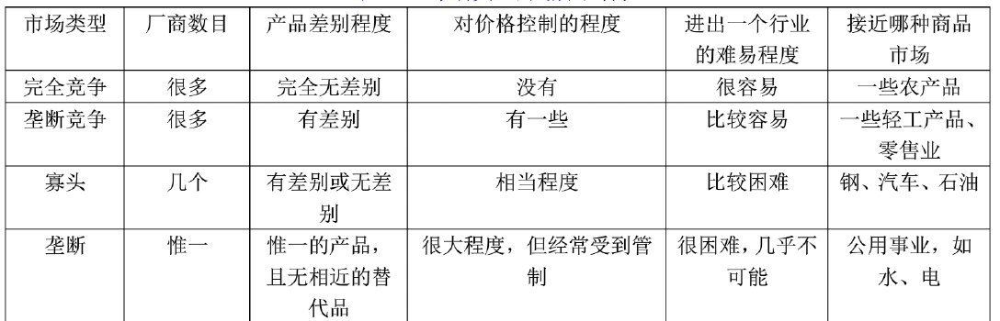

$~$

## 4.2 Demand

> 需求

**Quantity demanded** is the amount of a good that buyers are willing and able to purchase. **需求量**：买者愿意购买，并且有能力购买的，这种物品的量

$~$

**Law of demand** is the claim that, other things being equal, the quantity demanded of a good falls when the price of the good rises. **需求定理**：**在其他条件不变的情况下**，物品价格上升时，需求量会相应下降

$~$

**Demand schedule** is a table that shows the relationship between the price of a good and the quantity demanded. **需求表**：表示一种物品在不同价格水平下的需求量的表

$~$

**Demand curve** is a graph of the relationship between the price of a good and the quantity demanded. **需求曲线**：反映**价格**和**需求量**的关系

$~$

**Figure 1.Catherine’s Schedule and Demand Curve.** 需求表和需求曲线的实例。从图中可以看出，价格越高，需求量越少
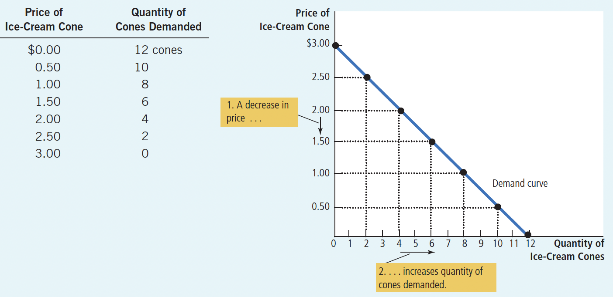

$~$

**Market Demand versus Individual Demand**
市场需求，与个人需求的关系

The market demand curve is the horizontal sum of the individual demand curves.
市场的需求曲线是把个人需求曲线，在水平方向上求和
（x轴为价格，y轴为需求量；水平方向求和，即y轴的数值不变，x轴的数值相加；即在相同的价格水平下，把需求量相加）

$~$

Figure 2 Market Demand as the Sum of Individual Demands. 市场需求，是个人需求的总和
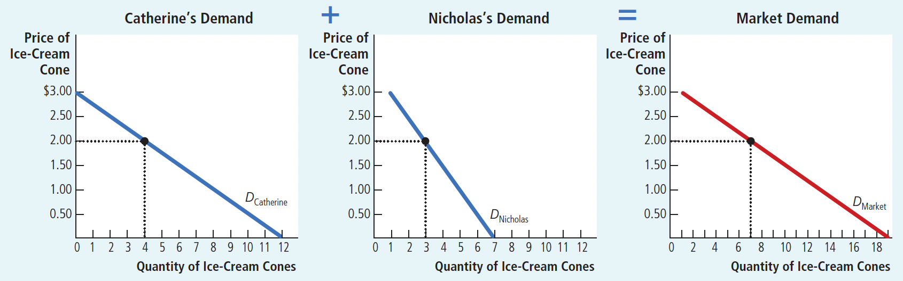

$~$

**Shifts in the Demand Curve**在什么因素下，需求曲线**本身**会改变？

1.Income
收入

+ **Normal good** is a good for which, other things being equal, an increase in income leads to a increase in quantity demanded. **正常物品**：其他条件不变，收入增加 $\rightarrow$ 需求量增加

+ **Inferior good** is a good for which, other things being equal, an increase in income leads to a decrease in quantity demanded.
**低档物品**：其他条件不变，收入增加 $\rightarrow$ 需求量增加

+ For example, Public Transportation, Economy cars
例如公共交通和私家车，前者是低档物品，后者是正常物品

$~$

2.Prices of related goods
两种相关联的物品，一种物品的价格，会影响另一种物品的需求量

+ **Substitutes** are two goods for which an increase in the price of one good leads to an increase in the demand for the other good.
**替代品**：如果一种物品价格上升，引起另一种物品需求量增加；那么这两种物品互为替代品

+ **Complements** are two goods for which an increase in the price of one good leads to a decrease in the demand for the other good.
**互补品**：如果一种物品价格上升，引起另一种物品需求量减少；那么这两种物品互为互补品

$~$

3.Tastes: While economists do not normally try to explain people’s tastes, they do examine what happens when tastes change.
爱好也会影响需求曲线。虽然解释人们的爱好不属于经济学的范畴，但我们知道，当爱好转向一种物品时，会使这种物品的需求增加

$~$

4.Expectations: Your expectations about the future may affect your demand for a good or service today.
对未来的预期会影响需求量。当人们认为未来会变得不景气的时候，会减少消费，持有现金，或将钱储蓄起来

$~$

5.Number of Buyers
市场需求还取决于买者的数量

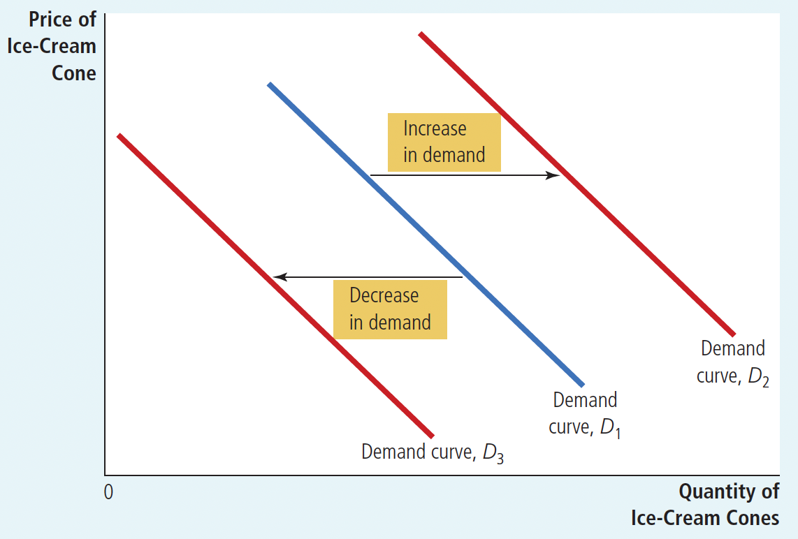

**Figure 3.Shifts in the Demand Curve.**

图3:这张图解释了，什么是“需求曲线**本身**发生的变化”

$~$

Table 1.Variables That Influence Buyers
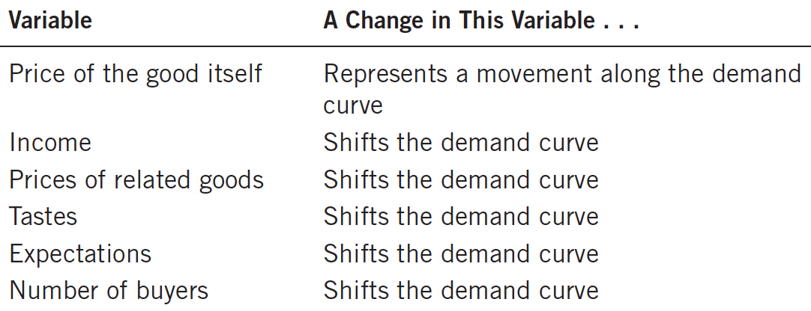

影响买者的因素有两种：

+ 让需求量沿着需求曲线移动
+ 需求曲线本身发生变化

$~$

Figure 4.Shifts in the Demand Curve versus Movements along the Demand Curve. 以香烟为例，说明需求曲线**本身的变化**，和**沿着需求曲线的移动**，二者的区别
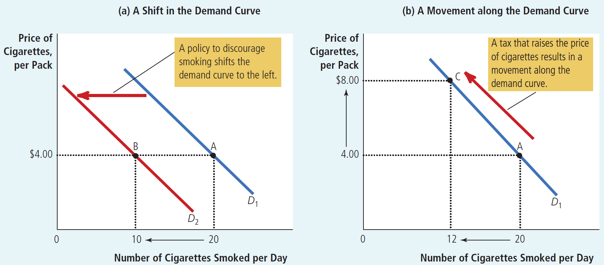

阻遏吸烟的政策，会让香烟的需求曲线本身左移。烟草税会增加香烟的价格，让需求量沿着需求曲线移动。

为什么改变价格，需求量会沿着需求曲线移动？因为需求曲线只包含了两个变量：价格和需求量。价格是需求曲线之内的因素，所以需求曲线本身不变

而政策、收入、爱好、对未来预期、买者数量之类的因素，是需求曲线之外的因素。改变这些因素，便不再符合 Law of Demand 中 "other things being equal" 的条件。如果只是沿着原来的需求曲线移动，不能反映这种外部的变化。所以需求曲线本身要发生改变。

$~$

### 4.3 Supply

> 供给

**Quantity** supplied is the amount of a good that sellers are willing and able to sell.
**供给量**：卖者愿意出售，并且能够出售的一种物品的数量

$~$

**Law of supply** is the claim that, other things being equal, the quantity supplied of a good rises when the price of the good rises.
**供给法则**：在其他条件不变的情况下，当物品的价格提升时，物品的供给量上升

$~$

**Supply schedule** is a table that shows the relationship between the price of a good and the quantity supplied.
**供给表**：表示一种物品的价格与供给量之间关系的表格

$~$

**Supply curve** is a graph of the relationship between the price of a good and the quantity supplied.
**供给曲线**：反映物品价格和供给量的关系

Figure 5.Ben’s Supply Schedule and Supply Curve.供给表和供给曲线的实例。从图中可以看出，价格越高，供给量越大

$~$

**Market Supply Versus Individual Supply:**
市场供给与个人供给

The market supply curve is the horizontal summation of the individual supply curves.

市场的供给曲线：是将个人的供给曲线，在水平方向求和

Figure 6.Market Supply as the Sum of Individual Supplies.

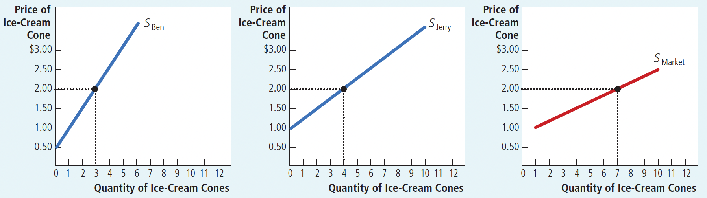

$~$

**Shifts in the Supply Curve**
供给曲线本身改变的原因

1.Input prices

+ 投入品（原材料）价格会影响供给量，因为这决定了企业的生产是否有利可图。投入品价格越高，供给量越低

2.Technology

+ 技术进步提高了生产效率，从而增加了生产量

3.Expectations

+ 对未来的预期，会影响在当下的生产。当企业认为未来产品的价格会提高时，他们会倾向于一部分现在生产的产品储存起来，留待以后销售，从而供应量减少

4.Number of Sellers

+ 卖者的数量也会影响供给量

$~$

Figure 7.Shifts in the Supply Curve. 供给曲线发生改变时的图像形态

$~$

Table 2.Variables That Influence Sellers. 

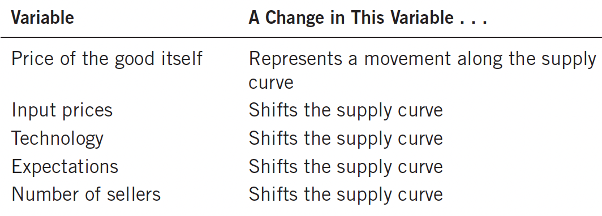

影响卖者的因素也有两种：

+ 供给量沿着供给曲线移动
+ 供给曲线本身发生变化

$~$

## 4.4 Supply and Demand Together

> 供给和需求的联动

**Equilibrium** is a situation in which supply and demand have been brought into balance.

**均衡**：供给量和需求量相等的状态

$~$

**Equilibrium price** is the price that balances supply and demand.

**均衡价格**：使供给与需求平衡的价格

$~$

**Equilibrium quantity** is the quantity supplied and the quantity demanded when the price has adjusted to balance supply and demand.

**均衡数量**：在均衡价格下的供给量与需求量

$~$

Figure 8.The Equilibrium of Supply and Demand.求【均衡价格】和【均衡数量】的方法：将供给曲线和需求曲线联立，交点在x轴和y轴的投影，就是均衡数量和均衡价格了

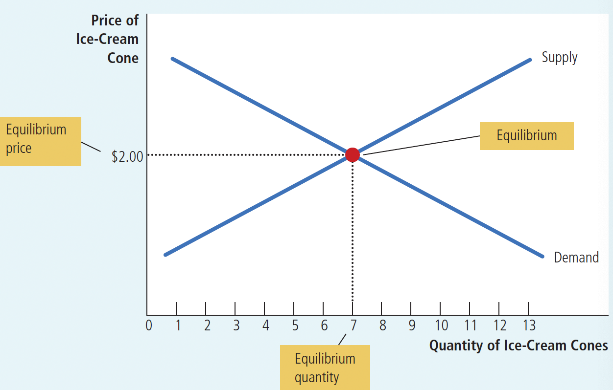

$~$

**Surplus** is a situation in which quantity supplied is greater than quantity demanded.

**过剩**：供给量>需求量的状态

$~$

**Shortage** is a situation in which quantity demanded is greater than the quantity supplied.

**短缺**：供给量<需求量的状态

$~$

**Law of supply and deman**d is the claim that the price of any good adjusts to bring the supply and demand for that good into balance.

**供求定理**：认为任何物品的价格都会自发调整，来使这种物品的供给和需求达到平衡

$~$

Figure 9. Markets Not in Equilibrium.过剩和短缺，是市场没有达到均衡的状态

$~$

**Three steps to analyzing changes in equilibrium** 分析均衡变动的三个步骤

1. Decide whether the event shifts the supply or demand curve or both.
这个事件是使供给曲线移动？还是使需求曲线移动？还是两者都移动？

2. Decide which direction the curve shifts.
供给/需求曲线向哪个方向移动？

3. Use the supply and demand diagram to see how the shift changes the equilibrium.
画出新的供给曲线和需求曲线，根据交点在x轴和y轴上的投影，判断新的均衡价格，和均衡数量

$~$

Example 1: A Change in Market Equilibrium Due to a Shift in Demand 在一个炎热的夏天（冰淇淋的需求增加），分析冰淇淋的均衡如何移动
1. 供给曲线不变，因为炎热没有直接影响冰淇淋生产。
2. 炎热天气，使需求曲线向右移动了
3. 画出供给曲线和需求曲线（如图10），可知均衡价格和均衡数量都增加

Figure 10.How an Increase in Demand Affects the Equilibrium.
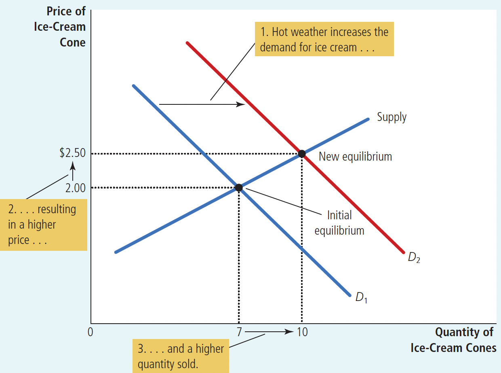

$~$

Example 2: A Change in Market Equilibrium Due to a Shift in Supply 飓风破坏了工厂（冰淇淋的供给量减少），分析冰淇淋的均衡的移动情况

1. 需求曲线不变
2. 飓风破坏了工厂，使供给曲线向左移动了
3. 画出供给曲线和需求曲线（如图11），可知均衡价格上升，均衡数量下降

Figure 11.How a Decrease in Supply Affects the Equilibrium.
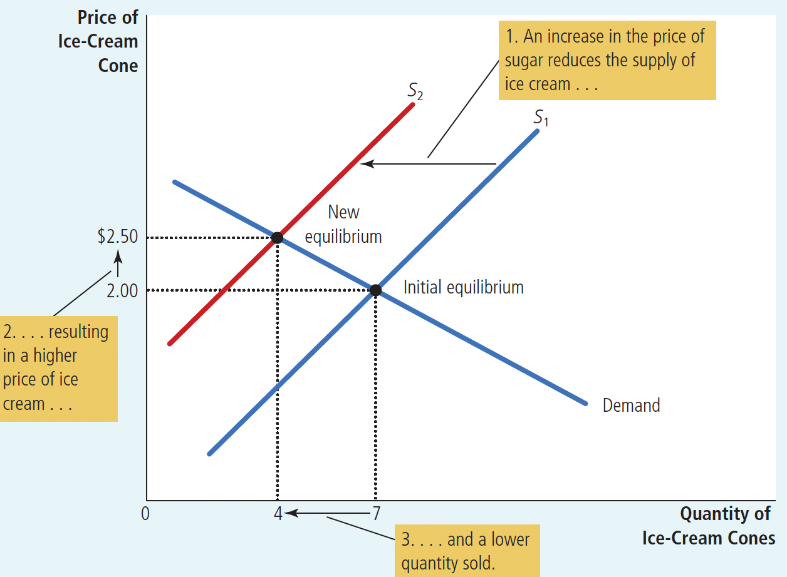

$~$

Example: Shifts in Both Supply and Demand 在炎热天气，并且飓风破坏了工厂下（需求增加的同时，供给减少），分析冰淇淋的均衡如何变化

1. 需求曲线向右移动
2. 供给曲线向左移动
3. 画出供给曲线和需求曲线（如图12），可知均衡价格上升，均衡数量既有可能上升也有可能下降

Figure 12.A Shift in Both Supply and Demand. 供给量和需求量同时改变，是如何影响均衡的
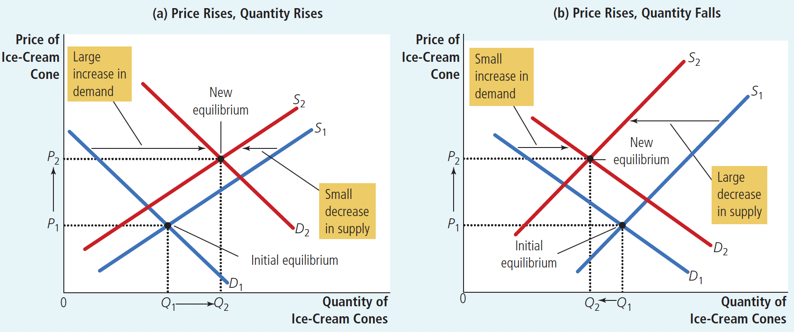

$~$

Table 4.What Happens to **P**rice and **Q**uantity When Supply or Demand Shift? 如果你不想画供给曲线和需求曲线来判断均衡价格/均衡数量的变化的话，也可以看这个表！

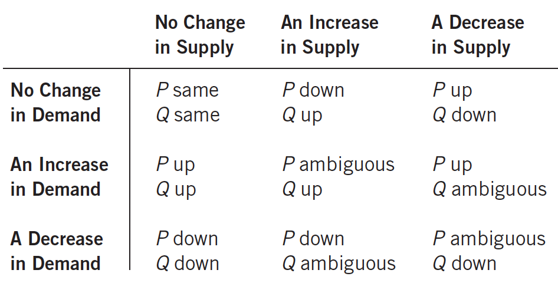
>ambiguous：既有可能上升也有可能下降

$~$

一些非常让人迷惑的概念的辨析

+ Shifts in curves v.s. movements along curves “曲线本身的移动”和“沿着曲线的移动”

+ Supply v.s. Quantity Supplied “供给”和“供给量”

+ Demand v.s. quantity demanded “需求”和“需求量”

“Supply” refers to the position of the supply curve, whereas the “quantity supplied” refers to the amount suppliers wish to sell.
供给曲线本身的移动称为“供给变动”，沿着一条固定的供给曲线的变动称为“供给量的变动”
换言之，“供给”是那条可以左移/右移的供给曲线，而“供给量”只是那条曲线上的一点在x轴上的投影

“Demand” refers to the position of the demand curve, whereas the “quantity demanded” refers to the amount buyers wish to buy.
需求曲线本身的移动称为“需求变动”，沿着一条固定的需求曲线的变动称为“需求量的变动”

$~$

## 4.7 Summary
>理论上，这些内容在上面都有，但也可以再看一遍

Economists use the model of supply and demand to analyze competitive markets. In a competitive market,there are many buyers and sellers, each of whom has little or no influence on the market price.

The demand curve shows how the quantity of a good demanded depends on the price. According to the law of demand, as the price of a good falls, the quantity demanded rises. Therefore, the demand curve slopes downward.

In addition to price, other determinants of how much consumers want to buy include income, the prices of substitutes and complements, tastes, expectations, and the number of buyers. If one of these factors changes,the demand curve shifts.

The supply curve shows how the quantity of a good supplied depends on the price. According to the law of supply, as the price of a good rises, the quantity supplied rises. Therefore, the supply curve slopes upward.

In addition to price, other determinants of how much producers want to sell include input prices, technology,expectations, and the number of sellers. If one of these factors changes, the supply curve shifts.

The intersection of the supply and demand curves determines the market equilibrium. At the equilibrium price, the quantity demanded equals the quantity supplied.

The behavior of buyers and sellers naturally drives markets toward their equilibrium. When the market price is above the equilibrium price, there is a surplus of the good, which causes the market price to fall. When the market price is below the equilibrium price, there is a shortage, which causes the market price to rise.

To analyze how any event influences a market, we use the supply-and-demand diagram to examine how the event affects the equilibrium price and quantity. To do this, we follow three steps. First, we decide whether the event shifts the supply curve or the demand curve(or both). Second, we decide in which direction the curve shifts. Third, we compare the new equilibrium with the initial equilibrium.

In market economies, prices are the signals that guide economic decisions and thereby allocate scarcere sources. For every good in the economy, the price ensures that supply and demand are in balance. The equilibrium price then determines how much of the good buyers choose to consume.
