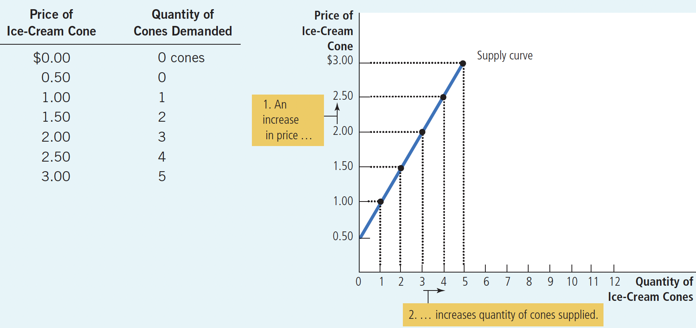
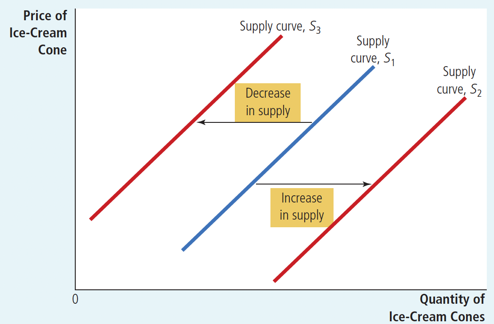
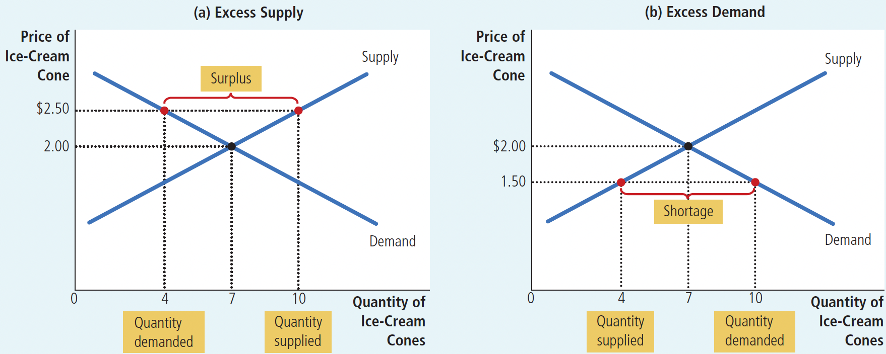

# Ch4 The Market Forces of Supply and Demand

> 供给与需求的市场力量

$~$

## 4.1 Markets and Competition
> 市场与竞争

$~$

**Supply** and **demand** are the most important concepts in economics. 

**供给**和**需求**，是经济学中最重要的概念。但在讨论它们之前，我们先需要讨论**市场**和**竞争**的概念。
因为有了市场，才有买者和卖者，进而才有需求和供给。
只有在竞争市场中，买者和卖者对价格没什么影响，才能讨论供给和需求的改变对于价格的影响。

$~$

**Market** is a group of buyers and sellers of a particular good or service.

**市场**：某种商品/服务的买者与卖者组成的一个群体

$~$

A **competitive market** is a market in which there are many buyers and many sellers so that each has a negligible impact on the market price.

那么，什么是**竞争**？

**竞争市场**：市场中有充分多的买者和卖者，以至于任何一个买者或卖者，对市场价格的影响都可以忽略

$~$

**Perfectly competitive markets** are defined by two characteristics:
一种特殊的竞争市场叫做**完全竞争市场**，它由两个因素决定：

+ homogeneous products
产品都是完全一样的

+ many buyers and sellers so no one influences the price.
有充分多的买者和卖者，以至于没有人能影响价格

$~$

Under perfect competition, firms are **price takers**.
由于完全竞争市场上的买者和卖者，必须接受市场决定的价格，因此他们称为 **价格接受者** 。在市场价格下，买者可以购买他们想购买的所有东西，卖者可以出售他们想出售的所有东西

$~$

A market with only one seller is called **monopoly**.
垄断市场：只有一个卖者的市场

>A market with few sellers is called an **oligopoly**.
**寡头市场**：少数几个卖者的市场：

$~$

Some degree of competition is present in most markets.
在大部分市场中，都会有一定程度的竞争

$~$

## 4.2 Demand

> 需求

**Quantity demanded** is the amount of a good that buyers are willing and able to purchase. **物品的需求量**：买者愿意购买，并且有能力购买的，这种商品的量

$~$

**Law of demand** is the claim that, other things being equal, the quantity demanded of a good falls when the price of the good rises. **需求定理**：**在其他条件不变的情况下**，商品价格上升时，需求量会相应下降

$~$

**Demand schedule** is a table that shows the relationship between the price of a good and the quantity demanded. **需求表**：表示一种商品在不同价格水平下的需求量的表

$~$

**Demand curve** is a graph of the relationship between the price of a good and the quantity demanded. **需求曲线**：反映**价格**和**需求量**的关系

$~$

**Figure 1.Catherine’s Schedule and Demand Curve.** 需求表和需求曲线的实例。从图中可以看出，价格越高，需求量越少

$~$

**Market Demand versus Individual Demand**
市场需求，与个人需求的关系

The market demand curve is the horizontal sum of the individual demand curves.
市场的需求曲线是把个人需求曲线，在水平方向上求和
（x轴为价格，y轴为需求量；水平方向求和，即y轴的数值不变，x轴的数值相加；即在相同的价格水平下，把需求量相加）

$~$

Figure 2 Market Demand as the Sum of Individual Demands. 市场需求，是个人需求的总和

$~$

**Shifts in the Demand Curve**在什么因素下，需求曲线**本身**会改变？

1.Income
收入

+ **Normal good** is a good for which, other things being equal, an increase in income leads to a increase in quantity demanded. **正常商品**：其他条件不变，收入增加 $\rightarrow$ 需求量增加

+ **Inferior good** is a good for which, other things being equal, an increase in income leads to a decrease in quantity demanded.
**低档商品**：其他条件不变，收入增加 $\rightarrow$ 需求量增加

+ For example, Public Transportation, Economy cars
例如公共交通和私家车，前者是低档商品，后者是正常商品

$~$

2.Prices of related goods
两种相关联的商品，一种商品的价格，会影响另一种商品的需求量

+ **Substitutes** are two goods for which an increase in the price of one good leads to an increase in the demand for the other good.
**替代品**：如果一种商品价格上升，引起另一种商品需求量增加；那么这两种商品互为互补品

+ **Complements** are two goods for which an increase in the price of one good leads to a decrease in the demand for the other good.
**互补品**：如果一种物品价格上升，引起另一种物品需求量减少；那么这两种商品互为互补品

$~$

3.Tastes: While economists do not normally try to explain people’s tastes, they do examine what happens when tastes change.
爱好也会影响需求曲线。虽然解释人们的爱好不属于经济学的范畴，但经济学家会考察，当爱好改变时，会有什么变化发生

$~$

4.Expectations: Your expectations about the future may affect your demand for a good or service today.
对未来的预期会影响需求量。当人们认为未来会变得不景气的时候，会减少消费，持有现金，或将钱储蓄起来

$~$

5.Number of Buyers
市场需求还取决于买者的数量

**Figure 3.Shifts in the Demand Curve.**

图3:这张图解释了，什么是“需求曲线**本身**发生的变化”

$~$

**Table 1.Variables That Influence Buyers**影响需求量的因素有哪些

第一个因素商品的【价格】是让需求量**沿着需求曲线移动**；而后面的五个因素，是**改变需求曲线本身**

$~$

Figure 4.Shifts in the Demand Curve versus Movements along the Demand Curve. 以香烟为例，说明需求曲线**本身的变化**，和**沿着需求曲线的移动**，二者的区别

阻遏吸烟的政策，会让香烟的需求曲线本身左移。烟草税会增加香烟的价格，让需求量沿着需求曲线移动。

需求曲线只包含了两个变量：价格和需求量。因为价格是需求曲线之内的因素，所以改变价格，需求量会沿着需求曲线移动。

而政策、收入、爱好、对未来预期、买者数量之类的因素，是需求曲线之外的因素。改变这些因素，便不再符合 Law of Demand 中 "other things being equal" 的条件。如果只是沿着原来的需求曲线移动，不能反映这种外部的变化。所以需求曲线本身要发生改变。

$~$

### 4.3 Supply

> 供给

**Quantity** supplied is the amount of a good that sellers are willing and able to sell.
**供给量**：卖者愿意出售，并且能够出售的一种商品的数量

$~$

**Law of supply** is the claim that, other things being equal, the quantity supplied of a good rises when the price of the good rises.
**供给法则**：在其他条件不变的情况下，当商品的价格提升时，商品的供给量上升

$~$

**Supply schedule** is a table that shows the relationship between the price of a good and the quantity supplied.
**供给表**：表示一种物品的价格与供给量之间关系的表格

$~$

**Supply curve** is a graph of the relationship between the price of a good and the quantity supplied.
**供给曲线**：反映商品价格和供给量的关系

Figure 5.Ben’s Supply Schedule and Supply Curve.供给表和供给曲线的实例。从图中可以看出，价格越高，供给量越大

$~$

**Market Supply Versus Individual Supply:**
市场供给与个人供给

The market supply curve is the horizontal summation of the individual supply curves.

市场的供给曲线：是将个人的供给曲线，在水平方向求和

Figure 6.Market Supply as the Sum of Individual Supplies.

$~$

**Shifts in the Supply Curve**
供给曲线本身改变的原因

1.Input prices

+ 投入品（原材料）价格会影响供给量，因为这决定了企业的生产是否有利可图。投入品价格越高，供给量越低

2.Technology

+ 技术进步提高了生产效率，从而增加了生产量

3.Expectations

+ 对未来的预期，会影响在当下的生产。当企业认为未来产品的价格会提高时，他们会倾向于一部分现在生产的产品储存起来，留待以后销售，从而供应量减少

4.Number of Sellers

+ 卖者的数量也会影响供给量

$~$

Figure 7.Shifts in the Supply Curve. 供给曲线发生改变时的图像形态

$~$

Table 2.Variables That Influence Sellers.能够影响供给量的因素

第一个因素价格，让供给量沿着供给曲线移动（如图5）；后四个因素，改变供给曲线本身（如图6）

$~$

## 4.4 Supply and Demand Together

> 供给和需求的联动

**Equilibrium** is a situation in which supply and demand have been brought into balance.

**均衡**：供给量和需求量相等的状态

$~$

**Equilibrium price** is the price that balances supply and demand.

**均衡价格**：使供给与需求平衡的价格

$~$

**Equilibrium quantity** is the quantity supplied and the quantity demanded when the price has adjusted to balance supply and demand.

**均衡数量**：在均衡价格下的供给量与需求量

$~$

Figure 8.The Equilibrium of Supply and Demand.求【均衡价格】和【均衡数量】的方法：将供给曲线和需求曲线联立，交点在x轴和y轴的投影，分别就是均衡数量和均衡价格了

$~$

**Surplus** is a situation in which quantity supplied is greater than quantity demanded.

**过剩**：供给量>需求量的状态

$~$

**Shortage** is a situation in which quantity demanded is greater than the quantity supplied.

**短缺**：供给量<需求量的状态

$~$

**Law of supply and deman**d is the claim that the price of any good adjusts to bring the supply and demand for that good into balance.

**供求定理**：认为任何商品的价格都会自发调整，来使这种商品的供给和需求达到平衡

Figure 9. Markets Not in Equilibrium.过剩和短缺，是市场没有达到均衡的状态

$~$

**Three steps to analyzing changes in equilibrium** 分析均衡变动的三个步骤

1. Decide whether the event shifts the supply or demand curve or both.
这个事件是使供给曲线移动？还是使需求曲线移动？还是两者都移动？

2. Decide which direction the curve shifts.
供给/需求曲线向哪个方向移动？

3. Use the supply and demand diagram to see how the shift changes the equilibrium.
画出新的供给曲线和需求曲线，根据交点在x轴和y轴上的投影，判断新的均衡价格，和均衡数量

$~$

Example 1: A Change in Market Equilibrium Due to a Shift in Demand 在一个炎热的夏天（冰淇淋的需求增加了），分析冰淇淋的均衡如何移动
1. 供给曲线不变，因为炎热没有直接影响冰淇淋生产。
2. 炎热天气，使需求曲线向右移动了
3. 画出供给曲线和需求曲线（如图10），可知均衡价格和均衡数量都增加

Figure 10.How an Increase in Demand Affects the Equilibrium. 需求量改变，供给量不变，是如何影响均衡的

$~$

**(Important) Shifts in curves versus movements along curves:**

再次辨析“曲线本身的移动”和“沿着曲线的移动”

+ “Supply” refers to the position of the supply curve, whereas the “quantity supplied” refers to the amount suppliers wish to sell.
供给曲线本身的移动称为“供给变动”，沿着一条固定的供给曲线的变动称为“供给量的变动”

+ “Demand” refers to the position of the demand curve, whereas the “quantity demanded” refers to the amount buyers wish to buy.
需求曲线本身的移动称为“需求变动”，沿着一条固定的需求曲线的变动称为“需求量的变动”

$~$

Example 2: A Change in Market Equilibrium Due to a Shift in Supply 飓风破坏了工厂（冰淇淋的供给量减少），分析冰淇淋的均衡的移动情况

过程同例1，略，图解见图11

Figure 11.How a Decrease in Supply Affects the Equilibrium. 供给量改变，需求量不变，是如何影响均衡的

$~$

Example: Shifts in Both Supply and Demand 在炎热天气，并且飓风破坏了工厂下（需求增加的同时，供给减少），分析冰淇淋的均衡如何变化

过程同例1，略，图解见图12

Figure 12.A Shift in Both Supply and Demand. 供给量和需求量同时改变，是如何影响均衡的

$~$

Table 4.What Happens to **P**rice and **Q**uantity When Supply or Demand Shift? 如果你不想画供给曲线和需求曲线来判断均衡价格/均衡数量的变化的话，也可以看这个表！

$~$

## Conclusion: How Prices Allocate Resources 

> 本章的内容，用一句话总结的话，就是如何通过价格来配置资源

In any economic system, scarce resources have to be allocated among competing uses.具体的讲，就是各种用途之间，会竞争稀缺资源。任何一种经济制度都必须在各种用途之间，分配稀缺资源

## 4.7 Summary
>理论上这些内容在上面都有，但也可以再看一遍

Economists use the model of supply and demand toanalyze competitive markets. In a competitive market,there are many buyers and sellers, each of whom haslittle or no influence on the market price.

The demand curve shows how the quantity of a gooddemanded depends on the price. According to the lawof demand, as the price of a good falls, the quantitydemanded rises. Therefore, the demand curve slopesdownward.

In addition to price, other determinants of how muchconsumers want to buy include income, the prices ofsubstitutes and complements, tastes, expectations, andthe number of buyers. If one of these factors changes,the demand curve shifts.

The supply curve shows how the quantity of a goodsupplied depends on the price. According to the lawof supply, as the price of a good rises, the quantity suppliedrises. Therefore, the supply curve slopes upward.

In addition to price, other determinants of how muchproducers want to sell include input prices, technology,expectations, and the number of sellers. If one ofthese factors changes, the supply curve shifts.

The intersection of the supply and demand curvesdetermines the market equilibrium. At the equilibriumprice, the quantity demanded equals the quantitysupplied.

The behavior of buyers and sellers naturally drivesmarkets toward their equilibrium. When the marketprice is above the equilibrium price, there is a surplusof the good, which causes the market price tofall. When the market price is below the equilibriumprice, there is a shortage, which causes the marketprice to rise.

To analyze how any event influences a market, we usethe supply-and-demand diagram to examine how theevent affects the equilibrium price and quantity. To dothis, we follow three steps. First, we decide whetherthe event shifts the supply curve or the demand curve(or both). Second, we decide in which direction thecurve shifts. Third, we compare the new equilibriumwith the initial equilibrium.

In market economies, prices are the signals thatguide economic decisions and thereby allocate scarceresources. For every good in the economy, the priceensures that supply and demand are in balance. Theequilibrium price then determines how much of thegood buyers choose to consume

## Chapter Quick Quiz

1.A change in which of the following will NOT shift the demand curve for hamburgers?

a. the price of hot dogs

b. the price of hamburgers

c. the price of hamburger buns

d. the income of hamburger consumers

$~$

2.An increase in ________ will cause a movement along a given demand curve, which is called a change in________.

a. supply, demand

b. supply, quantity demanded

c. demand, supply

d. demand, quantity supplied

$~$

3.Movie tickets and film streaming services are substitutes. If the price of film streaming increases, what happens in the market for movie tickets?

a. The supply curve shifts to the left.

b. The supply curve shifts to the right.

c. The demand curve shifts to the left.

d. The demand curve shifts to the right.

$~$

4.The discovery of a large new reserve of crude oil will shift the ________ curve for gasoline, leading to a ________ equilibrium price.

a. supply, higher

b. supply, lower

c. demand, higher

d. demand, lower

$~$

5.If the economy goes into a recession and incomes fall, what happens in the markets for inferior goods?

a. Prices and quantities both rise.

b. Prices and quantities both fall.

c. Prices rise and quantities fall.

d. Prices fall and quantities rise.

$~$

6.Which of the following might lead to an increase in the equilibrium price of jelly and a decrease in the equilibrium quantity of jelly sold?

a. an increase in the price of peanut better, a complement to jelly

b. an increase in the price of Marshmallow Fluff, a substitute for jelly

c. an increase in the price of grapes, an input into jelly

d. an increase in consumers’ incomes, as long as jelly is a normal good
