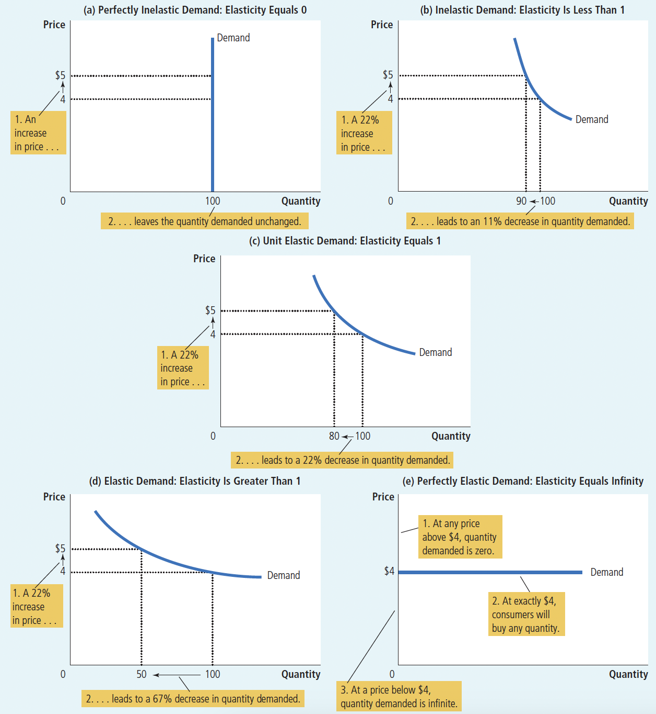
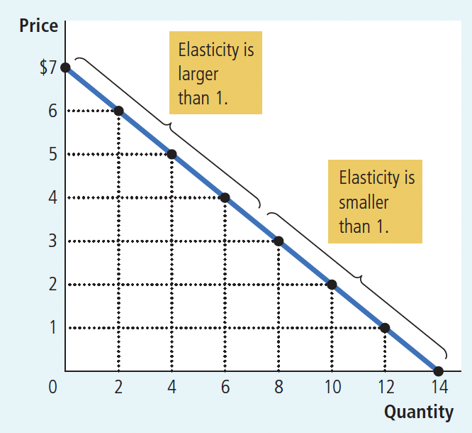
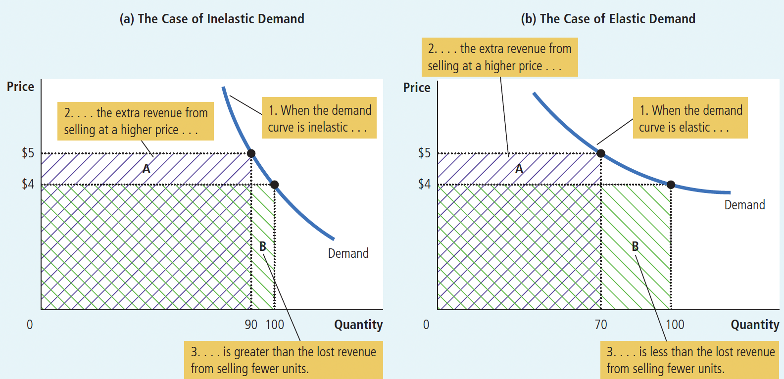
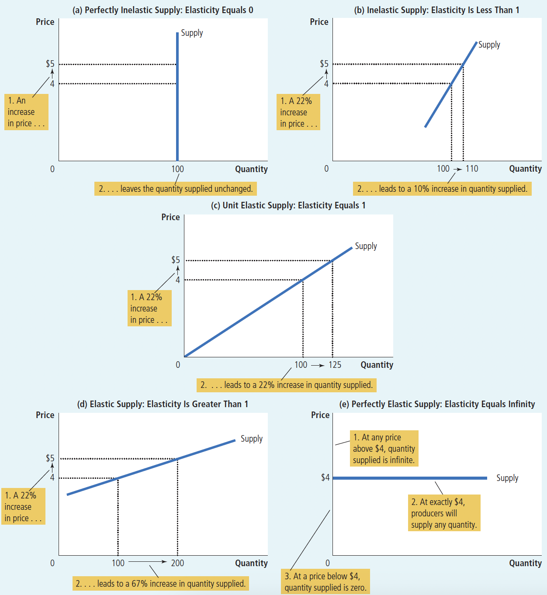

# Ch5 Elasticity and Its Application

$~$

Based on the content of Chapter 4, The Law of Demand states that as price rises, quantity demanded falls. The Law of Supply states that as price rises, quantity supplied increases. So how do we quantitatively study these changes? Using the concept of elasticity, including demand elasticity and price elasticity

$~$

## 5.1 Elasticity of Demand

$~$

The first type of demand elasticity is **price elasticity of demand**: it measures the sensitivity of the quantity demanded of a good to changes in its own price.

$~$

$$
\text { price elasticity of demand }=\frac{\text { percentage change in quantity demanded }}{\text { percentage change in price }}
$$

$~$

> The economic meaning of price elasticity of demand can be expressed as "when the price changes by one percent, how many percent the quantity demanded might change"
>
> All price elasticities of demand are expressed as positive numbers; if the result is negative, take the absolute value
>

$~$

Factors affecting price elasticity of demand:

+ Availability of close substitutes
  + Items with close substitutes tend to have elastic demand because consumers can easily switch from this item to others
  
+ Necessities versus luxuries
  + The demand for necessities tends to be inelastic, while the demand for luxuries tends to be elastic
  
+ Market definition
  + The demand elasticity for narrowly defined markets tends to be greater than for broadly defined markets, as it's easier to find close substitutes in narrowly defined markets
  
+ Time horizon
  + Generally, the demand for goods tends to be more elastic in the long run
  

$~$

The Midpoint Method: A Better Way to Calculate Percentage Changes and Elasticities

$~$

> When calculating the price elasticity of demand between two points on a demand curve, the result is different when calculated from point A to B versus from B to A, because the basis for calculating percentage changes is different. Therefore, we use the midpoint method to calculate the price elasticity of demand between points $(P_1，Q_1)$ and $(P_2，Q_2)$, with the formula:
>

$~$

$$
\text { price elasticity of demand }=\frac{\left(Q_2-Q_1\right) /\left[\left(Q_2+Q_1\right) / 2\right]}{\left(P_2-P_1\right) /\left[\left(P_2+P_1\right) / 2\right]}
$$

Numerator: Percentage change in quantity calculated using the midpoint method, change in quantity ÷ midpoint quantity

Denominator: Percentage change in price calculated using the midpoint method, change in price ÷ midpoint price

This ensures the same result whether calculating from point A to B or from B to A

$~$

> In reality, even the midpoint method is not used much; we mainly focus on the meaning of elasticity—the degree of response of quantity demanded to price changes, rather than how to calculate elasticity

$~$

The relationship between the demand curve and price elasticity of demand: The flatter the demand curve through a certain point, the greater the price elasticity of demand; the steeper the demand curve through a certain point, the smaller the price elasticity of demand.

$~$

Figure 5.1 The Price Elasticity of Demand

(a) If $\mathrm{E}_{\mathrm{d}}=0$, the demand for the good is said to be perfectly inelastic

(b) If $0<E_d<1$, the demand for the good is said to be relatively inelastic, like most necessities

(c) If $\mathrm{E}_{\mathrm{d}}=1$, the demand for the good is said to have unit elasticity. In this case, the relative change in quantity demanded equals the relative change in price

(d) If $1<\mathrm{E}_{\mathrm{d}}<\infty$, the demand for the good is said to be relatively elastic. Like most luxury goods

(e) If $\mathrm{E}_{\mathrm{d}}=\infty$, the demand for the good is said to be perfectly elastic

$~$

figure 5.4 Elasticity along a Linear Demand Curve 

For a linear demand curve, although the slope is constant everywhere, the elasticity is not equal. This is because:

$\text { price elasticity of demand }=\frac{\left(Q_2-Q_1\right) /\left[\left(Q_2+Q_1\right) / 2\right]}{\left(P_2-P_1\right) /\left[\left(P_2+P_1\right) / 2\right]}$

Although $\frac{\left(Q_2-Q_1\right)}{\left(P_2-P_1\right) }$ is constant everywhere, $\frac{\left[\left(Q_2+Q_1\right) / 2\right]}{\left[\left(P_2+P_1\right) / 2\right]}$ changes everywhere

$~$

**The relationship between total revenue and price elasticity of demand:**

**Total revenue**: The total income a firm receives from selling a certain quantity of products at a certain price

It equals the price of a unit product $P$ multiplied by the sales volume $Q$, i.e., $\mathrm{TR}=\mathrm{P} \cdot \mathrm{Q}$

$~$

Figure 5.3 How Total Revenue Changes When Price Changes

+ (a) When price elasticity of demand is less than 1, total revenue changes in the same direction as price; because when price increases, the decrease in quantity demanded < the increase in price

+ (b) When price elasticity of demand is greater than 1, total revenue changes in the opposite direction to price; because when price increases, the decrease in quantity demanded > the increase in price

$~$

Other demand elasticities

**Income elasticity of demand**: Measures the sensitivity of the relative change in quantity demanded of a good to the relative change in consumer **income**

$~$

$$
\text { Income elasticity of demand }=\frac{\text { Percentage change in quantity demanded }}{\text { Percentage change in income }}
$$

+ Normal goods: Goods with income elasticity of demand greater than zero. The quantity demanded of normal goods increases as income levels increase
+ Inferior goods: Goods with income elasticity of demand less than zero. The quantity demanded of inferior goods decreases as income levels increase

> Among normal goods, those with 0 $<\mathrm{EM}<1$ are necessities, those with $\mathrm{EM}>1$ are luxury goods

$~$

**Cross-price elasticity of demand**: Measures the sensitivity of the relative change in quantity demanded of one good to the relative change in the **price of another good**

$~$

$$
\text { Cross-price elasticity of demand }=\frac{\text { Percentage change in quantity demanded of good 1 }}{\text { Percentage change in price of good 2 }}
$$

+ If cross-price elasticity of demand > 0, goods 1 and 2 are substitutes. For example, rice and flour; a rise in rice price will lead to an increase in flour consumption

+ If cross-price elasticity of demand < 0, goods 1 and 2 are complements. For example, cars and gasoline; a rise in gasoline price will lead to a decrease in car consumption

+ If cross-price elasticity of demand = 0, goods 1 and 2 are unrelated. For example, eggs and light bulbs are two unrelated products; changes in egg prices have no effect on light bulb consumption

$~$

## 5.2 The Elasticity of Supply

**Price Elasticity of Supply**: A measure of the sensitivity of quantity supplied to changes in price

$~$

$$
\text{Price Elasticity of Supply} = \frac{\text{Percentage Change in Quantity Supplied}}{\text{Percentage Change in Price}}
$$
$~$

The price elasticity of supply often depends on the length of time considered. In most markets, supply is more elastic in the long run than in the short run. This is because in the short run, producers find it difficult to quickly adjust their production scale to increase or decrease supply. However, in the long run, producers can build new factories or shut down production to change output in response to changes in demand. Therefore, long-term output is more sensitive to price changes, and the long-run price elasticity of supply is greater than the short-run elasticity.

$~$

> Since the price elasticity of supply measures the degree of response of quantity supplied to price, the price elasticity of supply determines whether the supply curve is steep or flat.

$~$

Figure 5.5 The Price Elasticity of Supply: Shape of supply curves under different price elasticities of supply

(a) If $E_s = 0$, the supply of the good is said to be perfectly inelastic, such as rare antiques.

(b) If $0 < E_s < 1$, the supply of the good is said to be inelastic, such as most agricultural products.

(c) If $E_s = 1$, the supply of the product is said to have unit elasticity.

(d) If $1 < E_s < \infty$, the supply of the product is said to be elastic, such as most industrial goods.

(e) If $E_s = \infty$, the supply of the good is said to be perfectly elastic.

$~$

## 5.3 Three Applications of Supply, Demand, and Elasticity

$~$

Example 1: Why Good News for Farming May Be Bad News for Farmers

Agricultural product market:

+ Technological progress shifts the supply curve for agricultural products to the right

+ However, the demand for food is usually inelastic (steep demand curve) because food is not expensive and is a necessity

+ As a result, the rightward shift of the supply curve causes a large decrease in the equilibrium price and a small increase in the equilibrium quantity supplied

+ Therefore, it is inevitable that technological progress in agriculture reduces the total revenue of the farming group

$~$

Example 2 Why Did OPEC Fail to Keep the Price of Oil High?

Oil market:

+ The Organization of Petroleum Exporting Countries (OPEC) reduced oil production to raise oil prices

+ In the short run, the demand for oil is inelastic (steep demand curve) because consumers cannot easily find substitutes. Therefore, the reduction in supply greatly increased the price and increased producers' total revenue

+ However, in the long run, consumers found substitutes and used more fuel-efficient cars, making oil demand more elastic. Additionally, producers found more oil, making the supply curve more elastic

+ As a result, oil prices rose significantly in the short run but fell back somewhat in the long run

$~$

Example 3 Does Drug Interdiction Increase or Decrease Drug-Related Crime?

Illegal drug market:

+ In the short run, the demand for illegal drugs is inelastic
+ As a result, anti-drug policies aimed at reducing drug supply often cause drug prices to rise significantly while consumption decreases only slightly, thus increasing the total expenditure of drug users. This requires drug users to increase their funds, leading to an increase in drug-related crimes
+ In the long run, this increase in total expenditure and crime is less because over time, the demand for these illegal drugs becomes more elastic. In other words, policies aimed at reducing drug demand decrease the total revenue in the drug market and reduce drug-related crimes.

## Quick Quiz

1. A life-saving medicine without any close substitutes will tend to have
a. a small elasticity of demand.
b. a large elasticity of demand.
c. a small elasticity of supply.
d. a large elasticity of supply.
2. The price of a good rises from $\$ 8$ to $\$ 12$, and the quantity demanded falls from 110 to 90 units. Calculated with the midpoint method, the price elasticity of demand is
a. $1 / 5$.
b. $1 / 2$.
c. 2 .
d. 5 .

3. A linear, downward-sloping demand curve is
a. inelastic
b. unit elastic.
c. elastic.
d. inelastic at some points, and elastic at others.
4. The ability of firms to enter and exit a market over time means that, in the long run,
a. the demand curve is more elastic.
b. the demand curve is less elastic.
c. the supply curve is more elastic.
d. the supply curve is less elastic.
5. An increase in the supply of a good will decrease the total revenue producers receive if
a. the demand curve is inelastic.
b. the demand curve is elastic.
c. the supply curve is inelastic.
d. the supply curve is elastic.
6. Over time, technological advance increases consumers' incomes and reduces the price of smartphones. Each of these forces increases the amount consumers spend on smartphones if the income elasticity of demand is greater than $\qquad$ and if the price elasticity of demand is greater than $\qquad$
a. zero, zero
b. zero, one
c. one, zero
d. one, one

## SUMMARY

- The price elasticity of demand measures how much the quantity demanded responds to changes in the price. Demand tends to be more elastic if close substitutes are available, if the good is a luxury rather than a necessity, if the market is narrowly defined, or if buyers have substantial time to react to a price change.
- The price elasticity of demand is calculated as the percentage change in quantity demanded divided by the percentage change in price. If quantity demanded moves proportionately less than the price, then the elasticity is less than 1 and demand is said to be inelastic. If quantity demanded moves proportionately more than the price, then the elasticity is greater than 1 and demand is said to be elastic.
- Total revenue, the total amount paid for a good, equals the price of the good times the quantity sold. For inelastic demand curves, total revenue moves in the same direction as the price. For elastic demand curves, total revenue moves in the opposite direction as the price.
- The income elasticity of demand measures how much the quantity demanded responds to changes in consumers' income. The cross-price elasticity of demand measures how much the quantity demanded of one good responds to changes in the price of another good.
- The price elasticity of supply measures how much the quantity supplied responds to changes in the price. This elasticity often depends on the time horizon under consideration. In most markets, supply is more elastic in the long run than in the short run.
- The price elasticity of supply is calculated as the percentage change in quantity supplied divided by the percentage change in price. If quantity supplied moves proportionately less than the price, then the elasticity is less than 1 and supply is said to be inelastic. If quantity supplied moves proportionately more than the price, then the elasticity is greater than 1 and supply is said to be elastic.
- The tools of supply and demand can be applied in many different kinds of markets. This chapter uses them to analyze the market for wheat, the market for oil, and the market for illegal drugs.

## QUESTIONS FOR REVIEW

1. Define the price elasticity of demand and the income elasticity of demand.
2. List and explain the four determinants of the price elasticity of demand discussed in the chapter.
3. If the elasticity is greater than 1 , is demand elastic or inelastic? If the elasticity equals zero, is demand perfectly elastic or perfectly inelastic?
4. On a supply-and-demand diagram, show equilibrium price, equilibrium quantity, and the total revenue received by producers.
5. If demand is elastic, how will an increase in price change total revenue? Explain.
6. What do we call a good with an income elasticity less than zero?
7. How is the price elasticity of supply calculated? Explain what it measures.
8. If a fixed quantity of a good is available, and no more can be made, what is the price elasticity of supply?
9. A storm destroys half the fava bean crop. Is this event more likely to hurt fava bean farmers if the demand for fava beans is very elastic or very inelastic? Explain.

## PROBLEMS AND APPLICATIONS

1. For each of the following pairs of goods, which good would you expect to have more elastic demand and why?
a. required textbooks or mystery novels
b. Beethoven recordings or classical music recordings in general
c. subway rides during the next 6 months or subway rides during the next 5 years
d. root beer or water
2. Suppose that business travelers and vacationers have the following demand for airline tickets from New York to Boston:
\begin{tabular}{rcc} 
Price & \begin{tabular}{c} 
Quantity Demanded \\
(business travelers)
\end{tabular} & \begin{tabular}{c} 
Quantity Demanded \\
(vacationers)
\end{tabular} \\
\hline$\$ 150$ & 2,100 tickets & 1,000 tickets \\
200 & 2,000 & 800 \\
250 & 1,900 & 600 \\
300 & 1,800 & 400
\end{tabular}
a. As the price of tickets rises from $\$ 200$ to $\$ 250$, what is the price elasticity of demand for (i) business travelers and (ii) vacationers? (Use the midpoint method in your calculations.)
b. Why might vacationers have a different elasticity from business travelers?
3. Suppose the price elasticity of demand for heating oil is 0.2 in the short run and 0.7 in the long run.
a. If the price of heating oil rises from $\$ 1.80$ to $\$ 2.20$ per gallon, what happens to the quantity of heating oil demanded in the short run? In the long run?
(Use the midpoint method in your calculations.) b. Why might this elasticity depend on the time horizon?
4. A price change causes the quantity demanded of a good to decrease by 30 percent, while the total revenue of that good increases by 15 percent. Is the demand curve elastic or inelastic? Explain.
5. Cups of coffee and donuts are complements. Both have inelastic demand. A hurricane destroys half the coffee bean crop. Use appropriately labeled diagrams to answer the following questions.
a. What happens to the price of coffee beans?
b. What happens to the price of a cup of coffee? What happens to total expenditure on cups of coffee?
c. What happens to the price of donuts? What happens to total expenditure on donuts?
6. The price of coffee rose sharply last month, while the quantity sold remained the same. Five people suggest various explanations:

Leonard: Demand increased, but supply was perfectly inelastic.
Sheldon: Demand increased, but it was perfectly inelastic.
Penny: Demand increased, but supply decreased at the same time.
Howard: Supply decreased, but demand was unit elastic.
RaJ: Supply decreased, but demand was perfectly inelastic.

Who could possibly be right? Use graphs to explain your answer.
