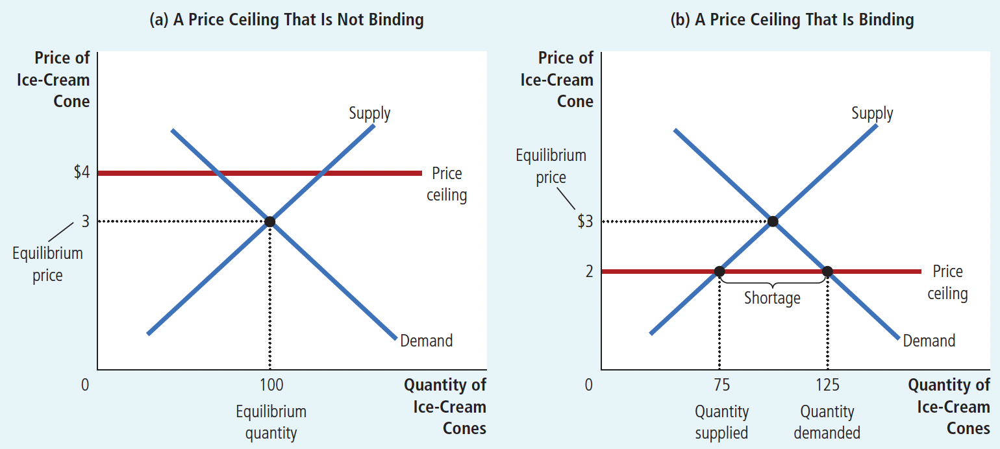

# Ch06 Supply, Demand and Government Policies

## 6.1 Price Controls

**Price ceiling**: The legal maximum price for a good. e.g., rent controls

**Price floor**: The legal minimum price for a good. e.g., agricultural price supports, minimum wages

$~$

**How Price Ceilings Affect Market Outcomes:**

+ **Non-binding price ceiling** (as shown in Figure 6.1(a)): If the price ceiling is above the equilibrium price, it has no effect on price or quantity sold.
+ **Binding price ceiling** (as shown in Figure 6.1(b)): If the price ceiling is below the equilibrium price, it causes the economy to deviate from equilibrium, resulting in quantity demanded exceeding quantity supplied, leading to a shortage.

Figure 6-1 A Market with a Price Ceiling

> When the government imposes a binding price ceiling on a competitive market, a shortage of the good arises, and sellers must ration the scarce goods among the large number of potential buyers

$~$

**Price Ceiling in the Short Run and in the Long Run:**

In the short run,

+  supply and demand are inelastic. 

  + Landlords have a fixed number of apartments to rent, and they cannot adjust this number quickly as market conditions change.

  + The number of people searching for housing in a city may not be highly responsive to rents in the short run because people take time to adjust their housing arrangements.

+ The initial shortage caused by rent control is small. The primary effect in the short run is to reduce rents.

$~$

In the long run,

+ supply and demand are more elastic.

  + Landlords respond to low rents by not building new apartments and by failing to maintain existing ones.

  + Low rents encourage people to find their own apartments

+ Rent control causes a large shortage

Figure 6.3 Rent Control in the Short Run and in the Long Run

$~$

**How Price Floors Affect Market Outcomes:**

+ **Non-binding price floor** (as shown in Figure 6.4(a)): If the price floor is below the equilibrium price, it has no effect on price or quantity sold.
+ **Binding price floor** (as shown in Figure 6.4(b)): If the price floor is above the equilibrium price, it causes the economy to deviate from equilibrium, resulting in the final price equaling the level set by the price floor, with quantity supplied exceeding quantity demanded, leading to a surplus.

Figure 6.4 A Market With a Price Floor

$~$

## 6.2 The Effects of Taxation

**Tax incidence**: Refers to the final distribution of the tax burden, or the ultimate result of tax shifting.

Next, we use supply and demand tools to analyze how the tax burden is distributed.

First, let's analyze how taxing sellers affects market outcomes.

$~$

Figure 6.6 A Tax on Sellers

+ The demand curve is not affected; the tax on sellers shifts the supply curve to the left (or, equivalently, upward).

+ For any market price of ice cream, the effective price to sellers—the amount they get to keep after paying the tax—is \$0.50 lower. Sellers will supply a quantity of ice cream as if the price were \$0.50 lower than it is. 
+ To induce sellers **to supply any given quantity**, the market price must now be \$0.50 higher to compensate for the effect of the tax. The supply curve shifts upward from $S_1$ to $S_2$ by the exact size of the tax (\$0.50).

+ Compare the initial and the new equilibriums: the equilibrium price of ice cream rises from \$3.00 to \$3.30, and the equilibrium quantity falls from 100 to 90 cones.

Implications:

+ Taxes discourage market activity. When a good is taxed, the quantity of the good sold is smaller in the new equilibrium.
+ Buyers and sellers share the burden of taxes. In the new equilibrium, buyers pay more for the good, and sellers receive less.

$~$

Figure 6.7 A Tax on Buyers

+ The supply curve is not affected; the tax on buyers shifts the demand curve to the left (or, equivalently, downward).

+ The effective price to buyers is now $0.50 higher than the market price (whatever the market price happens to be).
+ To induce buyers **to demand any given quantity**, the market price must now be \$0.50 lower to make up for the effect of the tax. Thus, the tax shifts the demand curve downward from $D_1$ to $D_2$ by the exact size of the tax (\$0.50).

+ Compare the initial equilibrium and the new equilibrium: the equilibrium price of ice cream falls from \$3.00 to \$2.80, and the equilibrium quantity falls from 100 to 90 cones.

Implications:

+ Taxes discourage market activity. When a good is taxed, the quantity of the good sold is smaller in the new equilibrium.
+ Buyers and sellers share the burden of taxes. In the new equilibrium, buyers pay more for the good, and sellers receive less.

$~$

Taxes levied on sellers and taxes levied on buyers are equivalent. In both cases, the tax places a wedge between the price that buyers pay and the price that sellers receive.

The same equilibrium result will be reached, with the tax burden distributed between producers and consumers. Taxation reduces the equilibrium quantity of the good, increases the price paid by buyers, decreases the price received by sellers, and generates tax revenue for the government.

The only difference between a tax levied on sellers and a tax levied on buyers is who sends the money to the government.

$~$

**Elasticity and Tax Incidence:**

From the previous section, we know that the tax burden is shared by both sellers and buyers.

However, the impact on each party differs. The elasticity of demand and supply determines how the tax burden is distributed between buyers and sellers, with the tax burden falling more heavily on the less elastic side of the market.

This is because elasticity actually measures the willingness of buyers or sellers to leave the market when conditions become unfavorable. Low demand elasticity means buyers haven't found suitable substitutes for consuming this good. Low supply elasticity means sellers haven't found suitable alternatives to producing this good. When a tax is imposed on such a good, the side of the market with fewer choices can't easily leave and thus must bear a larger share of the tax burden.

$~$

Figure 6.9(a) Taxation in a market with elastic supply and inelastic demand

Sellers are very sensitive to the price of the good, resulting in a relatively flat supply curve; while buyers are very insensitive, resulting in a steeper demand curve.

When a tax is imposed on a market with such elasticities, the price received by sellers decreases only slightly, so sellers bear a smaller burden; while the price paid by buyers increases significantly, so buyers bear most of the tax burden.

$~$

Figure 6.9(b) Taxation in a market with inelastic supply and elastic demand.

Sellers are very insensitive to the price of the good, resulting in a steeper supply curve; while buyers are very sensitive, resulting in a relatively flat demand curve.

When a tax is imposed on a market with such elasticities, the price paid by buyers increases only slightly, while the price received by sellers decreases significantly. Therefore, sellers bear most of the tax burden.
