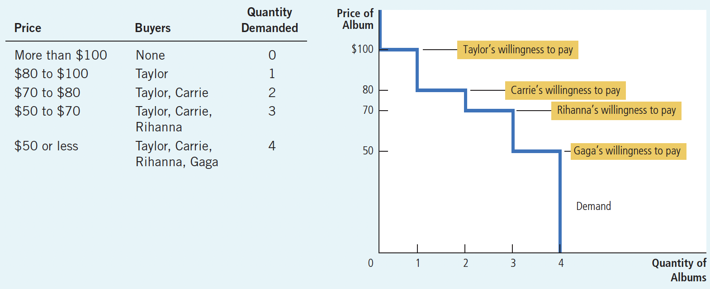
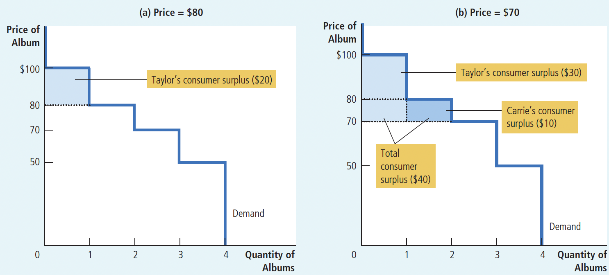
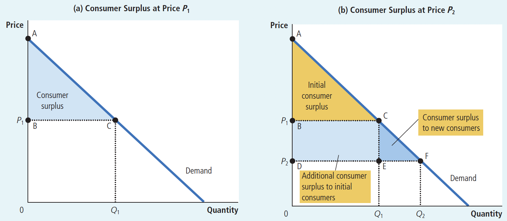
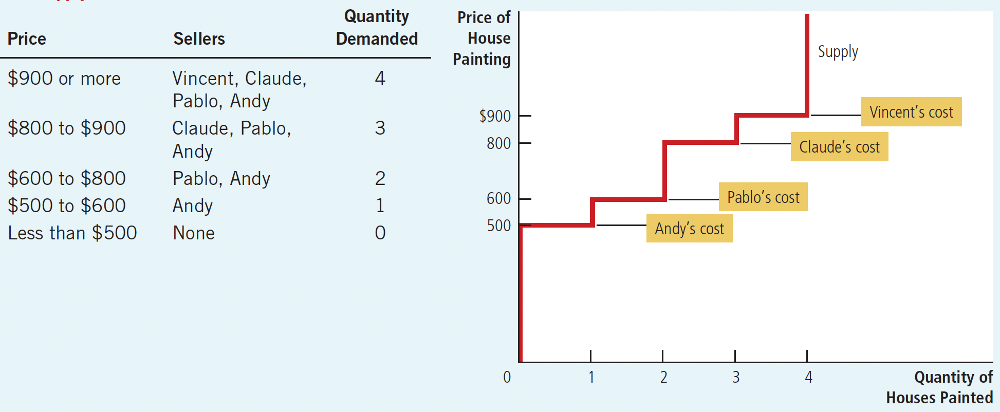
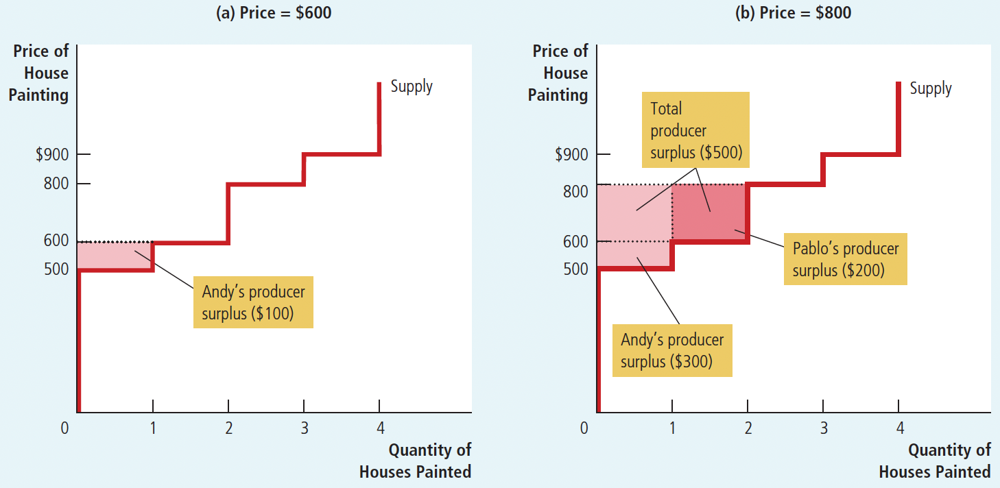
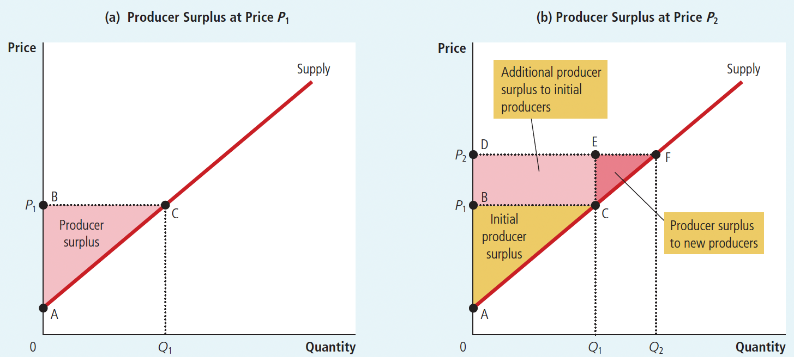
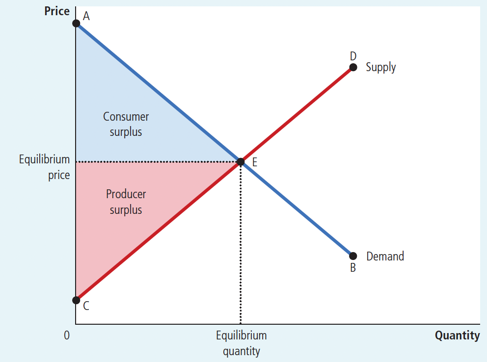
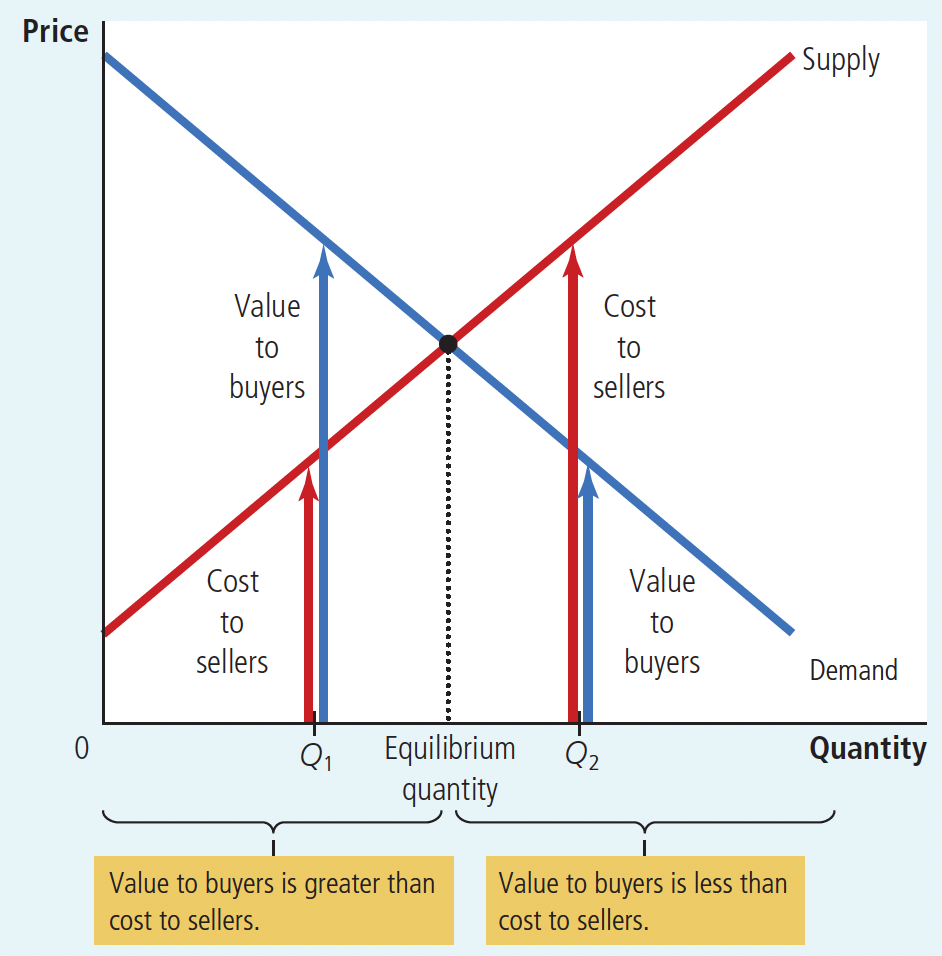

1. # Ch07 Consumers, Producers and the Efficiency of Markets

In this chapter, we take up the topic of **welfare economics**.

**welfare economics**: the study of how the allocation of resources affects economic well-being

>We begin by examining the benefits that buyers and sellers receive from engaging in market transactions.
>
>We then examine how society can make these benefits as large as possible.
>
>This analysis leads to a profound conclusion: In any market, the equilibrium of supply and demand maximizes the total benefits received by all buyers and sellers combined.

$~$

## 7.1 Consumer Surplus

**willingness to pay**: the maximum amount that a buyer will pay for a good

+ Each buyer would be eager to buy the good at a price less than their willingness to pay
+ refuse to buy the good at a price greater than their willingness to pay
+ At a price equal to their willingness to pay, the buyer would be indifferent about buying the good

**consumer surplus**: the amount a buyer is willing to pay for a good minus the amount the buyer actually pays for it

$~$

**Measuring Consumer Surplus with the Demand Curve:**

Calculating consumer surplus: Find the area below the demand curve and above the price(as shown in figure 7.1 and figure 7.2)

$~$

Figure 7.1 The Demand Schedule and the Demand Curve

$~$

Figure 7.2 Measuring Consumer Surplus with the Demand Curve

In panel (a), the price of the good is \$80 and the consumer surplus is \$20.

In panel (b), the price of the good is \$70 and the consumer surplus is \$40.

$~$

**Price Decrease Can Increase Consumer Surplus:**

When the price of a good decreases, consumer surplus increases for two reasons:

1. Existing consumers can pay less for the quantity they want to purchase, thus gaining more surplus(as shown in figure 7.3(a))
2. New buyers enter the market as the price is now below their willingness to pay, creating new consumer surplus(as shown in figure 7.3(b))

Figure 7.3 How Price Affects Consumer Surplus

+ In panel (a), the price is $P_1$, the quantity demanded is $Q_1$, and consumer surplus equals the area of the triangle ABC

+ When the price falls from $P_1$ to $P_2$, as in panel (b), the quantity demanded rises from $Q_1$ to $Q_2$ and the consumer surplus rises to the area of the triangle ADF. The increase in consumer surplus (area BCFD) occurs...

  + in part because existing consumers now pay less (area BCED) and

  + in part because new consumers enter the market at the lower price (area CEF).

$~$

**What Does Consumer Surplus Measure:**

+ Consumer surplus measures the benefit that buyers receive from a good as the buyers themselves perceive it.
+ Thus, consumer surplus is a good measure of economic well-being of buyers.

$~$

## 7.2 Producer Surplus

**Producer Surplus:** the amount a seller is paid for a good minus the seller's **cost** of providing it

**Cost:** the value of everything a seller must give up to produce a good

>Here the term cost should be interpreted as the opportunity cost: It includes the out-of-pocket expenses as well as the value that the painters place on their own time.

Cost is the minimum value that sellers are willing to accept to produce goods.

Therefore, producer surplus is also: 

the total payment sellers actually receive for providing a certain quantity of a product

minus 

the minimum total payment they are willing to accept.

$~$

**Measuring Producer Surplus with the Supply Curve:**

Calculating producer surplus: Find the area above the supply curve and below the price(as shown in figure 7.4 and figure 7.5)

$~$

Figure 7.4 The Supply Schedule and the Suply Curve

$~$

Figure 7.5 Measuring Producer Surplus with the Supply Curve

In panel (a), the price of the good is \$600 and the producer surplus is \$100.

In panel (b), the price of the good is \$800 and the producer surplus is \$500.

$~$

**Price Increase Can Increase Producer Surplus:**

This increase in producer surplus consists of two parts:

1. Existing sellers can receive more benefit for the quantity they want to sell(as shown in figure 7.6(a))
2. Some new sellers enter the market, creating new producer surplus(as shown in figure 7.6(b))

$~$

Figure 7.6 How Price Affects Producer Surplus

+ In panel (a), the price is $P_1$, the quantity supplied is $Q_1$, and producer surplus equals the area of the triangle ABC.
+ When the price rises from $P_1$ to $P_2$, as in panel (b), the quantity supplied rises from $Q_1$ to $Q_2$ and the producer surplus rises to the area of the triangle ADF. The increase in producer surplus (area BCFD) occurs...
  + in part because existing producers now receive more (area BCED) 
  + in part because new producers enter the market at the higher price (area CEF).

$~$

We use producer surplus to measure the well-being of sellers.
(the same way as we use consumer surplus to measure the well-being of buyers.)

>Because these two measures of economic welfare are so similar, we use them together in the next section.

$~$

## 7.3 Market Efficiency

How to measure the economic well-being of a society?

One possible measure is **total surplus**, the sum of consumer and producer surplus.

+ Consumer surplus is the benefit that buyers receive from participating in a market.

+ Producer surplus is the benefit that sellers receive.

It is therefore natural to use total surplus as a measure of society's economic well-being.

$~$

Figure 7.7 Consumer and Producer Surplus in the Market Equilibrium

Consumer surplus = Value to buyers - Amount paid by buyers

Producer surplus = Amount received by sellers - Cost to sellers

Total surplus = (Value to buyers - Amount paid by buyers) + (Amount received by sellers - Cost to sellers) = **Value to buyers - Cost to sellers**

>When we discuss social welfare, we discuss not only **efficiency** but also **equity**:
>
>**efficiency**: the property of a resource allocation of maximizing the total surplus received by all members of society
>
>**equity:** the property of distributing economic prosperity uniformly among the members of society

$~$

The resource allocation that maximizes the sum of consumer and producer surplus can be said to be efficient. The quantity produced in a free market is the quantity that maximizes the sum of consumer and producer surplus.

**Evaluating the Market Equilibrium:**

1. Free markets allocate the supply of goods to the buyers who value them most highly, as measured by their willingness to pay.

2. Free markets allocate the demand for goods to the sellers who can produce them at the lowest cost.

3. Free markets produce the quantity of goods that maximizes the sum of consumer and producer surplus.

>From 1. and 2., we know that given the quantity produced and sold in a market equilibrium, the social planner cannot increase economic well-being by changing the allocation of consumption among buyers or the allocation of production among sellers.
>
>From 3., the social planner can't raise total economic well-being by increasing or decreasing the quantity of the good.

Figure 7.8 illustrates why insight 3 is true

$~$

Figure 7.8 The Efficiency of the Equilibrium Quantity

In summary, these three observations about market outcomes tell us that the market outcome (equilibrium of supply and demand) maximizes the sum of consumer and producer surplus.

> In this case,
>
> "Market outcome" = "Equilibrium of supply and demand"
>
> "Maximization of the sum of consumer and producer surplus" = "Efficient allocation of resources"

In other words, the "invisible hand" in the market guides buyers and sellers to efficiently allocate resources.

$~$

## 7.4 Conclusion: Market Efficiency and Market Failure

There are two reasons why free markets may be inefficient:

1. Markets may be imperfectly competitive. If individual buyers or sellers (or a small group) can influence prices, they have market power and can cause prices and quantities to deviate from equilibrium.

2. Markets can have negative externalities that affect people who are not participating in the market at all. Buyers and sellers in the market do not consider negative effects such as pollution, which can lead to market equilibrium that may not be efficient for the entire society.