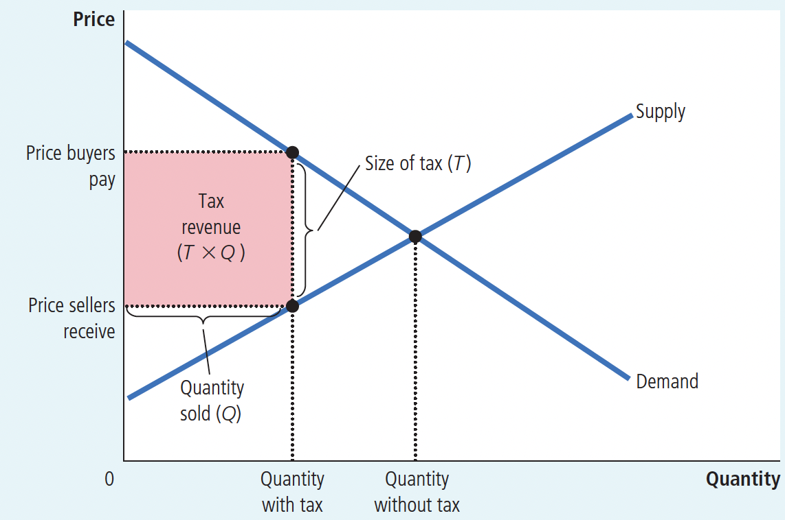
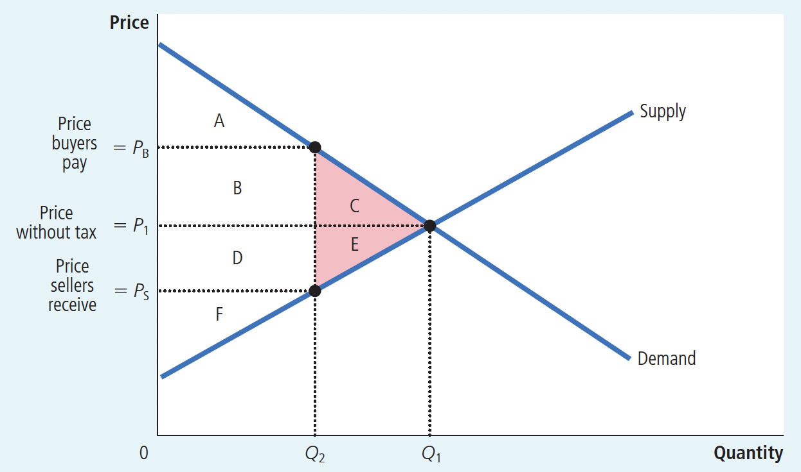
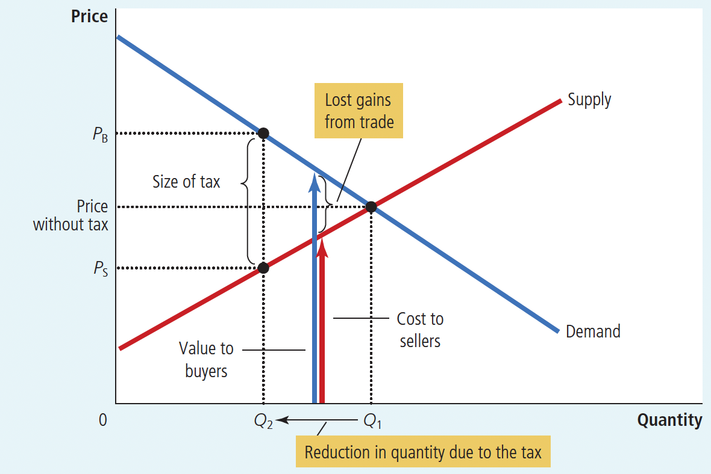
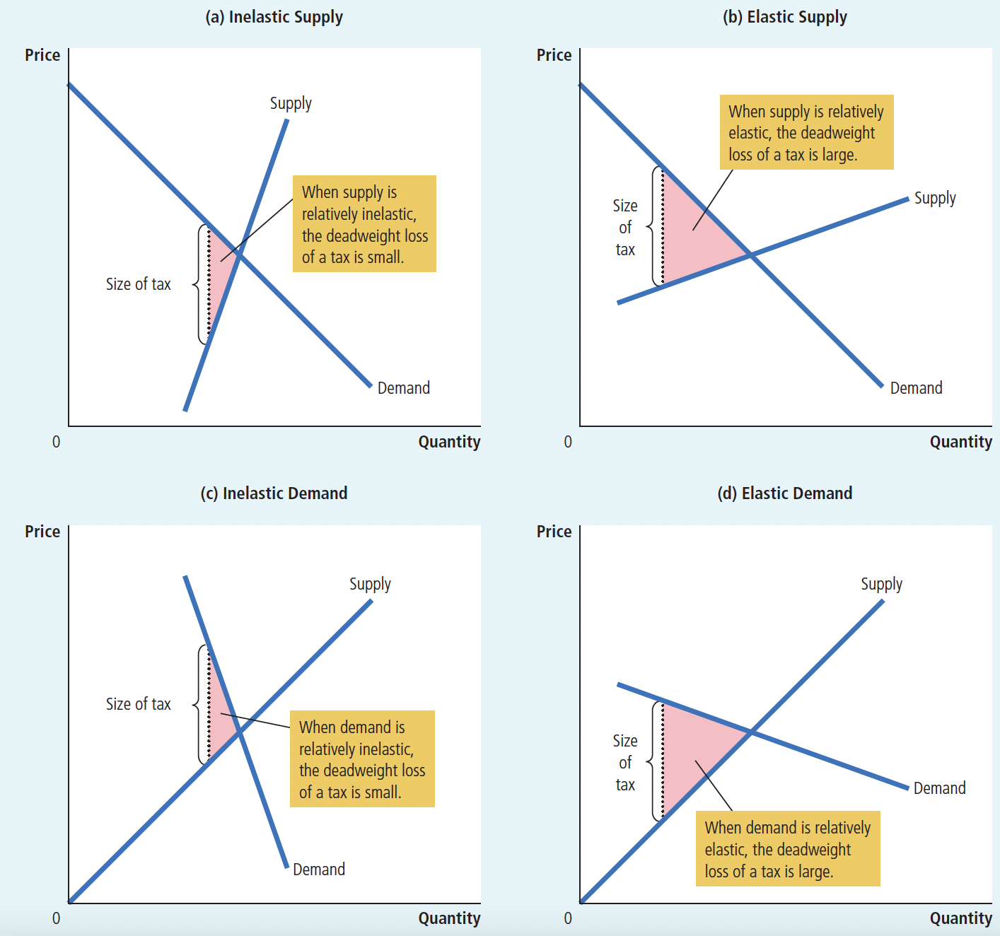
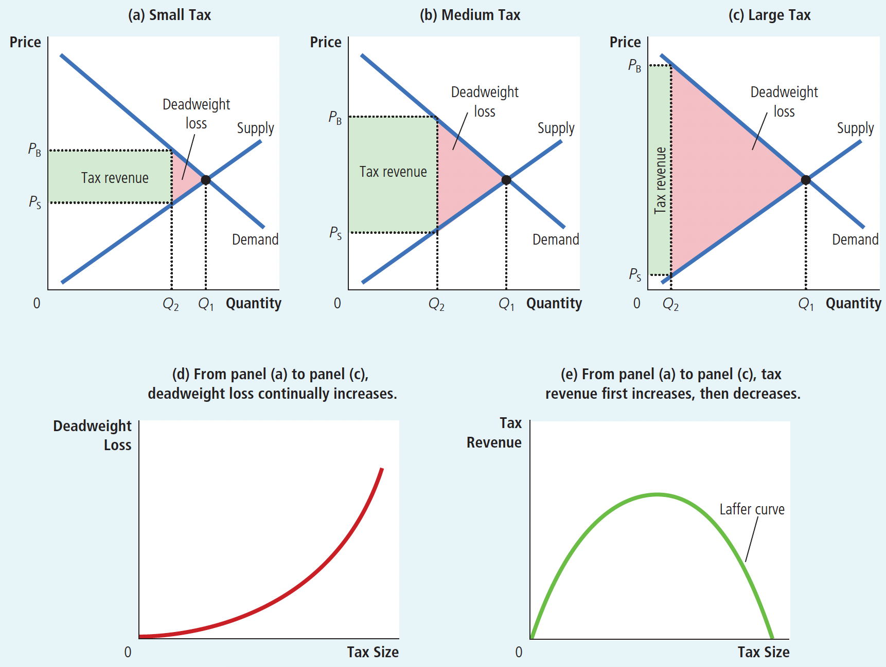

# Ch08: Application: The Costs of Taxation

## 8.1 The Deadweight Loss of Taxation

**Deadweight loss:** the fall in total surplus that results from a market distortion(*such as a tax*).

$~$

**How a Tax Affects Market Participants:**

$~$

First, we introduce the concept of tax revenue(as shown in Figure 8.2)

Figure 8.2 Tax Revenue

The tax revenue that the government collects equals $T \times Q$ (the size of the tax T times the quantity sold Q)

$~$

Figure 8.3 How a Tax Affects Welfare

|                  | Without Tax   | With Tax  | Change   |
| ---------------- | ------------- | --------- | -------- |
| Consumer Surplus | $A+B+C$       | $A$       | $-(B+C)$ |
| Producer Surplus | $D+E+F$       | $F$       | $-(D+E)$ |
| Tax Revenue      | None          | $B+D$     | $+(B+D)$ |
| Total Surplus    | $A+B+C+D+E+F$ | $A+B+D+F$ | $-(C+E)$ |

The area C + E shows the fall in total surplus and is the deadweight loss of the tax.

$~$

Induction:

+ Markets usually allocate scarce resources efficiently. This means that, supply and demand equilibrium maximizes the total surplus of buyers and sellers in the market.
+ However, when a tax raises the price buyers pay and lowers the price sellers receive, it gives buyers an incentive to consume less and sellers an incentive to produce less than they would without the tax.
+ As buyers and sellers respond to these incentives, the size of the market shrinks below its optimum level.
+ Thus, taxes distort incentives and cause market resource allocation to be inefficient.

$~$

**Deadweight losses and the gains from trade:**

$~$

Figure 8.4 The Source of a Deadweight Loss

When the government imposes a tax on a good, the quantity sold falls from $Q_1$ to $Q_2$ . At every quantity between $Q_1$ and $Q_2$ , the potential gains from trade among buyers and sellers are not realized. These lost gains from trade create the deadweight loss.

Induction:

+ When the government taxes a good, the quantity sold decreases. As a result, some of the potential benefits of trade between buyers and sellers are not realized. The loss of these trade benefits causes the deadweight loss.

$~$

## 8.2 Determinants of the Deadweight Loss

The price elasticities of supply and demand determines whether the deadweight loss from a tax is large or small (as shown in Figure 8.5)

$~$

Figure 8.5 Tax Distortions and Elasticities

+ In panels (a) and (b), the demand curve and the size of the tax are the same, but the more elastic the supply curve, the larger the deadweight loss of the tax(the shaded area).
+ In panels (c) and (d), the supply curve and the size of the tax are the same, but the more elastic the demand curve, the larger the deadweight loss of the tax.

$~$

Why the price elasticities of supply and demand determines whether the deadweight loss from a tax is large or small? 

1. Taxes cause deadweight loss because they induce buyers and sellers to change their behavior.

   + The tax raises the price buyers pay, so they consume less.

   + The tax lowers the price sellers receive, so they produce less.

2. Because of these changes in behavior, the size of the market shrinks below the optimal level. 

3. The elasticities of demand and supply measure how much buyers and sellers respond to price changes, thus determining the extent to which the tax distorts the market outcome. Therefore, the larger the elasticities of supply and demand, the greater the deadweight loss of a tax.

> more elasticity $\rightarrow$ more behavior $\rightarrow$ more deadweight

$~$

## 8.3 Deadweight Loss and Tax Revenue

What happens to the deadweight loss and tax revenue when the size of a tax changes? (as shown in Figure 8.6)

>The deadweight loss is the reduction in total surplus due to the tax.
>
>Tax revenue is the amount of the tax multiplied by the amount of the good sold.

$~$

Figure 8.6 How Deadweight Loss and Tax Revenue Vary with the Size of a Tax

$~$

+ In panel (a), a small tax has a small deadweight loss and raises a small amount of revenue.
+ In panel (b), a somewhat larger tax has a larger deadweight loss and raises a larger amount of revenue.
+ In panel (c), a very large tax has a very large deadweight loss, but because it has reduced the size of the market so much, the tax raises only a small amount of revenue.
+ Panels (d) and (e) summarize these conclusions. Panel (d) shows that as the size of a tax grows larger, the deadweight loss grows larger.
+ Panel (e) shows that tax revenue first rises and then falls. This relationship is called the Laffer curve.

$~$

Induction

(1) The more taxes increase, the greater the distortion of incentives, and the more the deadweight loss increases.

>In fact, the deadweight loss of taxes increases faster than the size of the tax, because the deadweight loss increases with the square of the tax increase. For example, if the tax doubles, the deadweight loss quadruples.

(2) Tax revenue initially increases as the tax size expands, then decreases.

>This is because, at first, the increase in tax revenue is due to the tax collected from each unit being greater than the reduction in units sold.
>
>However, at some point, the continually increasing tax reduces the market size (sales and taxable scale) to such an extent that the government begins to collect high taxes on a small number of goods, causing tax revenue to start decreasing.

(3) The Laffer Curve(as shown in Figure 8.6(e) )

The basic meaning of the Laffer curve is that tax revenue does not always increase with higher tax rates. After a certain point, the total amount of tax not only fails to increase but may even decrease.
>This is because the factors determining tax revenue depend not only on the tax rate but also on the size of the tax base, i.e., the income of economic entities.
>
>Excessively high tax rates weaken the enthusiasm for economic activities of economic entities because with very high tax rates, enterprises only have minimal profits or even no profits. Enterprises will reduce production, lowering their income and thus reducing the tax base, causing tax sources to shrink and ultimately leading to a reduction in total tax revenue.

$~$

## 8.4 Conclusion

Taxes bring losses to market participants in two ways:

1. Resources are transferred from buyers and sellers to the government;
2. Taxes distort incentives, so fewer goods are produced and sold than without taxes, which means that taxes cause society to lose some of the benefits of an efficient market.