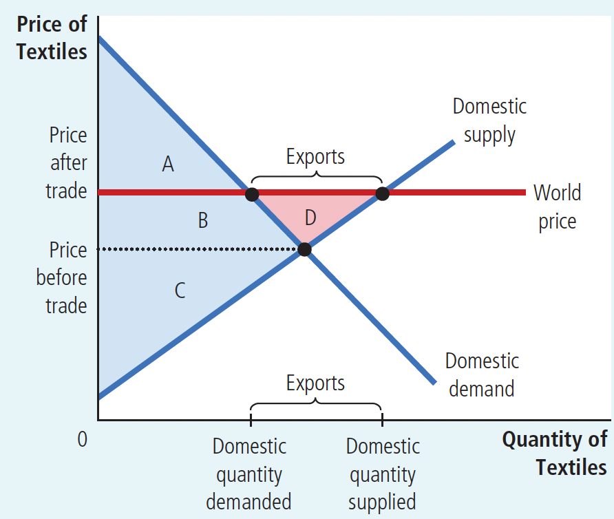
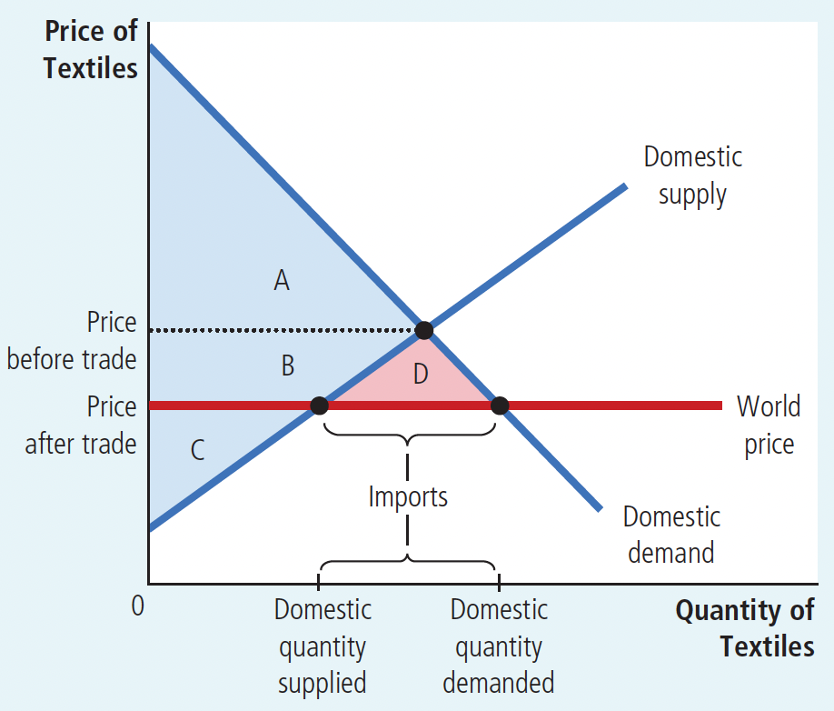
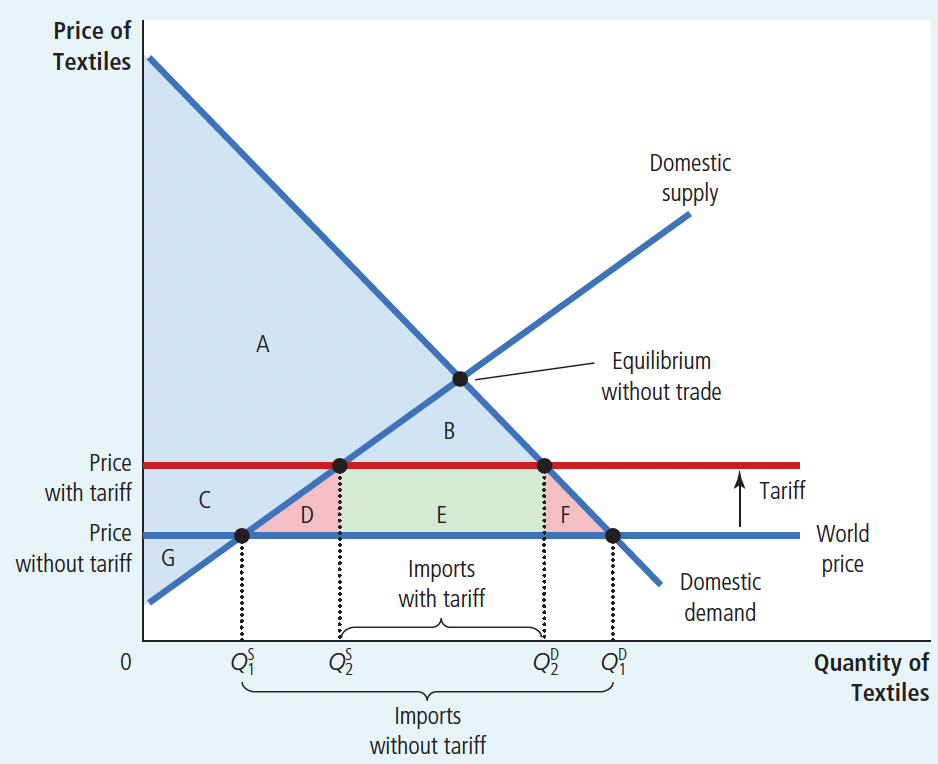

# Ch09 Application-The Costs of Taxation

**Factors Determining Trade:** world price， comparative advantage.

$~$

Without international trade, the market produces a domestic price that equalizes domestic supply and demand.

$~$

**world price**: the price of a good that prevails in the world market for that good

Therefore, by comparing the world price of a good before trade with its domestic price, one can discover whether the domestic country or other countries have a lower opportunity cost in producing that good, and thus which country has a comparative advantage in producing that good.

If the world price of a good is higher than its domestic price

+ the country has a comparative advantage in producing that good
+ should export it if trade is allowed.

If the world price of a good is lower than its domestic price

+ foreign countries have a comparative advantage in producing that good
+ it should be imported if trade is allowed.

$~$

**Effects of Trade:**

When a country allows trade and becomes an exporter of a good(As shown in Figure 9.2)

+ the producers of that good benefit
+ consumers are worse off.
+ the benefits of trade outweigh the losses, increasing the country's economic welfare.

$~$

Figure 9.2 International Trade in an Exporting Country

$~$

|                  | Before Trade | After Trade   | Change    |
| ---------------- | ------------ | ------------- | --------- |
| Consumer Surplus | A + B        | A             | - B       |
| Producer Surplus | C            | B + C + D     | + (B + D) |
| Total Surplus    | A + B + C    | A + B + C + D | **+ D**   |

> The area D shows the increase in total surplus and represents the gains from trade.

$~$

When a country allows trade and becomes an importer of a good(As shown in Figure 9.3)

+ consumers of that good benefit
+ producers are worse off
+ the benefits of trade outweigh the losses, increasing the country's economic welfare.

$~$

Figure 9.3 International Trade in an importing Country

$~$

|                  | Before Trade | After Trade   | Change    |
| ---------------- | ------------ | ------------- | --------- |
| Consumer Surplus | A            | A + B + D     | + (B + D) |
| Producer Surplus | B + C        | C             | - B       |
| Total Surplus    | A + B + C    | A + B + C + D | **+ D**   |

> The area D shows the increase in total surplus and represents the gains from trade.

$~$

**Effects of a Tariff:**

**tariff**: a tax on goods produced abroad and sold domestically

Tariffs bring the market closer to equilibrium as if trade didn't exist, thus reducing the benefits of trade.(As shown in Figure 9.4)

Although domestic producers benefit and government revenue increases, the loss to consumers outweighs these benefits combined.

Tariffs cause deadweight loss because they are a form of taxation. Like any sales tax on a good, tariffs distort incentives and cause scarce resources to be allocated away from optimal levels. 

+ tariffs allow domestic producers to charge prices higher than world prices, encouraging them to increase inefficient production.
+ tariffs raise the price buyers must pay, forcing them to reduce consumption.

$~$

Figure 9.4 The Effects of a Tariff

$~$

|                    | Before Trade              | After Trade       | Change            |
| ------------------ | ------------------------- | ----------------- | ----------------- |
| Consumer Surplus   | A + B + C + D + E + F     | A + B             | - (C + D + E + F) |
| Producer Surplus   | G                         | C + G             | + C               |
| Government Revenue | None                      | E                 | + E               |
| Total Surplus      | A + B + C + D + E + F + G | A + B + C + E + G | **- (D + F)**     |

> The area D + F shows the fall in total surplus and represents the deadweight loss of the tariff.

$~$

>Compared to other taxes, tariffs have two main characteristics:
>
>1. the objects of tariff collection are goods and items entering or leaving the country;
>2. tariffs have an international nature and are an important means of foreign trade policy.

>The main functions of tariffs are twofold:
>
>1. to increase the fiscal revenue of the country. (fiscal tariffs)
>2. to protect domestic industries and the domestic market. (protective tariffs)

$~$

**Import Quotas - Another Way to Restrict Trade:**

Effects of Import Quotas

+ Import quotas are restrictions on the quantity of goods produced abroad but sold domestically.
  As quotas raise domestic prices above world prices, domestic sellers benefit, license holders benefit, but consumer losses exceed these benefits combined.

$~$

Comparison of Effects between Tariffs and Import Quotas

+ Similarity: raise domestic prices of goods, reduce domestic consumer welfare, increase domestic producer welfare, and cause deadweight loss.
+ Difference:
  + tariffs generate government revenue, while import quotas create surplus for license holders. 
>However, the government can capture the license holder surplus by charging for licenses. If the government does this, the effect of import license fees is exactly the same as tariffs.

$~$

## 9.3 Various Arguments for Restricting Trade

1. The Jobs Argument

   + Opponents of free trade argue: Free trade with other countries destroys domestic jobs; one should be skeptical about trade creating jobs.

   + Economists believe: While free trade eliminates some jobs, it also creates others; the benefits of trade are based on comparative advantage, not absolute advantage, and workers in each country will ultimately find jobs in industries where their country has a comparative advantage.

1. The National-Security Argument
   + Opponents of free trade argue: When an industry is threatened by competition from other countries, that industry is crucial to national security.
   + Economists believe: When there are legitimate national security concerns, protecting key industries may be appropriate. However, this view can quickly be exploited by producers seeking to profit at the expense of consumers.

2. The Infant-Industry Argument
   + Opponents of free trade argue: Sometimes new industries support temporary trade restrictions, which help the industry grow. After the protection period, these industries mature and can compete with foreign competitors; sometimes old industries also claim they need temporary protection to help them adjust to new circumstances.
   + Economists believe: The infant-industry argument is difficult to implement in reality; protection is not necessary for an industry to grow.

3. The Unfair-Competition Argument
   + Opponents of free trade argue: Free trade is desirable only when all countries play by the same rules. If businesses from different countries are subject to different laws and regulations, then it's unfair for these businesses to compete in the international market.
   + Economists believe: When another country already has subsidies, the home country will benefit from the purchasing opportunities.

4. The Protection-as-a-Bargaining-Chip Argument
   + Opponents of free trade argue: Trade restrictions may be useful when bargaining with trading partners; the threat of trade restrictions can help eliminate trade restrictions already implemented by foreign governments.
   + Economists believe: Threats may not work and may even make the country's choices more difficult; implementing trade restrictions will also reduce the country's economic welfare.

   

## Conclusion

Countries that restrict free trade usually limit imports rather than exports. This is because producers are harmed by imports but benefit from exports.

The vast majority of economists support free trade. Free trade among U.S. states has increased welfare by allowing different regions to specialize in producing goods in which they have a comparative advantage. Similarly, free trade among countries allows them to enjoy the benefits of comparative advantage and benefit from trade.

## Summary

- The effects of free trade can be determined by comparing the domestic price before trade with the world price. A low domestic price indicates that the country has a comparative advantage in producing the good and that the country will become an exporter. A high domestic price indicates that the rest of the world has a comparative advantage in producing the good and that the country will become an importer.
- When a country allows trade and becomes an exporter of a good, producers of the good are better off, and consumers of the good are worse off. When a country allows trade and becomes an importer of a good, consumers are better off, and producers are worse off. In both cases, the gains from trade exceed the losses.
- A tariff-a tax on imports-moves a market closer to the equilibrium that would exist without trade and, therefore, reduces the gains from trade. Although domestic producers are better off and the government raises revenue, the losses to consumers exceed these gains.
- There are various arguments for restricting trade: protecting jobs, defending national security, helping infant industries, preventing unfair competition, and responding to foreign trade restrictions. Although some of these arguments have merit in some cases, most economists believe that free trade is usually the better policy.

## Quick Quiz

1. If a nation that does not allow international trade in steel has a domestic price of steel lower than the world price, then

a. the nation has a comparative advantage in producing steel and would become a steel exporter if it opened up trade.

b. the nation has a comparative advantage in producing steel and would become a steel importer if it opened up trade.

c. the nation does not have a comparative advantage in producing steel and would become a steel exporter if it opened up trade.

d. the nation does not have a comparative advantage in producing steel and would become a steel importer if it opened up trade.

2. When the nation of Ectenia opens itself to world trade in coffee beans, the domestic price of coffee beans falls. Which of the following describes the situation?

a. Domestic production of coffee rises, and Ectenia becomes a coffee importer.

b. Domestic production of coffee rises, and Ectenia becomes a coffee exporter.

c. Domestic production of coffee falls, and Ectenia becomes a coffee importer.

d. Domestic production of coffee falls, and Ectenia becomes a coffee exporter.

3. When a nation opens itself to trade in a good and becomes an importer,

a. producer surplus decreases, but consumer surplus and total surplus both increase.

b. producer surplus decreases, consumer surplus increases, and so the impact on total surplus is ambiguous.

c. producer surplus and total surplus increase, but consumer surplus decreases.

d. producer surplus, consumer surplus, and total surplus all increase.

4. If a nation that imports a good imposes a tariff, it will increase

a. the domestic quantity demanded.

b. the domestic quantity supplied.

c. the quantity imported from abroad.

d. all of the above.

5. Which of the following trade policies would benefit producers, hurt consumers, and increase the amount of trade?

a. the increase of a tariff in an importing country

b. the reduction of a tariff in an importing country

c. starting to allow trade when the world price is greater than the domestic price

d. starting to allow trade when the world price is less than the domestic price

6. The main difference between imposing a tariff and handing out licenses under an import quota is that a tariff increases

a. consumer surplus.

b. producer surplus.

c. international trade.

d. government revenue.
