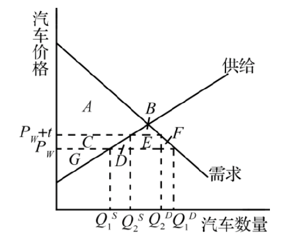

## Quick Quiz

1.如果一个不允许钢铁进行国际贸易的国家的国内价格低于世界价格，那么（）

a. 该国在生产钢铁中有比较优势，如果开放贸易会成为钢铁出口国

b. 该国在生产钢铁中有比较优势，如果开放贸易会成为钢铁进口国

c. 该国在生产钢铁中没有比较优势，如果开放贸易会成为钢铁出口国

d. 该国在生产钢铁中没有比较优势，如果开放贸易会成为钢铁进口国

【答案】a

【解析】国内价格反映钢铁的机会成本，即该国为了得到一单位钢铁必须放弃多少其他东西。如果国内价格低于世界价格，即国内生产钢铁的成本低，这表明相对于其他国家而言，该国在生产钢铁上具有比较优势。一旦允许贸易，该国就会成为一个钢铁出口国。该国的钢铁生产者渴望得到国外可以得到的高价格，并开始向其他国家的买者出售他们的钢铁。

2.当 Ectenia 国在咖啡豆方面对世界开放贸易时，国内咖啡豆的价格下降。以下哪一个选项说明了这种情况？ 

a. 国内咖啡产量增加，而且 Ectenia 变成了咖啡进口国

b. 国内咖啡产量增加，而且 Ectenia 变成了咖啡出口国

c. 国内咖啡产量减少，而且 Ectenia 变成了咖啡进口国

d. 国内咖啡产量减少，而且 Ectenia 变成了咖啡出口国

【答案】c

【解析】国内咖啡豆的价格下降说明该国咖啡豆国内价格高于世界价格，Ectenia 国生产咖啡豆没有比较优势。一旦允许贸易，由于外国卖者提供了更好的价格，Ectenia 国的咖啡消费者将会购买其他国家的咖啡豆，国内咖啡产量减少，Ectenia 就会变成咖啡进口国。

3.当一国开放一种产品的贸易并成为一个进口国时，将带来哪种结果？（）

a. 生产者剩余减少，但消费者剩余和总剩余都增加

b．生产者剩余减少，消费者剩余增加，而进口对总剩余的影响不确定

c. 生产者剩余和总剩余都增加，但消费者剩余减少

d. 生产者剩余、消费者剩余和总剩余都增加

【答案】a

【解析】当一国开放一种产品的贸易并成为一个进口国时，说明贸易前国内价格高于世界价格。一旦允许贸易，国内价格就必然等于世界价格，国内供给量小于国内需求量。买者的状况变好（消费者剩余增加），而卖者的状况变坏（生产者剩余减少）。贸易提高了该国家作为一个整体的经济福利，总剩余增加。

4. 如果进口一种产品的国家征收关税，这就会增加（）

a. 国内需求量

b. 国内供给量

c. 从国外的进口量

d. 以上全部

【答案】b

【解析】在自由贸易下，国内价格等于世界价格。关税使进口产品的价格提高到世界价格之上，其增加量等于关税。由于关税提高了产品价格，它使国内需求量减少，使国内供给量增加。关税减少了进口量，并使国内市场向没有贸易时的均衡移动。

5.以下哪一种贸易政策将有利于生产者，损害消费者，并增加一国贸易量？（）

a. 增加对进口国征收的关税

b. 减少对进口国征收的关税

c. 当世界价格高于国内价格时，开始允许贸易

d. 当世界价格低于国内价格时，开始允许贸易

【答案】c

【解析】当世界价格高于国内价格时，一旦允许贸易，该国生产者渴望得到国外可以得到的高价格，并开始向其他国家的买者出售他们的产品，贸易量提高，有利于生产者，但国内价格升高到世界价格，损害国内消费者。

6．征收关税和在进口配额时发放许可证的主要差别是关税增加了（）

a. 消费者剩余

b. 生产者剩余

c. 国际贸易

d. 政府收入

【答案】d

【解析】征收关税和在进口配额时发放许可证的唯一差别是：关税增加了政府的收入，而进口配额为那些得到进口许可证的人创造了剩余。进口许可证持有者的利润是国内价格（他出售进口物品的价格）和世界价格（他购买这些物品的价格）之间的差额。

## Questions for Review

1.一国在没有国际贸易时的国内价格向我们传达了该国比较优势的哪些信息？

答：当没有国际贸易，某种商品的国内价格高于该种商品的世界价格时，该国在生产这种商品上没有比较优势；当某种商品的国内价格低于世界价格时，该国在该产品生产上具有比较优势，这是因为在世界市场上按世界价格交换时，该国可以获利。具体分析如下：

（1）贸易的决定因素是比较优势。在没有国际贸易时，市场产生了使国内供给量与国内需求量相等的国内价格。世界价格是一种物品在世界市场上通行的价格，而价格代表机会成本。因此，比较贸易前一种物品的世界价格和国内价格就可以回答究竟是本国生产的机会成本低，从而生产该种物品有比较优势，还是其他国家在该物品的生产上具有比较优势。

（2）假设在没有国际贸易时，考察 A 国生产牛肉是否有比较优势。可以通过把 A 国国内牛肉价格同牛肉的世界价格相比来考察。如果 A 国国内的牛肉价格低于世界价格，则 A 国在世界市场上具有生产牛肉的比较优势。相反，如果 A 国国内的牛肉价格高于世界价格，则外国生产牛肉有比较优势。通过将某种物品的国内价格同国际价格相比较，我们可以知道某国在生产该种物品上是否有比较优势。

2.一国什么时候成为一种物品的出口者？什么时候成为进口者？

答：如果一种物品的世界价格高于国内价格，该国在生产这种物品上有比较优势。如果允许贸易，应该出口该产品，则该国就可以成为这种产品的出口国。

如果一种物品的世界价格低于国内价格，外国在生产这种物品上有比较优势。如果允许贸易，应该进口该产品，则该国就可以成为这种产品的进口国。

3.画出一个进口国的供求图。在允许贸易之前，消费者剩余和生产者剩余是多少？有自由贸易时，消费者剩余和生产者剩余是多少？总剩余有什么变化？

答：自由贸易前后消费者剩余和生产者剩余的变化如图 9-1 所示。

贸易之前，消费者剩余是面积 A ，生产者剩余是面积 $\mathrm{B}+\mathrm{E}$ ；有自由贸易时，消费者剩余是面积 $\mathrm{A}+\mathrm{B}+\mathrm{C}+$ D ，生产者剩余是面积 E 。在允许贸易前，总剩余是面积 $\mathrm{A}+\mathrm{B}+\mathrm{E}$ ，有自由贸易时，总剩余是面积 $\mathrm{A}+\mathrm{B}+\mathrm{C}+\mathrm{D}$ $+E$ ，增加了面积 $\mathrm{C}+\mathrm{D}$ 

图 9-1 进口国的供求图

4.描述什么是关税以及关税的经济影响。

答：关税对经济的影响具有两面性，具体来讲：

（1）关税对经济的正面影响
关税提高了物品的国内价格，减少了国内消费者的福利，增加了国内生产者的福利。征收关税的作用主要有两个方面：一是增加本国财政收入；二是保护本国的产业和国内市场。其中以前者为目的而征收的关税称为财政关税，以后者为目的而征收的关税称为保护关税。

（2）关税对经济的负面影响
与任何一种物品销售税一样，关税会扭曲激励，使得稀缺资源的配置背离最优水平，使市场接近于没有贸易时的均衡，因此，减少了贸易的好处。关税虽然使国内生产者的状况变好，而且政府增加了收入，但造成消费者的损失大于获得的这些好处。关税造成的无谓损失具体表现为：第一，关税使国内生产者能收取的价格高于世界价格，结果，鼓励他们增加低效率的生产。第二，关税提高了买者不得不支付的价格，从而使得他们减少消费。

5.列出经常用来支持贸易限制的五种观点。经济学家如何对这些观点做出回应？

答：一般用来支持贸易限制的五种观点有：

（1）工作岗位论。自由贸易反对者认为与其他国家进行贸易减少了国内的工作岗位。经济学家认为，自由贸易在减少一些工作岗位的同时也创造了一些工作岗位，主要是消灭了一国没有比较优势的行业中的工作岗位，创造了有比较优势的行业中的工作岗位。并且，贸易的好处是依据比较优势而言，一国必定在某些物品的生产上有比较优势。每个国家的工人最终会在该国有比较优势的行业中找到工作。

（2）国家安全论。当某一行业受到来自国外的竞争威胁时，自由贸易的反对者往往宣称，允许它进行自由贸易会威胁到国家的安全。经济学家认为，当存在对国家安全的正当关心时，保护关键行业可能是合适的。但这种观点肯定会诱使一个行业的人夸大它们在国防中的作用，以便得到免受外国竞争的保护。

（3）幼稚产业论。这种观点认为，新兴行业应受到贸易限制的保护，这有助于该行业的成长。经济学家认为，幼稚产业论在现实中难以实施。为了成功运用保护，政府要确定保护哪个行业最终是有利的，并确定带给这些行业的利益是否大于保护给消费者带来的代价。这种保护对象的确定是困难的，往往是在政治上强有力的行业得到了保护。而且，保护一旦实施，就很难被取消。然而，保护并不是一个行业成长所必需的。

（4）不公平竞争论。这种观点认为，只有各国都按同样的规则行事，自由贸易才是合意的。如果各国的企业服从不同的法律和管制，那么，国际市场上的竞争是不公平的。例如，一个粮食出口国给予该国农民大量补贴，粮食进口国的农民会认为，这种补贴损害了他们的利益，并使两国粮食行业在自由贸易的竞争中变得不平等。经济学家认为，进口国的农民的确要蒙受损失，但进口国的消费者会从低价格中受益。而且，消费者得到的好处大于生产者的损失，粮食进口国仍会因自由贸易而使其总剩余增加。

（5）作为讨价还价筹码的保护论。该观点认为贸易限制的威胁有助于消除外国政府已实施的贸易限制。经济学家认为，如果这种威胁不起作用，该国会处在进退两难的尴尬境地。

6.实现自由贸易的单边方法和多边方法之间的区别是什么？各举出一个例子。

答：（1）实现自由贸易的单边与多边方法之间的差别

实现自由贸易的单边方法是通过一国单方面取消自己的贸易限制来实现的。而实现自由贸易的多边方法指多个国家在谈判基础上达成协议，共同削减贸易限制来达到自由贸易。

多边方法有可能比单边方法引起更自由的贸易，因为它可以减少国外与国内的贸易限制。但同时，如果国际谈判失败了，结果也会带来比在单边方法时更多的限制贸易。

此外，多边方法可能有一种政治优势。在大多数市场中，生产者人数比消费者人数少，而且组织严密——因此，也具有更大的政治影响。例如，艾索兰德国降低钢铁关税，如果就其本身来考虑可能在政治上有困难，因为钢铁公司会反对自由贸易，而那些受益的钢铁使用者人数如此之多，以至于要组织起来支持自由贸易是相当困难的。但假设在艾索兰德国降低钢铁关税的同时，内格博兰德国促进降低其小麦关税。在这种情况下，艾索兰德国那些在政治上有影响的小麦农民就会支持该协议。因此，在单方降低关税不可能时，自由贸易的多边方法有时可以赢得政治上的支持。

（2）实现自由贸易的单边与多边方法的例子

英国在 19 世纪采取了单边方法，即用单方面的方法取消自己的贸易限制。近年来智利和韩国也采取这种方法。

多边方法的一个重要例子是关贸总协定（GATT）。第二次世界大战后，美国协助建立了关贸总协定。它的宗旨是通过削减关税和其它贸易壁垒，削除国际贸易中的差别待遇，促进国际贸易自由化，以充分利用世界资源，扩大商品的生产与流通。关贸总协定成功地把成员国之间的平均关税从第二次世界大战后的 $40 \%$ 左右降低到现在的 $5 \%$ 左右。

## Problems and Applications

1. 没有贸易时，世界红酒的价格低于加拿大的现行价格。

a. 假设加拿大的红酒进口只是世界红酒总产量的一小部分，画出自由贸易下加拿大红酒市场的图形。在一个适当的表中，列出消费者剩余、生产者剩余和总剩余。

b．现在假设墨西哥湾流的异常移动使欧洲的夏天气候异常冷，破坏了葡萄收成。这种冲击对世界红酒价格有什么影响？用你在问题 a 中的图和表说明对加拿大的消费者剩余、生产者剩余和总剩余的影响。谁是赢家？谁是输家？加拿大作为一个整体，状况变好了还是变坏了？

答：a．如图 9-2 所示。在加拿大的葡萄酒市场上，葡萄酒的世界价格为 $P_1$ 。表 9-1 第二列是在 $P_1$ 情况下的结果

图 9-2 加拿大红酒市场

表 9-1 消费者剩余、生产者剩余和总剩余

|            | $\mathrm{P}_1$                                           | $\mathrm{P}_2$                                | 变动                       |
| ---------- | -------------------------------------------------------- | --------------------------------------------- | -------------------------- |
| 消费者剩余 | $\mathrm{A}+\mathrm{B}+\mathrm{D}+\mathrm{E}$            | $\mathrm{A}+\mathrm{D}$                       | $-(\mathrm{B}+\mathrm{E})$ |
| 生产者剩余 | C                                                        | $\mathrm{B}+\mathrm{C}$                       | +B                         |
| 总剩余     | $\mathrm{A}+\mathrm{B}+\mathrm{C}+\mathrm{D}+\mathrm{E}$ | $\mathrm{A}+\mathrm{B}+\mathrm{C}+\mathrm{D}$ | -E                         |

b. 墨西哥湾流的异常移动使欧洲的夏天气候异常冷，摧毁了葡萄收成，葡萄酒的世界价格上升至 $P_2$ 。表 9-1 描述了当价格为 $\mathrm{P}_2$ 时对消费者剩余、生产者剩余以及总剩余的影响。从表 $9-1$ 的 " $\mathrm{P}_2$ "栏及衡量剩余变化的 "变动"栏可知，加拿大红酒生产者是赢家，消费者是输家，加拿大的整体状况变坏了。

2. 假设国会对进口汽车征收关税，以保护美国汽车工业免受外国竞争。假设美国在世界汽车市场上是一个价格接受者，用图形说明：进口量的变化、美国消费者的损失、美国制造商的收益、政府收入以及关税带来的无谓损失。消费者的损失可以分为三部分：转移给国内生产者的收益、转移给政府的收入以及无谓损失。用你的图形确定这三个部分。

答：关税对进口汽车的影响如图 9-3 所示。无关税时，汽车的价格为 $\mathrm{P}_{\mathrm{W}}$ ，美国的产量是 $\mathrm{Q}^{\mathrm{S}}{ }_1$ ，美国的购买量是 $\mathrm{Q}^{\mathrm{D}}{ }_1$ ，美国汽车的进口为 $\mathrm{Q}_1^{\mathrm{D}}-\mathrm{Q}^{\mathrm{S}}{ }_1$ 。征收关税使汽车的价格增加到 $\mathrm{P}_{\mathrm{W}}+\mathrm{t}$ ，使美国汽车的供给量增加到 $\mathrm{Q}_2{ }_2$ ，而需求量减少到 $\mathrm{Q}_2{ }_2$ ，进口量减少为 $\mathrm{Q}_2{ }_2-\mathrm{Q}_2{ }_2$ 。表 9-2 描述了关税在税前和税后对消费者剩余、生产者剩余、政府收入和总剩余的影响。税后，消费者剩余减少 $\mathrm{C}+\mathrm{D}+\mathrm{E}+\mathrm{F}$ ，生产者剩余增加 C ，政府收入增加 E ，无谓损失为 $\mathrm{D}+\mathrm{F}$ 。消费者剩余的损失量 $\mathrm{C}+\mathrm{D}+\mathrm{E}+\mathrm{F}$ 分割如下： C 进入生产者剩余， E 进入政府收入，而 $\mathrm{D}+\mathrm{F}$ 则为无谓损失。

图 9-3 征收关税的影响

表 9-2 税前和税后对消费者剩余、生产者剩余、政府收入和总剩余的影响

|                 | 税前                                                         | 税后                       | 变动                                             |
| --------------- | ------------------------------------------------------------ | -------------------------- | ------------------------------------------------ |
| 消费者剩余      | $\mathrm{A}+\mathrm{B}+\mathrm{C}+\mathrm{D}+\mathrm{E}+\mathrm{F}$ | $A+B$                      | $-(\mathrm{C}+\mathrm{D}+\mathrm{E}+\mathrm{F})$ |
| 生产者剩余      | G                                                            | $\mathrm{C}+\mathrm{G}$    | $+C$                                             |
| 政府收入        | 0                                                            | E                          | +E                                               |
| 总剩余          | $A+B+C+D+E+F+G$                                              | $A+B+C+E+G$                | $-(D+F)$  |

3.当中国的纺织业扩张时，世界供给的增加降低了纺织品的世界价格。

a. 画出一个适当的图来分析这种价格变动如何影响一个像美国这样的纺织品进口国的消费者剩余、生产者剩余和总剩余。

b. 现在画出一个适当的图来说明这种价格变动如何影响像多米尼加共和国这样的纺织品出口国的消费者剩余、生产者剩余和总剩余。

c. 比较你对 a 和 b 的答案。相同之处是什么？不同之处是什么？哪一个国家将担心中国纺织品行业的扩张？哪一个国家将欢迎这种情况？解释原因。

答： a. 对于进口纺织品的国家来说，纺织品世界价格下降的影响如图9-4 所示。最初的世界价格为 PW1，最初的进口量为 $\left(Q^D{ }_1-Q^S{ }_1\right)$ ，下降后的世界价格为 $P_{W 2}$ ，进口量为 $\left(Q^D{ }_2-Q^S{ }_2\right)$ 。表 9-3 表示消费者剩余、生产者剩余和总剩余的变化情况。从表中可以看出，价格变动后国内消费者的福利提高了，国内生产者的福利下降了，总剩余的增加量等于面积 $\mathrm{D}+\mathrm{E}+\mathrm{F}$ 。

图 9-4 进口国消费者剩余、生产者剩余和总剩余的变化情况

表 9-3 价格变动前后对进口国消费者剩余、生产者剩余、政府收入和总剩余的影响

|            | $\mathrm{P}_{\mathrm{W} 1}$ | $\mathrm{P}_{\mathrm{W} 2}$ | 变动         |
| ---------- | --------------------------- | --------------------------- | ------------ |
| 消费者剩余 | A+B                         | $A+B+C+D+E+F$               | $+(C+D+E+F)$ |
| 生产者剩余 | $\mathrm{C}+\mathrm{G}$     | G                           | -C           |
| 总剩余     | $A+B+C+G$                   | $A+B+C+D+E+F+G$             | $+(D+E+F)$   |

b. 对于出口纺织品的国家来说，纺织品世界价格下降的影响如图 9-5 所示。最初的世界价格为 $\mathrm{P}_{\mathrm{W1}}$ ，最初的出口量为 $\mathrm{Q}_1^{\mathrm{s}}-\mathrm{Q}^{\mathrm{d}}{ }_1$ ，下降后的世界价格为 $\mathrm{P}_{\mathrm{W} 2}$ ，出口量为 $\mathrm{Q}_2^{\mathrm{s}}-\mathrm{Q}^{\mathrm{d}}{ }_2$ 。表 9 - 4 表示消费者剩余、生产者剩余和总剩余的变化情况。从表中可以看出，价格变动后国内消费者的福利提高了，国内生产者的福利下降了，总剩余的减少量等于面积 D

图 9-5 出口国纺织品世界价格下降消费者剩余，生产者剩余和总剩余的变化情况

表 9-4 价格变动前后对出口国消费者剩余、生产者剩余、政府收入和总剩余的影响

|               | $\mathrm{P}_{\mathrm{W} 1}$ | $\mathrm{P}_{\mathrm{W} 2}$        | 变动                       |
| ------------- | --------------------------- | ---------------------------------- | -------------------------- |
| 消费者剩余    | A                           | $\mathrm{A}+\mathrm{B}+\mathrm{C}$ | $+(\mathrm{B}+\mathrm{C})$ |
| 生产者剩余    | $B+C+D+E+F+G+H$             | $E+F+G+H$                          | -(B+C+D)                   |
| 总剩余  | $A+B+C+D+E+F+G+H$           | A+B+C+D+E+F+G+H  | -D |

a 和 b 的答案的相同之处是纺织品的世界价格下降会导致纺织品进口国和出口国的消费者的福利都得到提高，而生产者的福利都下降了

a 和 b 的答案的不同之处是纺织品世界价格下降会导致纺织品进口国的进口增加，总剩余增加，但纺织品出口国的出口减少，总剩余减少。

像多米尼加共和国这样的纺织品出口国担心中国纺织品行业的扩张，像美国这样的纺织品进口国欢迎中国纺织品行业的扩张，这是因为中国纺织品行业的扩张，将增加纺织品的世界供给，降低纺织品的世界价格，使纺织品出口国的总剩余减少，总体福利下降，使纺织品进口国的总剩余增加，总体福利提高。

4.考虑本章中支持限制贸易的观点。

a. 假设你是一个木材业的游说者，该行业因低价格的国外竞争而受损。你认为五种限制贸易的观点中，哪两个或三个能最有效地说服普通议员，让他（或她）支持贸易限制？解释你的理由。

b. 现在假设你是一个聪敏的经济学专业学生（希望这不是一个难以实现的假设）。虽然所有支持限制贸易的观点都有缺点，但请选择两个或三个看来对你最具经济学意义的观点。对于其中每种支持限制贸易的观点，给出支持它或反对它的经济学原理。

答：a. 木材业因国外低价格竞争而受损，因此，五种限制贸易的观点中，最能有效说服普通议员的观点有： (1)工作岗位论。国外的低价格竞争，甚至是倾销，减少了国内的工作岗位，导致了本国木材业的萎缩，伐木工人失业。(2)不公平竞争论。国外的低价格竞争是一种倾销行为，试图击垮美国的木材业，最终垄断美国市场。(3)国家安全论。木材也是一种重要的战略物资，木材业的萎缩会影响国家安全。

b. 最具经济学意义的观点主要是:

(1)幼稚产业论。这种观点认为，新兴行业应受到贸易限制的保护，这有助于该行业的成长。经济学家认为，幼稚产业论在现实中难以实施。为了成功运用保护，政府要确定保护哪个行业最终是有利的，并确定带给这些行业的利益是否大于保护给消费者带来的代价。这种保护对象的确定是困难的，往往是在政治上强有力的行业得到了保护。而且，保护一旦实施，就很难被取消。然而，保护并不是一个行业成长所必需的。

(2)不公平竞争论。这种观点认为，只有各国都按同样的规则行事，自由贸易才是合意的。如果各国的企业服从不同的法律和管制，那么，国际市场上的竞争是不公平的。例如，一个粮食出口国给予该国农民大量补贴，粮食进口国的农民会认为，这种补贴损害了他们的利益，使两国粮食行业在自由贸易的竞争中变得不平等。经济学家认为，进口国的农民的确要蒙受损失，但进口国的消费者会从低价格中受益。而且，消费者得到的好处大于生产者的损失，粮食进口国仍会因为自由贸易而使其总剩余增加。

5.Textilia 国不允许服装进口。在没有贸易的均衡时，一件 T 恤衫的价格为 20 美元，均衡数量为 300 万件。有一天该国总统在度假时读了亚当・斯密的《国富论》，他决定向世界开放 Textilia 国的市场。T 恤衫的市场价格下降到世界价格 16 美元。Textilia 国消费的 T 恤衫增加到 400 万件，而生产的 T 恤衫减少到 100 万件。

a. 用一个图描述以上情况。你的图上应该标明所有数字。

b. 计算开放贸易引起的消费者剩余、生产者剩余和总剩余的变动。（提示：三角形的面积是 $1 / 2 \times$ 底 $\times$ 高。）答：a．图9-6表示 Textilia 国的 T 恤衫市场供求情况。在没有贸易时，一件 T 恤衫的均衡价格为 20 美元，均衡数量为 300 万件。当允许贸易时， T 恤衫的均衡价格下降为 16 美元，均衡数量为 400 万件，其中进口 300 万件。

图9-6 Textilia 国的 T 恤衫市场

b. 消费者剩余增加了面积 $A+B+C_{\text {。 }}$ 其中 $, S_A=\frac{1}{2}(3+1) \times(20-16)=8, S_B=\frac{1}{2}(3$
-1) $\times(20-16)=4, S_c=\frac{1}{2}(4-3) \times(20-16)=2$ 。由于横轴表示的 T 桖衫的数量是以100 万件为单位来计量的，纵轴表示的 T 恤衫的价格是以美元 / 件为单位计量的，所以面积 A 表示 800 万美元，面积 B 表示 400 万美元，面积 C 表示 200 万美元，因而消费者剩余增加了 1400 万美元。

生产者剩余减少了面积 A，即生产者剩余减少了 800 万美元。
总剩余增加了面积 B + C，即总剩余增加了 600 万美元。

6. 中国是一个粮食（如小麦、玉米和大米）的生产大国。在2008年，中国政府由于担心粮食出口提高了国内消费者的食品价格，所以对粮食出口征税。

a. 画出说明一个出口国的粮食市场的图形。把这个图作为回答以下问题的出发点。

b. 出口税对国内粮食价格有什么影响?

c. 它如何影响国内消费者的福利、国内生产者的福利以及政府收入?

d. 用消费者剩余、生产者剩余和税收收入的总和来衡量，中国的总福利会发生什么变化？

答：a．一个出口国的粮食市场供求情况如图 9-7 所示，世界粮食价格为 $\mathrm{P}_{\mathrm{W}}$ 。图 9-7 中，在不征税的情况下，国内粮食的价格将等于国际市场价格，此时国内消费量为 $\mathrm{Q}_1$ ，出口量为（ $\left.\mathrm{Q}_4-\mathrm{Q}_1\right)$ 。

图 9-7 一个出口国的粮食市场图形

b. 如图 9-7 所示, 对每单位出口粮食征税 $\mathrm{t}=\mathrm{P}_{\mathrm{W}}-\mathrm{P}_1$, 出口关税导致国内价格下降, 此时国内市场价格为 $P_1$, 国内消费量增加为 $Q_2$, 出口量减少为 $\left(Q_3-Q_2\right)$ 。因此, 出口税将会降低出口国所获得的有效的世界价格,从而使国内粮食价格下降。

c. 国内消费者剩余、生产者剩余、政府税收收入的变化如表 9-5 所示

表 9-5 进口税对消费者剩余、生产者剩余、政府收入和总剩余的影响

|            | 国内消费者剩余 | 国内生产者剩余  | 政府收入 | 总剩余          |
| ---------- | -------------- | --------------- | -------- | --------------- |
| 不征出口税 | A              | B+C+ ... + J    | 0        | A+B+...+J       |
| 征收出口税 | A+B+I          | C+E+H+G         | F        | A+B+I+C+E+H+G+F |
| 变化情况   | 增加(B+I)      | 减少(B+I+D+F+J) | 增加F    | 减少(D+J)       |

d. 如表 9-5 所示，出口征税导致的生产者损失中，一部分转移给了消费者和政府。但也有一部分是国内没有任何人能得到补偿的。从经济学含义上看，这部分没有得到补偿的损失是本国的消费扭曲损失，这是由于出口征税会导致国内过多地消费该种产品造成的。总剩余将会下降，因为生产者剩余的减少量大于消费者剩余和政府税收收入的增加量之和，出口税导致了无谓损失。

7. 考虑一个从外国进口某种物品的国家。说出以下各种说法是对还是错。解释你的答案。

a. "需求弹性越大，从贸易中获益越多。"

b. "如果需求完全无弹性，就不能从贸易中获益。"

c. "如果需求完全无弹性，消费者就不能从贸易中获益。"

答：a．正确。对于一个既定的世界价格（低于国内价格）而言，当需求弹性越大时，需求数量增加越多。因此，当需求弹性越大时，消费者剩余也会越大，即从贸易中获益会越多。

b．错误。当且仅当需求完全无弹性时，才不能从贸易中获益。

c. 错误。允许贸易时，只要需求数量增加，消费者剩余就会增加，消费者就能从中受益

8.Kawmin 是一个生产并消费软糖的小国。软糖的世界价格是每袋1美元，Kawmin 国内软糖的供给与需求是由以下方程式决定的:

需求: $Q^D=8-P$

供给： $Q^S=P$

其中, P 是每袋软糖的美元价格, Q 是软糖的袋数。

a. 画出一个当 Kawimin 国不允许贸易时表示该国状况的图形（并标注清楚）。计算以下项目（记住三角形的面积是 $1 / 2 \times$ 底 $\times$ 高）：均衡价格与均衡数量、消费者剩余、生产者剩余和总剩余。

b．然后 Kawmin 国开放贸易市场。画出另一个表示软糖市场新状况的图形。计算均衡价格、消费量和生产量、进口量、消费者剩余、生产者剩余和总剩余。

c. 此后，Kawmin 国统治者对软糖生产者的抗议作出回应，对进口软糖征收每袋 1 美元的关税。用图形表示这种关税的影响。计算均衡价格、消费量和生产量、进口量、消费者剩余、生产者剩余、政府收入和总剩余。

d. 开放贸易的好处是什么？用关税限制贸易的无谓损失是什么？用数据回答。

答： a. 无贸易条件下，Kawmin 国的软糖市场状况如图 9-8 所示。供给曲线为 S，需求曲线为 D，两者决定了软糖市场的均衡价格为 $\mathrm{P}=4$ 美元 / 袋，均衡数量为 $\mathrm{Q}=4$ 袋。消费者剩余如图 9-8 中的阴影部分所示， $\mathrm{CS}=$ $0.5 \times(8-4) \times 4=8$ 美元；生产者剩余如图 9 - 8 中的阴影部分所示， $P S=0.5 \times 4 \times 4=8$ 美元；因而总剩余为 $\mathrm{TS}=8+8=16$ 美元。

图 9-8 无贸易下软糖市场的均衡 图 9-9 有贸易下 Kawmin 国软糖市场状况

b. 在有贸易的情况下，Kawmin 国的软糖市场状况如图 9-9 所示。此时，由于软糖市场的世界价格为 1 美元 / 袋，所以 Kawmin 国国内软糖的价格为 1 美元 / 袋，国内软糖的需求量为 7 袋，本国供应量为 1 袋，因而进口量为 $7-1=6$ （袋）。国内消费者剩余为 $\mathrm{CS}=0.5 \times(8-1) \times 7=24.5$ （美元）；生产者剩余为 $\mathrm{PS}=0.5 \times 1 \times 1$ $=0.5$ （美元）；总剩余为 $\mathrm{TS}=24.5+0.5=25$ （美元）

c. 在 Kawmin 国对每袋软糖征收 1 美元关税的情况下，软糖的国内价格上涨为每袋 2 美元，此时需求量为 6 袋，本国供给量为 2 袋，进口量为 4 袋。国内消费者剩余为 $\mathrm{CS}=0.5 \times(8-2) \times 6=18$ （美元）；生产者剩余为 $\mathrm{PS}=0.5 \times 2 \times 2=2$ （美元）；政府税收收入为 $\mathrm{T}=1 \times 4=4$ （美元）；总剩余为 $\mathrm{TS}=18+2+4=24$ （美元）

d. 当开放贸易时，经济总剩余从 16 美元增加到 25 美元，开放贸易的好处是总剩余增加了 9 美元。关税限制贸易的损失为 $25-24=1$ （美元）

9.在否决了纺织品关税（进口税）提案之后，Isoland 国总统现在考虑对纺织品消费（既包括进口的纺织品，也包括国内生产的纺织品）征收同样数额的税。

a．用教材中图 9-4 确定在纺织品消费税下，Isoland 国纺织品的消费量和生产量。

b. 对纺织品消费税设计一个与教材中图9-4 中表格相似的表格。

c. 哪一种税——消费税还是关税——使政府筹集的收入更多？哪一种税的无谓损失少？解释原因。

答：a．如图 9-10所示，在没有消费税和关税时，Isoland 国的纺织品的生产量为 $\mathrm{Q}^{\mathrm{S}}{ }_1$ ，消费量为 $\mathrm{Q}^{\mathrm{D}}{ }_1$ 。在纺织品消费税下，由于价格上升，国内的消费量下降为 $\mathrm{Q}^{\mathrm{D}}{ }_2$ ，但生产量即供给量仍然为 $\mathrm{Q}^{\mathrm{S}}{ }_1$ ，这是因为生产者依然按照世界价格进行生产

图9-10 征收消费税的影响

b. Isoland 国的纺织品消费税的征收前后情况如表 9-6 所示。

表 9-6 消费税对消费者剩余、生产者剩余、政府收入和总剩余的影响

|            | 无消费税                                                     | 有消费税                           | 变动         |
| ---------- | ------------------------------------------------------------ | ---------------------------------- | ------------ |
| 消费者剩余 | $\mathrm{A}+\mathrm{B}+\mathrm{C}+\mathrm{D}+\mathrm{E}+\mathrm{F}$ | $A+B$                              | $-(C+D+E+F)$ |
| 生产者剩余 | G                                                            | G                                  | 无           |
| 政府收入   | 无                                                           | $\mathrm{C}+\mathrm{D}+\mathrm{E}$ | $+(C+D+E)$   |
| 总剩余     | A+B+C+C+D+E+F+G                                              | A+B+C+D+E+G                        | $-F$         |

c. 消费税使政府筹集的收入更多，因为对纺织品征收消费税，既包括进口的纺织品，也包括国内生产的纺织品，都征收同样的数额，所以相比关税来说，征收消费税政府会获得更多的收入；同样，征收消费税造成的无谓损失更少，在对纺织品征收关税时，消费者不仅会减少国内商品的购买量，同时也会减少对进口纺织品的购买量，造成了更多的无谓损失。

10.假设美国是一个电视进口国，而且没有贸易限制。美国消费者一年购买 100 万台电视，其中 40 万台是国内生产的， 60 万台是进口的。

a. 假设日本电视制造商的技术进步使世界电视价格下降了 100 美元。画图说明这种变化如何影响美国消费者和美国生产者的福利，以及如何影响美国的总剩余。

b. 价格下降后，消费者购买 120 万台电视，其中 20 万台是国内生产的，而 100 万台是进口的。计算价格下降引起的消费者剩余、生产者剩余和总剩余的变动。

c. 如果政府的反应是对进口电视征收 100 美元关税，这会产生什么影响？计算增加的收入和无谓损失。从美国福利的角度看，这是一个好政策吗？谁可能会支持这项政策？

d. 假设价格下降并不是由于技术进步，而是由于日本政府向该行业进行了每台电视 100 美元的补贴。这会影响你的分析吗?

答：a. 技术进步使世界电视价格下降对美国的影响如图 9-11所示。电视的世界价格最初为 P1，消费者剩余为面积 $\mathrm{A}+\mathrm{B}$ ，生产者剩余为面积 $\mathrm{C}+\mathrm{G}$ ，总剩余为面积 $\mathrm{A}+\mathrm{B}+\mathrm{C}+\mathrm{G}$ ，进口量为 "进口 1 "。技术进步后，电视的世界价格下降为 P2（等于 $\mathrm{P} 1-100$ ），消费者剩余增加了面积 $\mathrm{C}+\mathrm{D}+\mathrm{E}+\mathrm{F}$ ，生产者剩余减少了面积 C ，总剩余增加了 $\mathrm{D}+\mathrm{E}+\mathrm{F}$ ，进口量上升为"进口 2 "。具体情况如表 9-7 所示

图 9-11 技术进步使世界电视价格下降对美国的影响

表 9-7 技术进步对消费者剩余、生产者剩余和总剩余变动表

|            | $\mathrm{P}_1$          | $\mathrm{P}_2$                                               | 变动                                             |
| ---------- | ----------------------- | ------------------------------------------------------------ | ------------------------------------------------ |
| 消费者剩余 | $A+B$                   | $\mathrm{~A}+\mathrm{B}+\mathrm{C}+\mathrm{D}+\mathrm{E}+\mathrm{F}$ | $+(\mathrm{C}+\mathrm{D}+\mathrm{E}+\mathrm{F})$ |
| 生产者剩余 | $\mathrm{C}+\mathrm{G}$ | G                                                            | -C                                               |
| 总剩余     | $A+B+C+G$               | A+B+C+D+E+F+G                                                | +(D+E+F)                                         |

b. 各个区域的面积计算如下: $S_c=\frac{1}{2}(200+400) \times 100=30000, S_o=\frac{1}{2}(400-200) \times$ $100=10000, S_{\varepsilon}=(1000-400) \times 100=60000, S_{\xi}=\frac{1}{2}(1200-1000) \times 100=10000$ 。由于横轴表示的电视的数量是以 1000 台为单位来计量的，纵轴表示的电视的价格是以美元/台为单位计量的，所以面积 C 表示 30000000 美元，面积 D 表示 10000000 美元，面积 E 表示 60000000 美元，面积 F 表示 10000000 美元。

因此，消费者剩余增加了 110000000 美元，生产者剩余减少了 30000000 美元，总剩余增加了 80000000 美元。

c. 如果政府对进口的电视征收 100 美元关税，那么，生产者和消费者的剩余都将恢复到最初，即电视价格为 $\mathrm{P}_1$ 时的状态。因而，消费者剩余减少了面积 $\mathrm{C}+\mathrm{D}+\mathrm{E}+\mathrm{F}$ （ 110000000 美元），生产者剩余增加了面积 C （ 30000000 美元），政府征收了 $100 \times 600000=60000000$ 美元的关税，征收关税带来的无谓损失相当于面积 D+F（20000000 美元）

从美国福利的角度看，这不是一个好政策，因为征收关税后美国的总剩余减少了。但是，美国国内的生产者会支持该政策，因为他们从征收关税中获益。

d. 这种分析并不受价格下降原因的影响。世界价格的下降使消费者总剩余的增加额超过了生产者剩余的减少额, 社会总剩余增加了。

11.考虑一个出口钢铁的小国。假设该国 "支持贸易"的政府决定通过对每吨销往国外的钢铁支付一定量货币来补贴钢铁出口。这种出口补贴如何影响国内钢铁价格、钢铁产量、钢铁消费量以及钢铁出口量？它如何影响消费者剩余、生产者剩余、政府收入和总剩余？从经济效率的角度看，这是一项好政策吗？（提示：对出口补贴的分析类似于关税的分析。)

答：出口补贴使钢的出口价格上升，生产者得到的补贴为 s ，如图 9-12 所示。图中的世界价格为 $\mathrm{P}_{\mathrm{W}}$ ，这是补贴前的价格。在这种价格下，国内消费者购买钢的数量为 $\mathrm{Q}_1{ }^{\mathrm{D}}$ ，生产者供给 $\mathrm{Q}_1{ }^{\mathrm{S}}$ ，国家的出口量为 $\left(\mathrm{Q}_1{ }^{\mathrm{S}}-\mathrm{Q}_1{ }^{\mathrm{D}}\right)$ 。将补贴列入价格后，供应商每单位得到的价格为 $\mathrm{PW}+\mathrm{s}$ ，由于出口时他们获得的世界价格是 $\mathrm{P}_{\mathrm{W}}$ ，政府将给他们补贴 S 。 然而，国内消费者仍然购买价格为世界价格 $P_{\mathrm{W}}$ 的钢。国内公司不想出售钢铁给国内的消费者，因为他们这样做没有得到补贴。所以，国内公司将其所有的钢铁产品销往国外，总量为 $\mathrm{Q}^2$ 。国内消费者继续购买 $\mathrm{Q}_1{ }^{\mathrm{D}}$ 。该国进口钢铁量为 $\mathrm{Q} 1^{\mathrm{D}}$ ，而出口钢铁量为 $\mathrm{Q}_2{ }^{\mathrm{S}}$ ，所以钢铁的净出口为 $\mathrm{Q}_2{ }^{\mathrm{S}}-\mathrm{Q}_1{ }^{\mathrm{D}}$ 

最后，钢铁的国内价格不变，钢铁产量增加，钢铁的消费量不变，出口量增加。具体如表 9-8 所示，消费者剩余不变，生产者剩余增加，政府收入下降，总剩余减少

图 9-12 补贴政策下的钢铁市场供求图

综上所述，从经济效率角度来看，这不是一项好政策，因为它导致了总剩余的减少。

表 9-8 补贴前后市场变动表

|            | 无补贴                                                   | 有补贴                                                       | 变动                                  |
| ---------- | -------------------------------------------------------- | ------------------------------------------------------------ | ------------------------------------- |
| 消费者剩余 | $\mathrm{A}+\mathrm{B}$                                  | $\mathrm{A}+\mathrm{B}$                                      | 0                                     |
| 生产者剩余 | $\mathrm{E}+\mathrm{F}+\mathrm{G}$                       | $\mathrm{B}+\mathrm{C}+\mathrm{E}+\mathrm{F}+\mathrm{G}$     | $+(\mathrm{B}+\mathrm{C})$            |
| 政府收入   | 0                                                        | $-(\mathrm{B}+\mathrm{C}+\mathrm{D})$                        | $-(\mathrm{B}+\mathrm{C}+\mathrm{D})$ |
| 总剩余     | $\mathrm{A}+\mathrm{B}+\mathrm{E}+\mathrm{F}+\mathrm{G}$ | $\mathrm{A}+\mathrm{B}-\mathrm{D}+\mathrm{E}+\mathrm{F}+\mathrm{G}$ | -D                                    |

