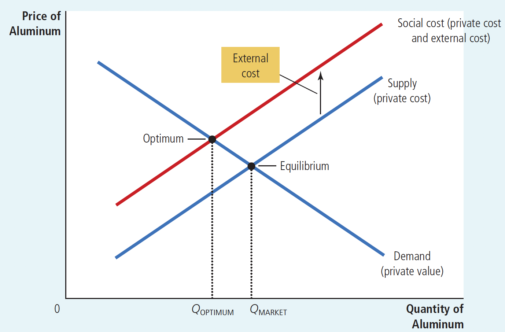
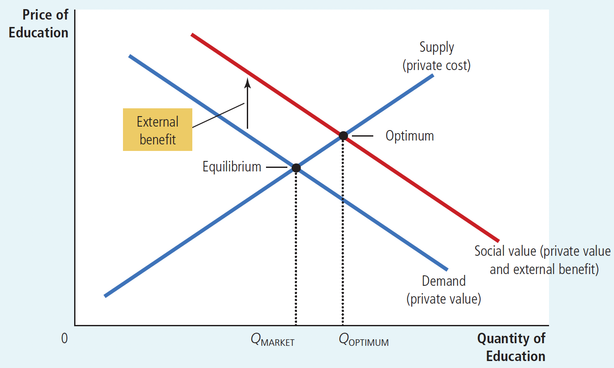
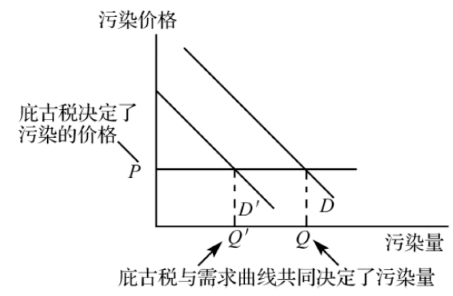
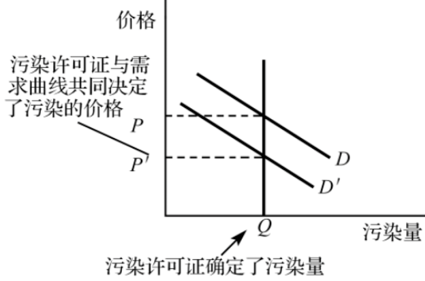
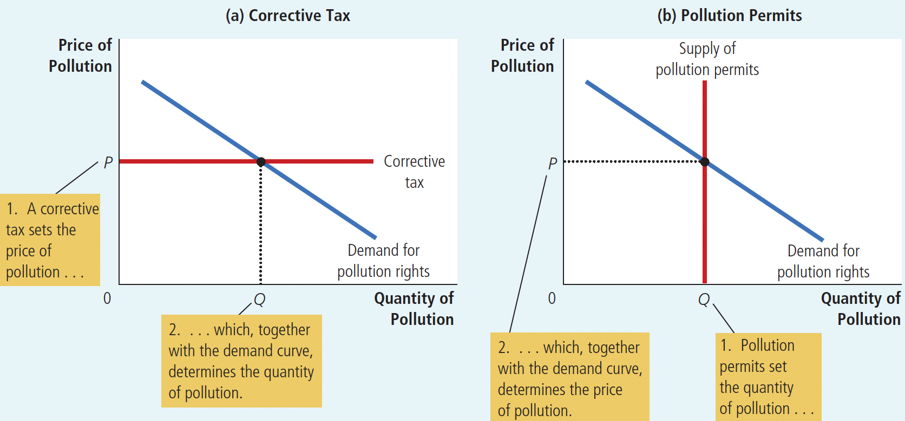

# Ch10 Externalities
**externality**: the uncompensated impact of one person’s actions on the well-being of a bystander

>without bearing the corresponding costs or receiving the corresponding benefits.

$~$

## 10.1 Externalities and Market Inefficiency

> In this section, we use the tools of welfare economics developed in Chapter 7 to examine how externalities affect economic well-being.

$~$

Externalities are divided into positive externalities and negative externalities:

+ Positive externalities: an economic entity's actions have a beneficial impact on others without receiving corresponding benefits
+ Negative externalities occur when an economic entity's actions have a detrimental impact on others without bearing the corresponding costs.

$~$

**Negative Externalities:**

Figure 10.2 Pollution Externality and the Social Optimum

+ In the presence of a negative externality, such as pollution, the social cost of the good exceeds the **private cost**.
+ The **optimal quantity**, $Q_{OPTIMUM}$ , is therefore smaller than the equilibrium quantity, $Q_{MARKET}$

$~$

**Positive externalities:**

Figure 10.3 Education and the Social Optimum

+ In the presence of a positive externality, the social value of the good exceeds the private value.
+ The optimal quantity, $Q_{OPTIMUM}$ , is therefore larger than the equilibrium quantity, $Q_{MARKET}$

$~$

**Induction(Externalities and Economic Efficiency):**

The impact of externalities creates inconsistencies between private costs and social costs, or between private benefits and social benefits, which can easily lead to market failure and inefficiency.

Negative externalities

+ the social cost of production is greater than the private cost
+ the social supply curve is above the market supply curve
+ market production quantity exceeds the socially desirable quantity
+ overproduction of the product.

Positive externalities 

+ the social benefit of production is greater than the private benefit
+ the social value curve is above the market demand curve
+ market production quantity is less than the socially desirable quantity
+ underproduction of the product.

$~$

## 10.2 Methods to Solve Externalities

+ Public (Government) methods to solve externalities

  + Command-and-control policies: Regulation

  + Market-based policies:
    + Corrective Taxes and Subsidies

    + Tradable Pollution Permits

> Regulation regulate behavior directly.
>
> Market-based policies provide incentives so that private decision makers will choose to solve the problem on their own.

+ Private methods to solve externalities

  + Using moral norms and social constraints

  + Charitable behavior

  + Relying on the self-interest of relevant parties to solve externality problems

  + Signing contracts between interested parties.

$~$

### 10.2.1 Public methods to solve externalities

**Internalizing the externality:** altering incentives so that people take into account the external effects of their actions

>When the private marginal benefit or cost of a good or service is adjusted sufficiently to make individuals or firms consider the external effects they generate in their decision-making, the internalization of external effects is achieved.
>
>To this end, the government usually adopts two types of measures: corrective taxation and corrective fiscal subsidies.
>
>The former aims to adjust private marginal costs by imposing taxes equal to the size of the external marginal costs on goods or services with negative external effects, raising their private marginal costs to a level consistent with social marginal costs, thereby internalizing negative external effects.
>
>The latter aims to adjust private marginal benefits by providing fiscal subsidies equal to the size of the external marginal benefits to consumers of goods or services with positive external effects, raising their private marginal benefits to a level consistent with social marginal benefits, thereby internalizing positive external effects.

$~$

**Corrective tax (Pigouvian taxes):** a tax designed to induce private decision makers to take into account the social costs that arise from a negative externality.

$~$

An ideal corrective tax would equal the external cost from an activity with negative externalities, and an ideal corrective subsidy would equal the external benefit from an activity with positive externalities.

$~$

As long as the tax rate remains unchanged, the price of pollution remains constant, while the movement of the demand curve changes the amount of pollution, causing the pollution quantity to vary. (As shown in Figure 10.a)

$~$

Figure 10.a The Equilibrium of Corrcevtive tax

Most taxes distort incentives and move the allocation of resources away from the social optimum. (As discussed in Chapter 8)

In contrast, corrective taxes alter incentives that market participants face to account for the presence of externalities and thereby move the allocation of resources closer to the social optimum. Thus, while corrective taxes raise revenue for the government, they also enhance economic efficiency.

$~$

> Example: *WHY IS GASOLINE TAXED SO HEAVILY?
>
> The gas tax can be viewed as a corrective tax aimed at addressing three negative externalities associated with driving: Congestion, Accidents, Pollution

$~$

**Tradable Pollution Permits:**

The pollution permit system: the government setting a total pollution quantity, issuing a certain amount of pollution permits to each enterprise, and allowing enterprises to trade these permits.

+ the issuance of pollution permits determines the amount of pollution.
+ As long as the number of permits remains unchanged, the pollution amount generally does not change
+ the movement of the demand curve changes the pollution price, causing the pollution price to decrease.(As shown in Figure 10.b)

$~$

Figure  10.b The Equilibrium of Pollution Permits

$~$

The similarity of the two policies Corrective Taxes and Pollution Permits, by considering the market for pollution. (As shown in Figure 10.4 )

$~$

Figure 10.4 The Equivalence of Corrective Taxes and Pollution Permits

+ In panel (a), the EPA sets a price on pollution by levying a corrective tax, and the demand curve determines the quantity of pollution.
+ In panel (b), the EPA limits the quantity of pollution by limiting the number of pollution permits, and the demand curve determines the price of pollution.
+ The **price** and **quantity of pollution** are the same in the two cases.

$~$

### 10.2.2 Private methods to solve externalities

+ Using moral norms and social constraints

+ Charitable behavior

+ Relying on the self-interest of relevant parties to solve externality problems

+ Signing contracts between interested parties.

$~$

**Coase theorem:** the proposition that if private parties can bargain without cost over the allocation of resources, they can solve the problem of externalities on their own.

+ Its content is: When **transaction costs** are zero, as long as property rights are clearly defined initially and economic parties are allowed to negotiate and trade, it will lead to efficient resource allocation.
+ The Coase theorem demonstrates that, if the assumptions hold, market forces are strong enough to solve externality problems through the market itself, without the need for government intervention.

**transaction costs:** the costs that parties incur during the process of agreeing to and following through on a bargain

>Transaction costs include: 
>
>1. costs of obtaining quality information about a product, such as product price, usability, and durability; 
>2. costs of negotiation between the parties to the transaction; 
>3. costs of contract performance by both parties to the transaction.
>
>The size of transaction costs depends on the following points:
>
>1. the number of transactions at a certain point in time over a period
>2. the quantity of goods traded at a certain point in time over a period
>3. the number of participants in each transaction
>4. the quantity of goods in each transaction.

$~$

Private economic entities may solve externality problems through the above methods, but in reality, due to some limiting factors, private entities cannot adequately address the problems caused by externalities. For example, transaction costs may be very expensive; all parties may strive to maximize their own interests, causing negotiations to break down; or because there are too many stakeholders involved, it may be impossible to coordinate all interests. Therefore, government intervention is needed to solve externality problems, internalize externalities, and achieve Pareto optimality.

$~$

## Conclusion

The market can maximize the total surplus of sellers and buyers in the market, and this is usually efficient.

However, if externalities appear in the market, market equilibrium cannot maximize the total benefits for the entire society, making the market inefficient.

The Coase theorem believes that they can negotiate themselves and reach an effective solution.

However, if **transaction costs** are high, government policies are needed to improve efficiency.

Pigouvian taxes and pollution permit systems are superior to command-and-control policies because they reduce pollution at lower costs, thereby increasing the demand for a clean environment.

$~$

## Quick Quiz & Solutions

1.Which of the following is an example of a positive externality?

a. Dev mows Hillary's lawn and is paid $\$ 100$ for performing the service.

b. While mowing the lawn, Dev's lawnmower spews out smoke that Hillary's neighbor Kristen has to breathe.

c. Hillary's newly cut lawn makes her neighborhood more attractive.

d. Hillary's neighbors pay her if she promises to get her lawn cut on a regular basis.

$~$

2.If the production of a good yields a negative externality, then the **social-cost curve** lies \($\qquad$\) the supply curve, and the **socially optimal quantity** is \($\qquad$\) than the equilibrium quantity.

a. above, greater

b. above, less

c. below, greater

d. below, less

$~$

3.When the government levies a tax on a good equal to the external cost associated with the good's production, it \($\qquad$\) the price paid by consumers and makes the market outcome \($\qquad$\) efficient.

a. increases, more

b. increases, less

c. decreases, more

d. decreases, less

$~$

4.Which of the following statements about corrective taxes is generally NOT true?

a. Economists prefer them to command-and-control regulation.

b. They raise government revenue.

c. They cause deadweight losses.

d. They reduce the quantity sold in a market.

$~$

5.The government auctions off 500 units of pollution rights. They sell for $\$ 50$ per unit, raising total revenue of $\$ 25,000$. This policy is equivalent to a corrective tax of \($\qquad$\) per unit of pollution.

a. $\$ 10$

b. $\$ 50$

c. $\$ 450$

d. $\$ 500$

$~$

6.The Coase theorem does NOT apply if

a. there is a significant externality between two parties.

b. the court system vigorously enforces all contracts.

c. transaction costs make negotiating difficult.

d. both parties understand the externality fully.

$~$

SUMMARY

- When a transaction between a buyer and seller directly affects a third party, the effect is called an externality. If an activity yields negative externalities, such as pollution, the socially optimal quantity in a market is less than the equilibrium quantity. If an activity yields positive externalities, such as technology spillovers, the socially optimal quantity is greater than the equilibrium quantity.
- Governments pursue various policies to remedy the inefficiencies caused by externalities. Sometimes the government prevents socially inefficient activity by regulating behavior. Other times it internalizes an externality using corrective taxes. Another public policy is to issue permits. For example, the government could protect the environment by issuing a limited number of pollution permits. The result of this policy is similar to imposing corrective taxes on polluters.
- Those affected by externalities can sometimes solve the problem privately. For instance, when one business imposes an externality on another business, the two businesses can internalize the externality by merging. Alternatively, the interested parties can solve the problem by negotiating a contract. According to the Coase theorem, if people can bargain without cost, then they can always reach an agreement in which resources are allocated efficiently. In many cases, however, reaching a bargain among the many interested parties is difficult, so the Coase theorem does not apply.

$~$

QUESTIONS FOR REVIEW
1. Give an example of a negative externality and an example of a positive externality.
2. Draw a supply-and-demand diagram to explain the effect of a negative externality that occurs as a result of a firm's production process.
3. In what way does the patent system help society solve an externality problem?
4. What are corrective taxes? Why do economists prefer them to regulations as a way to protect the environment from pollution?

5. List some of the ways that the problems caused by externalities can be solved without government intervention.
6. Imagine that you are a nonsmoker sharing a room with a smoker. According to the Coase theorem, what determines whether your roommate smokes in the room? Is this outcome efficient? How do you and your roommate reach this solution?

$~$

PROBLEMS AND APPLICATIONS
1. Consider two ways to protect your car from theft. The Club (a steering wheel lock) makes it difficult for a car thief to take your car. Lojack (a tracking system) makes it easier for the police to catch the car thief who has stolen it. Which of these methods conveys a negative externality on other car owners? Which conveys a positive externality? Do you think there are any policy implications of your analysis?

2. Consider the market for fire extinguishers.
 a. Why might fire extinguishers exhibit positive externalities?
    b. Draw a graph of the market for fire extinguishers, labeling the demand curve, the social-value curve, the supply curve, and the social-cost curve.
    c. Indicate the market equilibrium level of output and the efficient level of output. Give an intuitive explanation for why these quantities differ.
    d. If the external benefit is $\$ 10$ per extinguisher, describe a government policy that would yield the efficient outcome.

3. Greater consumption of alcohol leads to more motor vehicle accidents and, thus, imposes costs on people who do not drink and drive.
 a. Illustrate the market for alcohol, labeling the demand curve, the social-value curve, the supply curve, the social-cost curve, the market equilibrium level of output, and the efficient level of output.
    b. On your graph, shade the area corresponding to the deadweight loss of the market equilibrium. (Hint: The deadweight loss occurs because some units of alcohol are consumed for which the social cost exceeds the social value.) Explain.

4. Many observers believe that the levels of pollution in our society are too high.
 a. If society wishes to reduce overall pollution by a certain amount, why is it efficient to have different amounts of reduction at different firms?
    b. Command-and-control approaches often rely on uniform reductions among firms. Why are these approaches generally unable to target the firms that should undertake bigger reductions?
    c. Economists argue that appropriate corrective taxes or tradable pollution rights will result in efficient pollution reduction. How do these approaches target the firms that should undertake bigger reductions?

5. The many identical residents of Whoville love drinking Zlurp. Each resident has the following willingness to pay for the tasty refreshment:

| Willingness to pay | Price/\$ |
|-----------------|--------|
| First bottle | 5 |
| Second bottle| 4|
| Third bottle | 3|
| Fourth bottle| 2|
| Fifth bottle | 1|
| Further bottles | 0|

  a. The cost of producing Zlurp is $\$ 1.50$, and the competitive suppliers sell it at this price. (The supply curve is horizontal.) How many bottles will each Whovillian consume? What is each person's consumer surplus?
  b. Producing Zlurp creates pollution. Each bottle has an external cost of $\$ 1$. Taking this additional cost into account, what is total surplus per person in the allocation you described in part (a)?
  c. Cindy Lou Who, one of the residents of Whoville, decides on her own to reduce her consumption of Zlurp by one bottle. What happens to Cindy's welfare (her consumer surplus minus the cost of pollution she experiences)? How does Cindy's decision affect total surplus in Whoville?
  d. Mayor Grinch imposes a $\$ 1$ tax on Zlurp. What is consumption per person now? Calculate consumer surplus, the external cost, government revenue, and total surplus per person.
  e. Based on your calculations, would you support the mayor's policy? Why or why not?

6. Bruno loves playing rock ' $n$ ' roll music at high volume. Placido loves opera and hates rock ' $n$​ ' roll. Unfortunately, they are next-door neighbors in an apartment building with paper-thin walls.
 a. What is the externality here?
    b. What command-and-control policy might the landlord impose? Could such a policy lead to an inefficient outcome?
    c. Suppose the landlord lets the tenants do whatever they want. According to the Coase theorem,

how might Bruno and Placido reach an efficient outcome on their own? What might prevent them from reaching an efficient outcome?

7. Figure 4 shows that for any given demand curve for the right to pollute, the government can achieve the same outcome either by setting a price with a corrective tax or by setting a quantity with pollution permits. Suppose there is a sharp improvement in the technology for controlling pollution.
    a. Using graphs similar to those in Figure 4, illustrate the effect of this development on the demand for pollution rights.
    b. What is the effect on the price and quantity of pollution under each regulatory system? Explain.

8. Suppose that the government decides to issue tradable permits for a certain form of pollution.

  a. Does it matter for economic efficiency whether the government distributes or auctions the permits? Why or why not?

  b. If the government chooses to distribute the permits, does the allocation of permits among firms matter for efficiency? Explain.

9. There are three industrial firms in Happy Valley.

| Firm | Initial Pollution Level | Cost of Reducing Pollution by 1 Unit |
|---------------|--------------------|-------------|
| A             | 30 units           | \$ 20 |
| B             | 40 units           | \$ 30 |
| C             | 20 units           | \$ 10 |

The government wants to reduce pollution to 60 units, so it gives each firm 20 tradable pollution permits.

a. Who sells permits and how many do they sell? Who buys permits and how many do they buy? Briefly explain why the sellers and buyers are each willing to do so. What is the total cost of pollution reduction in this situation?

b. How much higher would the costs of pollution reduction be if the permits could not be traded?