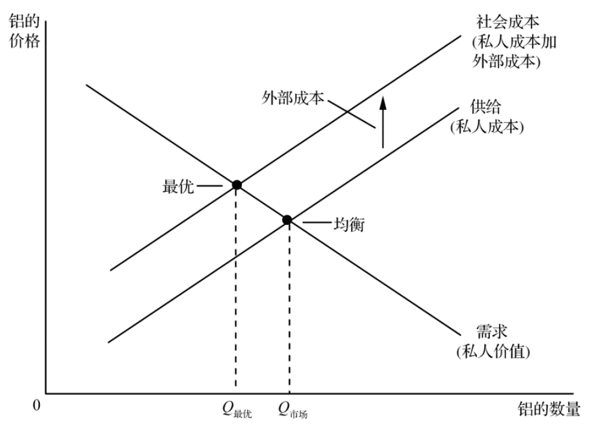
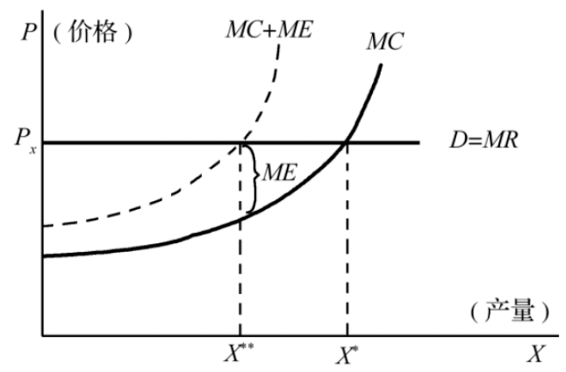
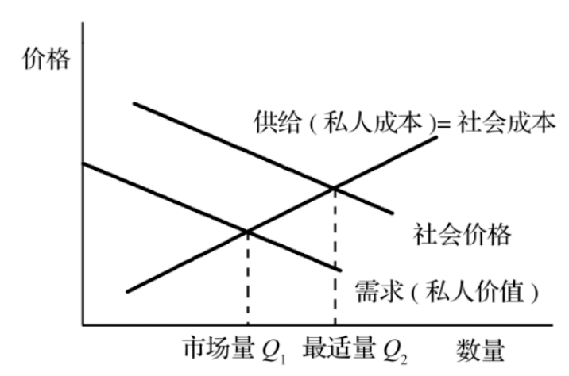
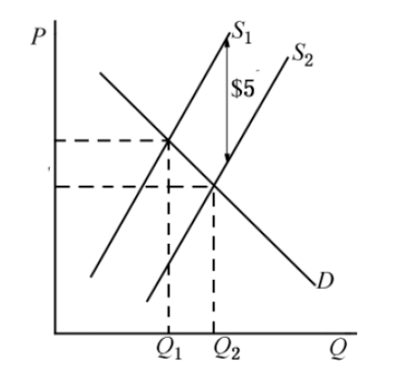
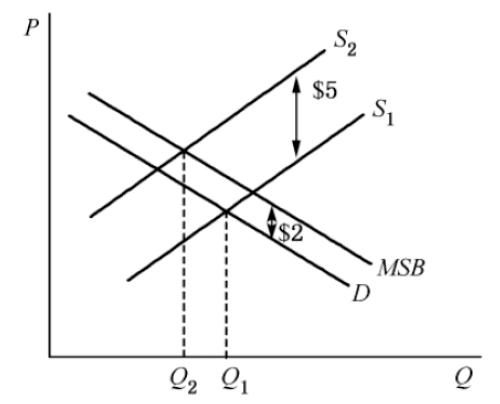
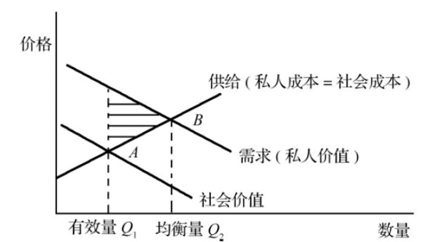
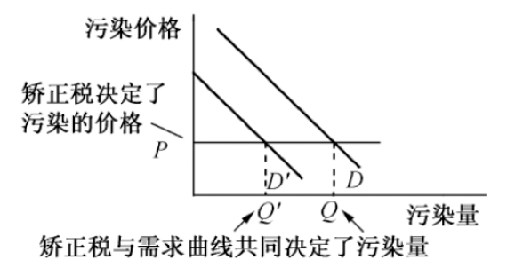
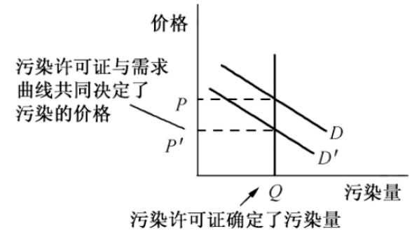

## Quick Quiz

1.以下哪一种是正外部性的例子？()

a. Bob 为 Hillary 剪草坪，并因这项工作得到 100 美元的报酬

b. 在剪草坪时, Bob 的剪草机喷出烟雾, 而 Hillary 的邻居 Kristen 不得不吸入

c. Hillary 剪好的新草坪使她所在的社区更有吸引力

d. 如果 Hillary 答应定期剪草坪，她的邻居会向她付费

【答案】 c

【解析】当一个人从事一种影响旁观者福利并对这种影响既不付报酬又不得报酬的活动时，就产生了外部性。如果这种影响是有利的，就称为正外部性。ad 两项的例子不属于外部性；b 项的例子属于负外部性。

2.如一种物品的生产引起了负外部性, 那么, 社会成本曲线就在供给曲线 $\qquad$ ，而且社会的最优数量 $\qquad$ 均衡数量( )

a. 上方；大于

b. 上方；小于

c. 下方；大于

d. 下方；小于

【答案】b

【解析】由于买者与卖者在决定其需求量或供给量时忽略了他们行为的外部效应，因此在存在外部性时，市场均衡并不是有效的。在存在负外部性的情况下，例如污染时，市场均衡仅仅反映了生产的私人成本，物品的社会成本大于其私人成本。因此，最优量 Q 最优小于均衡数量 Q 市场。

3.当政府对一种物品征收的税等于与生产这种物品相关的外部成本时, 它就 $\qquad$ 消费者支付的价格，并使市场结果 $\qquad$ 效率。( $\quad$ )

a. 提高了；更有

b. 提高了；更无

c. 降低了；更有

d. 降低了；更无

【答案】a

【解析】负外部性使市场生产的数量大于社会合意的数量，通过对有负外部性的物品征税使外部件内在化。如图 10-4 所示，对物品征税后，供给曲线移动到社会成本曲线，价格上升，均衡数量下降，达到社会合意的数量，是市场更有效率。

图 10-4 外部性与社会最优

4.以下哪一种关于矫正税的说法不正确？()

a. 经济学家更偏爱矫正税，而不是命令与控制型管制

b. 矫正税增加了政府收入

c. 矫正税引起了无谓损失

d. 矫正税减少了市场销售量

【答案】c

【解析】负外部性使市场生产的数量大于社会合意的数量，矫正税和管制都可以解决负外部性、减少销售量。但经济学家对矫正税的偏爱通常大于管制，因为税收可以以较低的社会成本减少负外部性，实现这个目标时更有效率。大多数税扭曲了激励，并引起了无谓损失。与此相反，矫正税改变了激励，从而使资源配置向社会最优水平移动。因此，矫正税既增加了政府的收入，又提高了经济效率。

5.政府拍卖出 500 单位的污染权。拍卖价格为每单位 50 美元，一共筹集了 25000 美元。这种政策相当于对每单位污染征收()的矫正税。

a. 10 美元

b. 50 美元

c. 450 美元

d. 500 美元

【答案】b

【解析】在使用矫正税时, 污染企业必须向政府交税；在使用污染许可证时，污染企业必须为购买许可证进行支付。即使自己拥有许可证的企业也必须为污染进行支付：污染的机会成本是它们在公开市场上出卖其许可证所能得到的收入，即拍卖价格。矫正税和污染许可证都是通过使企业产生污染成本而把污染的外部性内在化。所以，矫正税等于污染权的拍卖价格。

6.在以下哪一种情况下, 科斯定理并不适用？()

a. 双方之间存在严重的外部性

b. 法院系统可以有效地执行所有合约

c. 交易成本使谈判变得困难

d. 双方都完全了解外部性

【答案】c

【解析】受外部性影响的利益各方可通过签订合约来解决问题，根据科斯定理，如果人们能够无成本地谈判，那么，他们总可以达成一个资源有效配置的协议。但在许多情况下，在许多利益各方间达成协议很困难，从而科斯定理并不适用，其重要原因之一就是交易成本(即各方在达成协议与遵守协议过程中所发生的成本)的存在。

## Questions for review

1.举出一个负外部性的例子和一个正外部性的例子。

答：负外部性的例子：汽车废气有负外部性，因为它产生了使其他人不得不呼吸的烟雾。由于这种外部性，空气往往要受到严重污染。联邦政府努力通过规定汽车的排放废气标准来解决这个问题。联邦政府还对汽油征税，以减少人们开车的次数。

正外部性的例子：修复历史建筑具有正外部性，因为那些在这种建筑物附近散步或骑车的人会享受到这些建筑的美丽，并感受到这种建筑物的历史沧桑。建筑物的所有者得不到修复的全部利益，因此，他们往往很快就遗弃了这些建筑物。许多地方政府对这个问题的反应是对拆毁历史建筑物实行管制，并向修复这些建筑物的所有者提供税收减免。

2.用供求图解释企业生产过程中发生的负外部性的影响。

答：生产中的负外部性会导致市场失灵，即社会资源配置的失当。如图 10-3 所示，图中水平直线 $\mathrm{D}=\mathrm{MR}$是某竞争厂商的需求曲线和边际收益曲线，MC 则为其边际成本曲线。由于存在着生产上的负外部性(例如生产造成的污染)，社会的边际成本高于私人的边际成本，从而社会边际成本曲线位于(私人)边际成本曲线的上方，它由虚线(MC $+M E$ )表示。虚线(MC+ME)与私人边际成本曲线 MC 的垂直距离，亦即 ME，可以看成所谓边际外部不经济，即由于厂商增加一单位生产所引起的社会其他人所增加的成本。竞争厂商为追求利润最大化，其产量定在价格(亦即其边际收益)等于其边际成本处，即为 $\mathrm{X}^*$ ；但使社会利益达到最大的产量应当使社会的边际收益(可以看成为价格)等于社会的边际成本，即应当为 $\mathrm{X}^{* *}$ 。因此，生产的外部不经济造成产品生产过多，超过了帕累托效率所要求的水平 $\mathrm{X}^{* *}$ ，造成产品生产的过剩。

图 10-3 负外部性的影响

3.专利制度怎样帮助社会解决外部性问题?

答：专利制度帮助社会解决了技术外溢而产生的外部性问题。具体来讲：
先进国家在向其他国家输出消费品时，必须要宣传其产品的性能，甚至公布部分技术指标，这就会将一些技术无意识地传播到贸易进口国，这就是"技术外溢"。技术外溢是一种正的外部性，即发明该技术的社会收益大于私人收益。

专利法通过给予发明者在一定时期内排他性地使用自己的发明而保护了发明者的权利。当一个企业做出了技术突破时，它可以为这种技术突破申请专利并使自己占有大部分经济收益。专利通过赋予企业对其发明的产权来把外部性内在化。如果其他企业想使用新技术，它必须得到发明企业的允许并向它支付专利费。因此，专利制度更大地激励企业进行推动技术进步的研究和其他活动。专利制度推动了技术创新活动，而且帮助社会解决了由于技术外溢而产生的外部性问题。

4.什么是矫正税？为什么就保护环境免受污染的方法而言，经济学家对矫正税的偏好大于管制？

答：(1)矫正税的含义参见 "概念题" 第 3 题

(2)经济学家对矫正税作为一种保护环境免受污染的方法的偏好大于管制是因为税收以最低的总成本达到减少污染的目的。

假设有两个工厂——造纸厂和钢铁厂，每家工厂每年向河中倾倒 500 吨粘稠状的废物。环境保护署决定要减少污染量。考虑两种解决方法:

管制：环境保护署可以要求每家工厂把每年的排污量减少为 300 吨。

矫正税：环境保护署可以对每个工厂每排出一吨废物征收 5 万美元的税收。

大多数经济学家偏爱矫正税，具体的原因分析如下：

(1)在减少污染总水平上税收和管制同样有效。环境保护署可以通过把税收确定在适当的水平上，而达到它想达到的任何污染水平。税收越高，减少的污染也越多。实际上，如果税收足够高，工厂将完全关门，污染减少为零。

(2)矫正税减少污染更有效率。管制要求每个工厂减少等量污染，但等量减少并不一定是清洁水质的最省钱的方法。可能的情况是，造纸厂减少污染的成本比钢铁厂低。如果是这样的话，造纸厂对税收的反应是大幅度地减少污染，以便少交税，而钢铁厂的反应是减少的污染少，交的税多。

(3)矫正税规定了污染权的价格。正如市场把物品分配给那些对物品评价最高的买者一样，矫正税把污染权分配给那些减少污染成本最高的工厂。无论环境保护署选择的污染水平是多少，它都可以用税收以最低的总成本达到这个目标。

(4)矫正税对环境更有利。在命令与控制的管制政策下，一旦工厂达到了300吨污染物的目标就没有理由再减少排污。与此相比，税收激励工厂去开发更清洁的技术，因为更清洁的技术可以减少工厂不得不支付的税收量。

5.列出不用政府干预时也可以解决外部性引起的问题的一些方法

答：不用政府干预也可以解决外部性所引起的问题的方法有：

(1)用道德规范和社会约束来解决。例如，人们"做正确的事情"，不随地乱扔垃圾。

(2)慈善行为。例如，人们把钱捐给环保组织以及私人学院与大学。

(3)通过依靠有关各方的利己来解决外部性问题。例如，考虑一个苹果种植者和一个位置相互接近的养蜂人。每个人的经营都给对方带来了正外部性：蜜蜂在苹果树上采花粉，有助于果树结果实。同时，蜜蜂也用从苹果树上采集的花粉来酿造蜂蜜。但是，当苹果园主决定种多少苹果树和养蜂人决定养多少蜜蜂时，他们都没考虑到正外部性。结果，苹果园主种的树太少，而养蜂人养的蜜蜂也太少。如果养蜂人购买苹果树，或苹果园主买蜜蜂，这些外部性就内在化了，此时可以在同一个企业内进行这两种活动，而且这一个企业可以选择最优的苹果树和蜜蜂数量。

(4)利益各方签订合约。苹果园主和养蜂人之间的合约也可以解决树太少和蜜蜂太少的问题。这个合约可以规定树和蜜蜂的数量，也许还包括一方对另一方的支付。通过决定树和蜜蜂的正确数量，这个合约就可以解决通常这种外部性产生的无效率问题，并使双方的状况都变好。

私人经济主体可能通过以上方式解决外部性问题，但在现实中，由于一些限制性因素，使得私人主体并不能很好地解决外部性引起的问题。比如交易成本可能很昂贵，各方都可能竭力使自身利益最大化而使谈判破裂，或者因为所涉及的利益主体太多，而要协调各方利益不太可能。

6. 设想你是一个与吸烟者同住一间房的不吸烟者。根据科斯定理，什么因素决定了你的室友是否在房间里吸烟？这个结果有效率吗？你和你的室友如何达成这种解决方法？

答：科斯定理的内容：只要财产权是明确的，并且其交易成本为零或者很小，则无论在开始时财产权的配置是怎么样的，市场均衡的最终结果都是有效率的。

(1)根据科斯定理，我和我的室友将对他是否可以在室内吸烟进行讨价还价。如果他认为吸烟远比我认为干净的空气重要，那么他可以在室内吸烟；但如果我认为室内干净的空气远比他认为吸烟重要，那么达成的结果是他不可以在室内吸烟。

(2)只要可以无成本地对该问题进行讨价还价，那么问题的解决是有效的。

(3)如果允许吸烟，他将对我健康的损害进行赔偿；如果不允许吸烟，我将对他的损失进行赔偿，这样就可以解决该问题了。

## Problems and Applications

1. 考虑有两种方法保护你的汽车不被偷窃：防盗杆使偷车者难以偷走你的汽车；报警器使得在你的车被偷以后，警察可以轻而易举地抓住小偷。以上哪一种类型的保护会给其他车主带来负外部性呢？哪一种会带来正外部性？你认为你的分析有什么政策含义吗？

答：(1)防盗杆的保护给其他车主带来负外部性，因为防盗杆的使用使偷汽车者难以偷走我的汽车，但是偷车者会把注意力转向其他汽车，多偷那些没有安装防盗杆的汽车。

(2)报警器给其他车主带来正外部性，因为偷汽车者并不知道哪些汽车装了报警器，为避免被抓，他们会减少偷任何一辆车的概率。

(3)这一分析的政策含义是政府应该对那些装报警器的汽车所有者给予补贴，对使用防盗杆的汽车所有者征税。

2.考虑灭火器市场。

a. 为什么灭火器会表现出正外部性?

b. 画出灭火器市场的图形，标出需求曲线、社会价值曲线、供给曲线和社会成本曲线。

c. 指出市场均衡产量水平和有效率的产量水平。直观地解释为什么这两种产量不同。

d. 如果每个灭火器的外部利益是 10 美元，说明能带来有效率结果的政府政策。

答: a. 灭火器的使用不仅可以减少使用者自己的损失, 还可以减少其他人的生命、财产损失, 所以灭火器的使用有正外部性。

b. 灭火器的使用有正的外部性, 所以它的社会价值曲线高于它的需求曲线, 供给曲线和社会成本曲线相同,如图 10-5 所示。

图 10-5 灭火器市场图

c. 如图 10-5 所示，市场均衡的产量水平是 $\mathrm{Q}_1$ ，有效率的产量水平是 $\mathrm{Q}_2$ ，且 $\mathrm{Q}_1$ 小于 $\mathrm{Q}_2$ 。这两个产量不同是因为人们在购买灭火器时并没有把对他人的有利影响考虑在内，所以市场量小于最适量。

d. 政府为了使市场量达到最适量, 应该对每个灭火器购买者补贴 10 美元, 从而使需求曲线上移至社会价值曲线，市场量达到最适量。

3.旧金山的一家本地戏剧公司提出建立一家邻近的新剧院。在得到批准之前，市政规划者全面研究了该剧院对周围社区的影响。

a. 一个研究结果是，剧院引起交通拥堵，这对社区有不利影响。市政规划者估算，额外交通拥堵给社区带来的成本是每张票 5 美元。这是哪一种外部性？为什么？

b. 画出剧院门票市场的图形，标明需求曲线、社会价值曲线、供给曲线、社会成本曲线、市场均衡的产出水平，以及有效率的产出水平。再说明每单位的外部性数量。

c. 通过进一步研究，市政规划者发现了第二种外部性。排练话剧往往持续到深夜，演员、舞台工作人员和其他剧院成员不时来来往往。规划者发现，步行人数的增加改善了周围街道的安全状况，据估算，给社区带来的利益是每张票 2 美元。这是哪一种外部性？为什么？

d. 在一个新图形上，说明在存在这两种外部性情况下的剧院门票市场。再标明需求曲线、社会价值曲线、供给曲线、社会成本曲线、市场均衡的产出水平、有效率的产出水平，以及每单位这两种外部性的数量。

e. 描述一项可以带来有效率结果的政府政策。

答：a．额外交通是一种负的外部性，因为它造成了交通拥堵，给其他司机造成了成本。

b. 剧院门票市场的图形如图 10-6 所示。因为此时仅存在负的外部成本，所以图中的曲线 D 既是需求曲线，同时也是社会价值曲线； $S_2$ 为供给曲线，同时也是私人成本曲线； $S_1$ 为社会成本曲线，同时也是私人成本和外部成本之和。

如图 10-6 所示，需求曲线 D 与供给曲线 $\mathrm{S}_2$ 相交，决定了市场均衡的产出水平为 $\mathrm{Q}_2$ 。社会价值曲线 D 与社会成本曲线 $\mathrm{S}_1$ 相交，决定了有效率的产出水平为 $\mathrm{Q}_1$ 。

每单位负外部性的数量(即外部成本)为 5 美元，即为私人成本曲线与社会成本曲线之间的垂直距离。
c. 这是一种正的外部性，因为它给居住在剧院附近的居民带来了额外的收益。
d. 当存在两种外部性时，剧院门票市场的图形如图 10-7 所示。因为此时存在负的外部成本，所以 $\mathrm{S}_1$ 为供给曲线，同时也是私人成本曲线； $S_2$ 为社会成本曲线。还因为此时存在正的外部收益，所以需求曲线为 D ，社会价值曲线为 MSB。

如图 10-7 所示, 需求曲线 D 与供给曲线 $\mathrm{S}_1$ 相交, 决定了市场均衡的产出水平为 $\mathrm{Q}_1$ 。社会价值曲线 MSB 与社会成本曲线 $\mathrm{S}_2$ 相交，决定了有效率的产出水平为 $\mathrm{Q}_2$ 。

每单位负外部性的数量(即外部成本)为 5 美元，即为私人成本曲线与社会成本曲线之间的垂直距离。每单位正外部性的数量(即外部收益)为 2 美元，即为需求曲线与社会价值曲线之间的垂直距离。

图 10-6 外部成本对市场效率的影响

图 10-7 外部收益和外部成本对市场效率的影响

e. 在仅存在负外部性的情况下，政府可以对剧院出售的每张门票征税 5 美元，这将使剧院门票的供给曲线向上移动，与社会成本曲线重合，从而可以实现有效率的结果。如果同时存在正外部性和负外部性，则政府可以对剧院出售的每张门票征税 5 美元，同时对门票的需求者补贴 2 美元 / 张。这时供给曲线向上移动，与社会成本曲线重合；需求曲线向上移动，与社会价值曲线重合，因而可以实现有效率的结果。

4.酒的消费越多，引起的汽车事故就越多，因此，就给那些既不喝酒又不开车的人带来了成本
5.
a. 画图说明酒的市场，标出需求曲线、社会价值曲线、供给曲线、社会成本曲线、市场均衡的产量水平和有效率的产量水平。

b. 在你画的图上，用阴影标出与市场均衡的无谓损失相对应的面积。(提示：由于消费某种数量的酒引起社会成本大于社会价值而产生了无谓损失。)解释原因。

答：a. 酒的消费有负外部性，所以它的社会价值曲线低于需求曲线，供给曲线等于社会成本曲线，市场均衡产量为 $\mathrm{Q}_2$, 有效率的产量水平为 $\mathrm{Q}_1$, 且 $\mathrm{Q}_1$ 小于 $\mathrm{Q}_2$, 如图 10-8 所示

图 10-8 酒市场供给和需求曲线

b. 图 10-8 中的阴影部分就是市场均衡产生的无谓损失。酒的社会价值小于其私人价值，由社会价值和社会成本曲线决定的产量 $\mathrm{Q}_1$ 对社会来说是有效率的。但是，酒市场的交易双方在交易时并不考虑消费酒所带来的负外部性，市场只按私人成本和私人价值来确定使交易双方剩余最大化的均衡销售量 $Q_2$ 。在 $Q_2$ 的水平上，酒的社会成本大于酒的社会价值，产生无谓损失。无谓损失＝(单位产量的社会成本一单位产量的社会价值) $\times$ (均衡产量一有效率产量) $\times \frac{1}{2}$ 。

5.许多观察者认为, 我们的社会中污染程度是太高了。

a. 如果社会希望把总污染减少一定量，为什么让不同企业减少不同量是有效率的？

b. 命令与控制方法通常依靠各个企业等量地减少污染。为什么这种方法一般不能针对那些本应该减少更多污染的企业?

c. 经济学家认为, 适当的庇古税或可交易的污染权可以有效地减少污染。这些方法是怎样针对那些应该减少更多污染的企业的?

答：a．让不同企业减少不同量的污染是有效率的，因为不同企业减少污染的成本不同。

b．命令与控制方法对企业产生不了更多减少污染的激励。企业只要达到管制要求的排污量目标就完成任务了，没有理由再减少排污。而且，规定各企业统一的排污减少量并不一定是最省钱的保护环境的方法。由于不同企业减少污染需要的成本不同，要求所有企业等量减少排污是没有效率的。

c. 适当的矫正税可以把污染控制在环境部门想达到的任何程度。同时，矫正税把污染权分配给那些减少污染成本最高的工厂，是有效率的方法。而且，矫正税改变了对企业减少排污的激励，企业为了减少税收支出，总会尽力减少污染以少交税。可交易的污染权利即污染许可证减少污染与庇古税很相似。那些以高成本才能减少污染的企业愿意为污染许可证出最高的价格。那些以低成本就可以减少污染的企业也愿意出卖它们所拥有的许可证。污染许可证成了一种稀缺资源，企业为了降低成本，提高收益，会尽量减少对这种资源的购买，或者节省这种资源，出卖给别人。这样，企业就会更多地减少污染。

6.Whoville 的许多相同居民喜欢喝 Zlurp 饮料。每位居民对这种美味饮料的支付意愿是：

第一瓶 5 美元 第二瓶 4 美元 第三瓶 3 美元 第四瓶 2 美元 第五瓶 1 美元 更多瓶 0 美元

a. 生产 Zlurp 饮料的成本是 1.5 美元，而且竞争性的供给者以这一价格出售。(供给曲线是水平的。)每个 Whoville 居民将消费多少瓶？每个人的消费者剩余是多少？

b. 生产 Zlurp 饮料引起了污染。每瓶的外部成本是 1 美元。把这个额外的成本计算进去，在 a 题中你所描述的配置的情况下，每个人的总剩余是多少？

e. Whoville 的一个居民 Cindy Lou Who 决定把自己消费的 Zlurp 饮料减少一瓶。Cindy 的福利(她的消费者剩余减她消费的污染成本)会发生什么变动？Cindy 的决策如何影响 Whoville 的总剩余？

d. Grinch 市长对 Zlurp 饮料征收 1 美元的税收。现在每人消费多少？计算消费者剩余、外部成本、政府收入以及每个人的总剩余。

e. 根据你的计算，你会支持市长的政策吗？为什么？

答：a．根据题意可得，每个 Whoville 居民将消费 4 瓶 Zlurp 饮料；根据居民的支付意愿及生产 Zlurp 饮料的成本和价格，可知：消费第 1 瓶时，居民的消费者剩余是 $5-1.5=3.5$ 美元，消费第 2 瓶的消费者剩余是 $4-$ $1.5=2.5$ 美元，消费第 3 瓶的消费者剩余是 $3-1.5=1.5$ 美元，消费第 4 瓶的消费者剩余是 $2-1.5=0.5$ 美元，因此每个人的消费者剩余为 $3.5+2.5+1.5+0.5=8$ 美元。

b．由于污染引起饮料的外部成本为 1 美元，此时饮料的价格为 2.5 美元，按照 a 中的配置情况，每个居民消费 4 瓶饮料，那么每多消费 1 瓶居民的消费者剩余会减少 1 美元，因此，居民的消费者剩余为 $8-4=4$ 美元。

c. Cindy Lou Who 决定把自己消费的 Zlurp 饮料减少一瓶，那么她消费 3 瓶饮料的消费者剩余为 $3.5+2.5$ $+1.5-3=4.5$ 美元。因为 $4.5>4$ ，所以 Cindy 的福利将增加，从而也会带动 Whoville 居民整体消费者剩余水平的增加。

d. Grinch 市长对 Zlurp 饮料征收 1 美元的税收，此时饮料的价格变为 $1.5+1=2.5$ 美元，所以每人只消费 3 瓶饮料, 此时:

消费第 1 瓶的消费者剩余为 $5-2.5=2.5$ 美元，消费第 2 瓶的消费者剩余为 $4-2.5=1.5$ 美元，消费第 3 瓶的消费者剩余为 $3-2.5=0.5$ 美元；

每个居民造成的外部成本为 3 美元；政府从每个居民消费中得到的收入为 3 美元；

每个人的总剩余为 $2.5+1.5+0.5=4.5$ 美元。

e. 根据以上计算，可以支持市长的政策，因为每个居民的总剩余比不征税时的总剩余高；同时对饮料进行征税具有正的外部性，一方面可以增加政府收入，另一方面减少消费这者对饮料的需求，减少污染，降低生产者的外部成本。

7.Ringo 喜爱以高音量演奏摇滚乐。Luciano 喜爱歌剧, 并讨厌摇滚乐。不幸的是, 他们在一座墙薄如纸的公寓楼中是邻居。

a. 这个例子中的外部性是什么?

b. 房东可以实行什么命令和控制政策？这种政策会引起无效率的结果吗？

c. 假设房东允许房客做自己想做的事。根据科斯定理, Ringo 和 Luciano 可以怎样自己实现有效率的结果?什么可能妨碍他们实现有效率的结果？

答：a．这里的外部性是噪声污染。Ringo 用高音量播放摇滚乐，使邻居 Luciano 受到噪音干扰，但 Ringo 在决定用多高音量播放摇滚乐时并没有把这种影响考虑在内。

b．房东可以规定房客不得在房间里开大录音机、收音机或电视机的音量。这种政策可能会引起无效率的结果。它虽然使 Luciano 避免忍受摇滚乐干扰之苦，但也使 Ringo 无法享受自己喜爱的音乐。如果高音量摇滚乐使 Luciano 所承受的成本小于 Ringo 的收益，这项政策就是无效率的。

c. 根据科斯定理，Ringo 和 Luciano 可以就此事进行协商，比较他们各自的成本和收益，达成一个协议。要么，Ringo 向 Luciano 支付一定的金额以补偿 Luciano 忍受摇滚乐的痛苦；要么，Luciano 向 Ringo 支付一定的金额以补偿 Ringo 不能享受自己喜爱的音乐的损失。

但达成协议有时是很困难的，有时可能因为高昂的交易成本使谈判无法进行，有时会因为各方都竭力要达到更好的交易而使谈判破裂。假设 Ringo 从听摇滚乐中得到 400 美元收益，而 Luciano 由于听摇滚乐要承受 700 美元的成本。虽然 Ringo 放弃听高音量的摇滚乐，同时 Luciano 向他进行支付是有效率的。但是，如果 Ringo 想要 600 美元，而 Luciano 只愿意支付 500 美元。这时双方可能由于价格争执而使谈判破裂，最终不能达到有效率的结果。

8.图 10-9 表示污染权的需求曲线既定时，政府可以通过用矫正税确定价格或用污染许可证确定数量来达到同样的结果。现在假设控制污染的技术有了显著进步。

a. 用类似于图 10-9 的图形说明这种技术进步对污染权需求的影响。

b. 在每种管制制度下，这对污染的价格和数量有什么影响？解释原因。

答：a. 由于治污技术有显著进步，对污染权的需求减少了，污染权的需求曲线从 D 向左移到 $\mathrm{D}^{\prime}$ 。如果使用矫正税，如图 10-9 所示，需求曲线的移动使污染量减少；如果使用污染许可证，如图 10-10 所示，污染权需求曲线的移动使污染价格下降。

图 10-9 使用矫正税时污染需求减少的影响

图 10-10 使用污染许可证时污染需求减少的影响

b. 在矫正税制度下，矫正税决定了污染的价格，只要税率不变，污染的价格就不变，而需求曲线的移动改变了污染量，使污染量减少。在污染许可证制度下，污染许可证的发放量决定了污染量，只要许可证的数量不变，污染量一般不会变，而需求曲线的移动改变了污染价格，使污染价格降低。

9.假设政府决定发行针对某种污染的可交易许可证。

a. 政府是分配还是拍卖许可证对经济效率有影响吗？

b. 如果政府选择分配许可证，则许可证在各企业中的分配方式对效率有影响吗？

答：a．政府无论是分配还是拍卖许可证并不会对经济效率产生影响。因为许可证是可交易的，减少污染成本高的企业会出高价从别的企业购买许可证，也可以出高价在拍卖会上买到满足自己需要量的许可证。市场最终将会以最高的价格把许可证分配给对它评价最高的买者。

其他方式只要是公平地发放许可证，对效率的影响都是一样的。但如果在许可证的取得过程中存在幕后交易或特权现象，就会使社会效率大大降低，因为污染企业必须多花一部分成本去"寻租"。
b．许可证在各企业中的分配对效率不重要。许可证多余的企业可以在许可证市场上出卖多余的证，许可证缺少的企业也可以在市场上购买它所需要的量。

10.有三家工业企业。政府想把污染减少为 120 单位，所以它给每个企业 40 单位的可交易污染许可证

| 企业 | 最初的污染水平 / 单位 | 减少一单位污染的成本 / 美元 |
| ---- | --------------------- | --------------------------- |
| \A   | 70                    | 20                          |
| B    | 80                    | 25                          |
| C    | 50                    | 10                          |

a. 谁出售许可证？出售多少？谁购买许可证，购买多少？简单解释为什么卖者与买者愿意这样做。在这种情况下减少污染的总成本是多少？

b．如果许可证不能交易，减少污染的成本会高多少？

答：a. C 企业出卖许可证，出卖 40 单位；B 企业购买许可证，购买 40 单位。在这种情况下减少污染的总成本是 1100 美元。分析如下:

A 企业减少一单位污染的成本是 20 美元，B 企业是 25 美元，C 企业是 10 美元。因为 B 企业减少一单位污染的成本最高，所以它会保留自己的 40 单位许可证，而且还会向其他企业购买 40 单位，从而使污染量不变，仍保持在 80 单位水平。这样 A 和 C 企业总共还剩 40 单位许可证，由于 A 企业对许可证的评价高，所以它会保留自己的 40 单位许可证，使污染量不变，维持在 40 单位水平。因此，C 企业将自己的 40 单位许可证出售给 B 企业，A 企业既不购买也不出售许可证。最终，A 排放 40 单位污染，B 排放 80 单位，C不排放污染。在这种情况下，减少污染的总成本是 $30 \times 20+50 \times 10=1100$ 美元。

b. 如果许可证不能交易, A、B、C 三家都只得到 40 单位污染的许可, 这就意味着 A、B、C 企业必须减少的污染量分别是：30、40、10单位。与此相对应的成本是：

A: $30 \times 20=600$ 美元

B: $40 \times 25=1000$ 美元

C: $10 \times 10=100$ 美元

减少污染的总成本是 $600+1000+100=1700$ 美元，比 a 题中可交易时高出 600 美元( $1700-1100=600 )$ 