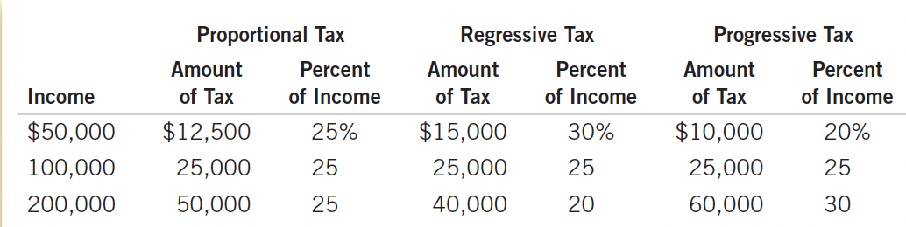

# Ch12 The Design of the Tax System

$~$

## 12.1 An Overview of U.S. Taxation

$~$

### 12.1.1 Taxes Collected by the Federal Government

>The federal government collects about 2/3 of the taxes in the economy

+ Revenue: Individual income tax
  + Social Security tax (payroll tax: tax on wages paid by businesses to workers)
  + corporate income tax, others (including: sales tax on certain special items, property tax, and tariffs, etc.).

+ Expenditures
  + Social Security (transfer payments to the elderly)
  + national defense
  + net interest (interest paid by the government when borrowing from the public)
  + income security (transfer payments to poor families, including temporary assistance to needy families and food stamps for poor families)
  + healthcare (health plans for the elderly)
  + health (Medicaid, health plans for the poor, medical research expenditures)
  + others

$~$

### 12.1.2 Taxes Collected by State and Local Governments

> State and local governments receive about 40% of tax revenue)

+ Revenue: 
  + Sales tax (levied as a percentage of total expenditure in stores)
  + property tax (levied as a percentage of the estimated value of land and buildings, paid by property owners)
  + individual income tax
  + corporate income tax
  + transfer payments from the federal government
  + others (fees for fishing and hunting licenses, road and bridge tolls)

+ Expenditures
  + Education (local governments pay for public schools)
  + public welfare (transfer payments to the poor)
  + highways
  + others (funds for libraries, police, fire departments, park maintenance, and snow removal, etc.)

$~$

## 12.2 Taxes and Efficiency

(1) The cost of taxation

Taxes should be both efficient and equitable.

If one tax raises the same or more revenue with a lower cost of taxation than another, it is more efficient. The most obvious cost of taxation is the tax payment itself, but taxes also cause two other costs:

1. Deadweight loss. Deadweight loss occurs when taxes distort the decisions people make. It is the inefficiency caused by taxes when people allocate resources based on tax incentives rather than the true costs and benefits of the goods and services they buy and sell.
2. Administrative burden. The administrative burden borne by taxpayers in complying with tax laws. Simplifying tax laws can reduce the administrative burden of the tax system.

An efficient tax system is one that causes small deadweight losses and administrative burdens.

$~$

(2) Others

**average tax rate**: total taxes paid divided by total income

>measuring the proportion of a taxpayer's income used for taxes

$~$

**marginal tax rate**: the amount by which taxes increase from an additional dollar of income

>determines the deadweight loss of income tax.

When understanding the sacrifice made by taxpayers, the average tax rate is more applicable. However, when needing to know how much incentives are distorted by taxes, i.e., how inefficient taxes are, the marginal tax rate is more appropriate.

Since people consider marginal quantities, high marginal tax rates do not encourage people to work hard and cause serious deadweight losses.

$~$

**Lump-sum tax**: a tax that is the same amount for every person

Lump-sum taxes are the most efficient taxes, mainly because:
1. Lump-sum taxes have a marginal tax rate of zero, thus not distorting decisions and causing no deadweight loss;
2. Lump-sum taxes cause the lowest administrative burden.

Lump-sum taxes are rare because they levy the same amount of tax on both rich and poor, which many people consider unfair.

$~$

## 12.3 Taxes and Equity

$~$

### 12.3.1 The Benefit Principle:

**benefits principle**: the idea that people should pay taxes based on the benefits they receive from government services.

This principle attempts to make public goods similar to private goods. People who frequently go to movies spend more money on tickets than those who rarely go, which seems fair. Similarly, a person who benefits more from public goods should pay more taxes than those who benefit less.

The benefit principle can be used to support the idea that wealthy citizens should pay more taxes than poor citizens, and can also be used to support funding anti-poverty programs with taxes from the rich.

$~$

### 12.3.2 The Ability-to-Pay Principle

**ability-to-pay principle**: the idea that taxes should be levied on a person according to how well that person can shoulder the burden

This principle sometimes justifies the claim that all citizens should make an "equal sacrifice" to support the government. However, the amount of sacrifice a person makes depends not only on how much tax they pay but also on their income and other circumstances.

$~$

The ability-to-pay principle leads to two concepts of equity: vertical equity and horizontal equity. 

**horizontal equit**y: the idea that taxpayers with similar abilities to pay taxes should pay the
same amount

**vertical equity**: the idea that taxpayers with a greater ability to pay taxes should pay larger amounts

Although these equity concepts are widely accepted, it is difficult to apply them straightforwardly to evaluate a tax system.

$~$

Three Types of Taxes Related to Vertical Equity: (As shown in Tab 12.4)

1. **proportional tax**: a tax for which high-income and low-income taxpayers pay the same
    fraction of income
2. **regressive tax**: a tax for which high-income taxpayers pay a smaller fraction of their income than do low-income taxpayers
3. **progressive tax**: a tax for which high-incometaxpayers pay a larger fraction of their income than do low-income taxpayers

   

Tab 12.4 Threee Tax Systems

   

### 12.3.3 Tax Incidence and Tax Equity

Tax incidence - the study of who bears the burden of taxation - is central to evaluating tax equity. The people who bear the burden of a tax are not always those who receive the tax bill from the government. Because taxes change supply and demand, they also change equilibrium prices. As a result, taxes affect more than just those who actually pay taxes according to the law. When evaluating the vertical and horizontal equity of any tax, it is important to consider these indirect effects.

$~$

## 12.4 Conclusion: The Trade-off between Equity and Efficiency

The goals of equity and efficiency in the tax system are often in conflict. Many people advocate changing tax laws to increase efficiency at the expense of equity, or to increase equity at the expense of efficiency. Disagreements over tax policy are often due to different emphases on these two goals.

$~$

## CHAPTER QuickQuiz

1. The two largest sources of tax revenue for the U.S. federal government are

a. personal and corporate income taxes.

b. personal income taxes and payroll taxes for social insurance.

c. corporate income taxes and payroll taxes for social insurance.

d. payroll taxes for social insurance and property taxes.

2. Aiden gives piano lessons. He has an opportunity cost of $\$ 50$ per lesson and charges $\$ 60$. He has two students: Brandon, who has a willingness to pay of $\$ 70$, and Chloe, who has a willingness to pay of $\$ 90$. When the government puts a $\$ 20$ tax on piano lessons and Aiden raises his price to $\$ 80$, the deadweight loss is $\qquad$ and the tax revenue is $\qquad$

a. $\$ 10, \$ 20$

b. $\$ 10, \$ 40$

c. $\$ 20, \$ 20$

d. $\$ 20, \$ 40$

3. If the tax code exempts the first $\$ 20,000$ of income from taxation and then taxes 25 percent of all income above that level, then a person who earns $\$ 50,000$ has an average tax rate of $\qquad$ percent and a marginal tax rate of $\qquad$ percent.

a. 15,25

b. 25,15

c. 25,30

d. 30,25

4. A toll is a tax on citizens who use toll roads. This policy can be viewed as an application of

a. the benefits principle.

b. horizontal equity.

c. vertical equity.

d. tax progressivity.

5. In the United States, taxpayers in the top 1 percent of the income distribution pay about $\qquad$ percent of their income in federal taxes.

a. 5

b. 10

c. 20

d. 30

6. If the corporate income tax induces businesses to reduce their capital investment, then

a. the tax does not have any deadweight loss.

b. corporate shareholders benefit from the tax.

c. workers bear some of the burden of the tax.

d. the tax achieves the goal of vertical equity.

$~$

## SUMMARY

- The U.S. government raises revenue using various taxes. The most important taxes for the federal government are personal income taxes and payroll taxes for social insurance. The most important taxes for state and local governments are sales taxes and property taxes.

- The efficiency of a tax system refers to the costs it imposes on taxpayers. There are two costs of taxes beyond the transfer of resources from the taxpayer to the government. The first is the deadweight loss that arises as taxes alter incentives and distort the allocation of resources. The second is the administrative burden of complying with the tax laws.

- The equity of a tax system concerns whether the tax burden is distributed fairly among the population. According to the benefits principle, it is fair for people to pay taxes based on the benefits they receive from the government. According to the ability-to-pay principle, it is fair for people to pay taxes based on their capability to handle the financial burden. When evaluating the equity of a tax system, it is important to remember a lesson from the study of tax incidence: The distribution of tax burdens is not the same as the distribution of tax bills.

- When considering changes in the tax laws, policymakers often face a trade-off between efficiency and equity. Much of the debate over tax policy arises because people give different weights to these two goals.

$~$

## QUESTIONS FOR REVIEW

1. Over the past century, has the government's tax revenue grown more or less slowly than the rest of the economy?

2. Explain how corporate profits are taxed twice.

3. Why is the burden of a tax to taxpayers greater than the revenue received by the government?

4. Why do some economists advocate taxing consumption rather than income?

5. What is the marginal tax rate on a lump-sum tax? How is this related to the efficiency of the tax?

6. Give two arguments why wealthy taxpayers should pay more taxes than poor taxpayers.

7. What is the concept of horizontal equity and why is it hard to apply?

$~$

## PROBLEMS AND APPLICATIONS

1. The information in many of the tables in this chapter can be found in the Economic Report of the President, which appears annually. Using a recent issue of the report at your library or on the Internet, answer the following questions and provide some numbers to support your answers. (Hint: The website of the Government Printing Office is http://www.gpo.gov.)

a. Figure 1 shows that government revenue as a percentage of total income has increased over time. Is this increase primarily attributable to changes in federal government revenue or in state and local government revenue?

b. Looking at the combined revenue of the federal government and state and local governments, how has the composition of total revenue changed over time? Are personal income taxes more or less important? Social insurance taxes? Corporate profits taxes?

2. Suppose you are a typical person in the U.S. economy. You pay 4 percent of your income in a state income tax and 15.3 percent of your labor earnings in federal payroll taxes (employer and employee shares combined). You also pay federal income taxes as in Table 2. How much tax of each type do you pay if you earn $\$ 30,000$ a year? Taking all taxes into account, what are your average and marginal tax rates? What happens to your tax bill and to your average and marginal tax rates if your income rises to $\$ 60,000$ ?

3. Some states exclude necessities, such as food and clothing, from their sales tax. Other states do not. Discuss the merits of this exclusion. Consider both efficiency and equity.

4. When someone owns an asset (such as a share of stock) that rises in value, he has an "accrued" capital gain. If he sells the asset, he "realizes" the gains that have previously accrued. Under the U.S. income tax system, realized capital gains are taxed, but accrued gains are not.

a. Explain how individuals' behavior is affected by this rule.

b. Some economists believe that cuts in capital gains tax rates, especially temporary ones, can raise tax revenue. How might this be so?

c. Do you think it is a good rule to tax realized but not accrued capital gains? Why or why not?

5. Suppose that your state raises its sales tax from 5 percent to 6 percent. The state revenue commissioner forecasts a 20 percent increase in sales tax revenue. Is this plausible? Explain.

6. The Tax Reform Act of 1986 eliminated the deductibility of interest payments on consumer debt (mostly credit cards and auto loans) but maintained the deductibility of interest payments on mortgages and home equity loans. What do you think happened to the relative amounts of borrowing through consumer debt and home equity debt?

7. Categorize each of the following funding schemes as examples of the benefits principle or the ability-to-pay principle.

a. Visitors to many national parks pay an entrance fee.

b. Local property taxes support elementary and secondary schools.

c. An airport trust fund collects a tax on each plane ticket sold and uses the money to improve airports and the air traffic control system.