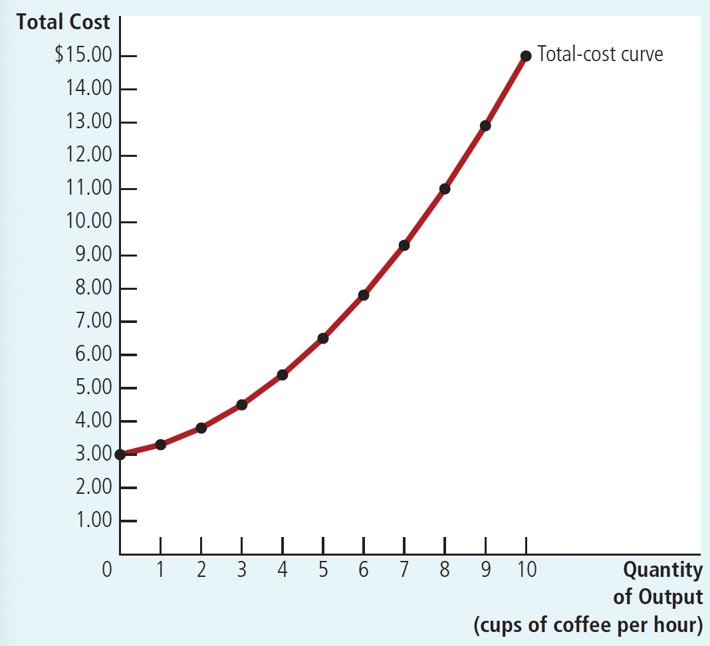

Part V: Firm Behavior and the Organization of Industry

# Ch13 The Costs of Production

$~$

## 13.1 What are costs?

**total revenue**: the amount a firm receives for the sale of its output

**total cost**: the market value of the inputs a firm uses in production

**profit** = Total revenue - Total cost

---

$~$

The ways economists and accountants measure costs:

+ When economists speak of a firm’s cost of production, they include all the opportunity costs of making its output of goods and services, including **explicit costs** and **implicit costs**.
+ Accountants have the job of keeping track of the money that flows into and out of firms. As a result, they measure the explicit costs but usually ignore the implicit costs.

$~$

**explicit costs**: input costs that require an outlay of money by the firm

> e.g. Raw materials, workers' wages, rent

**implicit costs**: input costs that do not require an outlay of money by the firm

> e.g. The value of income forgone by the owners of the business that could have been earned for other work, interest forgone on financial capital invested in the business.

---

$~$

The ways economists and accountants measure profits:

+ economic profit: total revenue minus total cost, including both explicit and implicit costs

+ accounting profit: total revenue minus total explicit cost

> Because the accountant ignores the implicit costs, accounting profit is usually larger than economic profit. For a business to be profitable from an economist’s standpoint, total revenue must exceed all the opportunity costs, both explicit and implicit.

$~$

Figure 13.1 Economists v.s. Accountants

$~$

## 13.2 Production and Costs

**production function**：the relationship between the quantity of inputs used to make a good andthe quantity of output of that good

**marginal product**: the increase in output that arises from an additional unit of input

**diminishing marginal product**: the property whereby the marginal product of an input declines as the quantity of the input increases

$~$

Now take Caroline's shop as an example of the three concepts: (As shown in Tab 13.1 and Figure 13.2)

$~$

Tab 13.1 Caroline's Production Function and Total cost

$~$

Figure 13.2 Carolin's Production and Total-Cost Curve

$~$

## 13.3 The Various Measures of Cost

> Long-term costs will be discussed in Section 13.4.
>
> Virtually all of the costs discussed in this section can be considered short-term costs
>
> i.e., all “costs” in this section can be preceded by the prefix “short-term”.

$~$

**fixed costs**(TFC): costs that do not vary with the quantity of output produced

> Fixed costs are incurred even if the firm produces nothing at all. For example, rent.

**variable costs**(TVC): costs that vary with the quantity of output produced

> For example, the cost of coffee beans, milk, sugar, and paper cups.

**Total costs**(TC): fixed costs + variable costs

$~$

**Average fixed cost**(AFC) = fixed cost / the quantity of output $AFC = FC / Q$

**Average variable cost**(AVC) = variable cost / the quantity of output $AVC = VC / Q$

**Average total cost**(ATC) = Total cost/Quantity $ATC = TC/Q$

$~$

**Marginal cost**(MC) = Change in total cost/Change in quantity $MC = ΔTC/ΔQ$

---

$~$

Take Conrad’s Coffee Shop as an example. (As shown in Tab 13.2)

Tab 13.2 The Various Measures of Cost: Conrad’s Coffee Shop

$~$

### 13.3.1 Cost Curves and Their Shapes

**Case 1: Cost Curve with diminishing marginal product**

$~$

In Conrad’s coffee shop(As shown in Tab 13.2), the total-cost curve gets steeper as the quantity of output increases because of diminishing marginal product. (As shown in Figure 13.3)

>When the quantity of coffee produced is already high, the shop is crowded with workers, and most of the equipment is fully utilized. Thus the marginal product of an extra worker is low, and the marginal cost of an extra cup of coffee is large.

$~$

Figure 13.3 Conrad's Total-Cost Curve

$~$

Figure 13.4 Conrad's Average-Cost and Marginal-Cost Curves

$~$

1. The Total Fixed Cost (TFC) curve is a horizontal line.

  > It indicates that in the short run, regardless of changes in output, total fixed costs remain constant.
2. The Total Variable Cost (TVC) curve is an upward-sloping curve starting from the origin.

  > At a certain level of output, the TVC curve has an inflection point (point C). Before this inflection point, the slope of the TVC curve is decreasing, while after the inflection point, the slope is increasing. This characteristic stems from the law of diminishing marginal returns.
3. The Total Cost (TC) curve is an upward-sloping curve that starts from the point where the horizontal TFC curve intersects the vertical axis.

  > At every level of output, not only is the slope of the TC curve equal to the slope of the TVC curve, but the vertical distance between the TC curve and the TVC curve is always equal to the Total Fixed Cost (TFC).
4. The Average Fixed Cost (AFC) curve is a hyperbola approaching both axes asymptotically, indicating that average fixed cost decreases as output increases.
5. The Marginal Cost(MC) Curve is Rising:

  > In Conrad's coffee shop, this upward slope reflects the property of diminishing marginal product.
6. The Average Total Cost(ATC) Curve is U-Shaped

     + Average fixed cost(AFC) always declines as output rises: the fixed cost is getting spread over a larger number of units. (AFC declines rapidly at first and then more slowly)

     + Average variable cost(AVC) usually rises as output increases because of diminishing marginal product.

     + **efficient scale**: the quantity of output that minimizes average total cost (The bottom of the U-shape)

7. The Relationship between Marginal Cost(MC) and Average Total Cost(ATC):

     + marginal cost < average total cost  $\Rightarrow$  average total cost is falling.

     + marginal cost > average total cost $\Rightarrow$ average total cost is rising.

     + The marginal-cost curve crosses the average-total-cost curve at its minimum.

Try to prove these three inferences!

$~$

### Case 2: No assumption of diminishing marginal production

In case 1, the firms have exhibited diminishing marginal product and, therefore, rising marginal cost at all levels of output. This simplifying assumption was useful, but many firms would experience increasing marginal product for a while before diminishing marginal product set in.(As shown in Figure 13.5)

Figure 13.5 Cost Curves for a Typical Firm

$~$

1. The Total Fixed Cost (TFC) curve is a horizontal line.
2. The Total Variable Cost (TVC) curve is an upward-sloping curve starting from the origin.
3. The Total Cost (TC) curve is an upward-sloping curve that starts from the point where the horizontal TFC curve intersects the vertical axis.
4. The Average Fixed Cost (AFC) curve is a hyperbola approaching both axes asymptotically, indicating that average fixed cost decreases as output increases.
5. The Average Variable Cost (AVC) curve, Average Total Cost (AC) curve,  and Marginal Cost (MC) curve are all U-shaped, demonstrating that costs first decrease and then increase as output rises. This characteristic also stems from the law of diminishing marginal returns.

---

Despite these differences from case 1, the cost curves in case 1 and case 2 share the three properties:

1. Marginal cost(MC) rises with the quantity of output.
2. The average-total-cost(AVC) curve is U-shaped.
3. The marginal-cost(MC) curve crosses the average-total-cost curve at the minimum of average total cost.

$~$

## 13.4 Costs in the Short Run and in the Long Run

$~$

### 13-4a The Relationship between Short-Run and Long-Run Average Total Cost

Due to the variability of fixed costs in the long run, the short-run average total cost (SRATC) curve differs from the long-run average total cost (LRATC) curve.

The long-run average total cost curve is a much flatter U-shaped curve compared to the short-run average total cost curve. Moreover, all short-run average cost curves are on or above the long-run average cost curve.

These characteristics arise because firms have greater flexibility in the long run. In fact, in the long run, a firm can choose which short-run cost curve it wants to operate on, corresponding to different scales of production. However, in the short run, it must use the short-run cost curve it has already chosen.

$~$

Figure 13.6 Average Total Cost in the Short and Long Runs

$~$

### 13-4b Economies and Diseconomies of Scale

economies of scale: the property whereby long-run average total cost falls as the quantity of output increases

diseconomies of scale: the property whereby long-run average total cost rises as the quantity of output increases

constant returns to scale: the property whereby long-run average total cost stays the same as the quantity of output changes

$~$

What might cause economies or diseconomies of scale?

+ Economies of scale: higher production levels allow specialization among workers,
which permits each worker to become better at a specific task.
>If Ford hires a large number of workers and produces a large number of cars, it can
reduce costs using modern assembly-line production.

+ Diseconomies of scale: coordination problems that are inherent in any large organization.
>The more cars Ford produces, the more stretched the management team becomes,
and the less effective the managers become at keeping costs down.

Why long-run average-total-cost curves are often U-shaped?

+ At low levels of production, long-run average total cost falls:

  + specialization increases
  + coordination problems are not yet acute

+ At high levels of production, long-run average total cost falls:

  + coordination problems grows
  + but the benefits of specialization have already been realized

$~$

