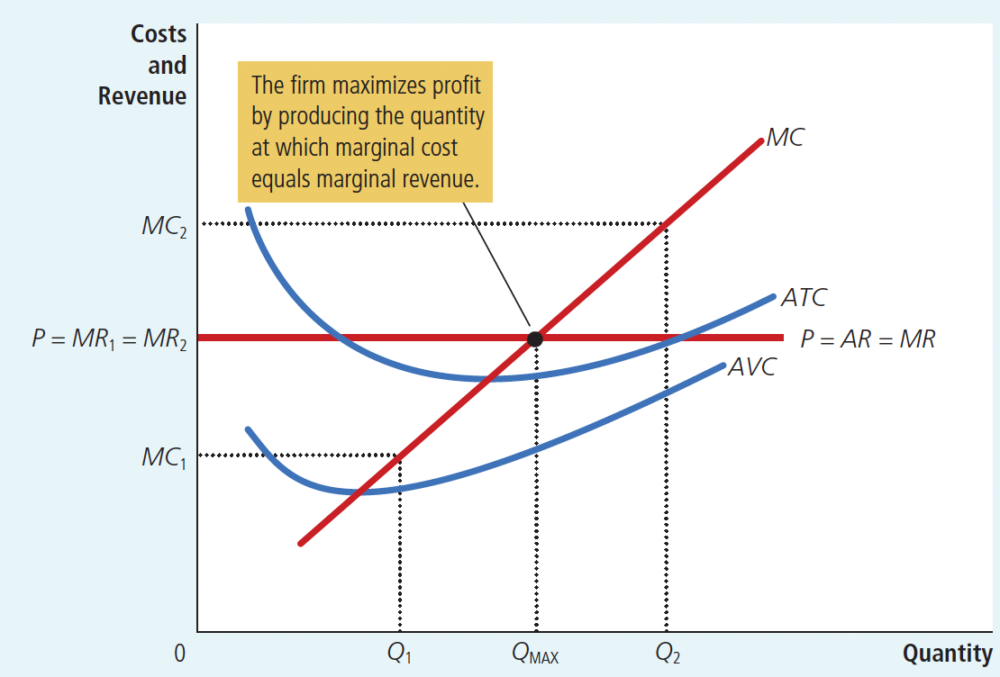
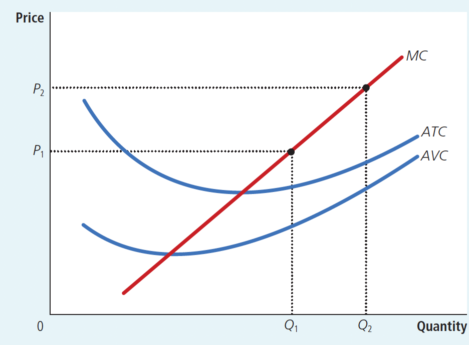
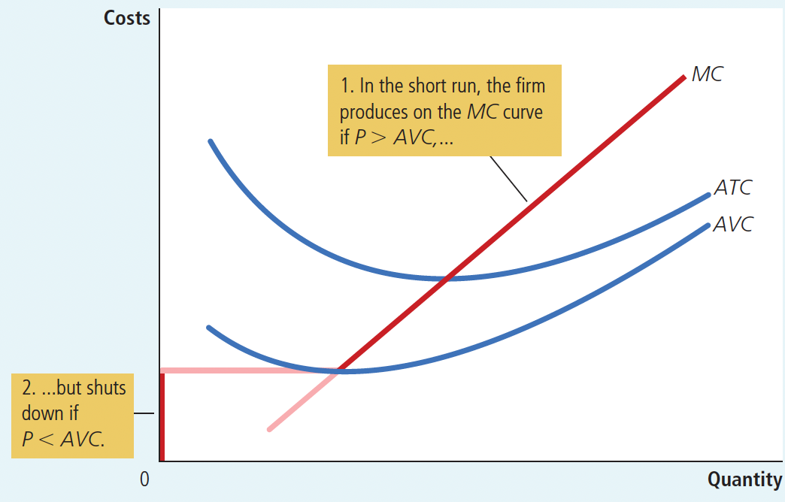
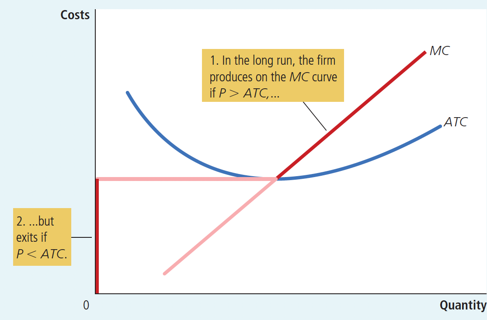
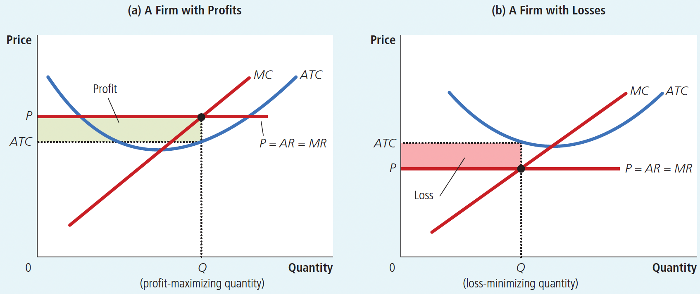
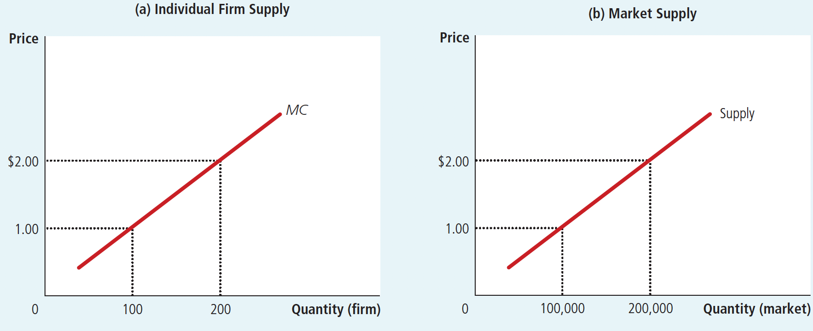
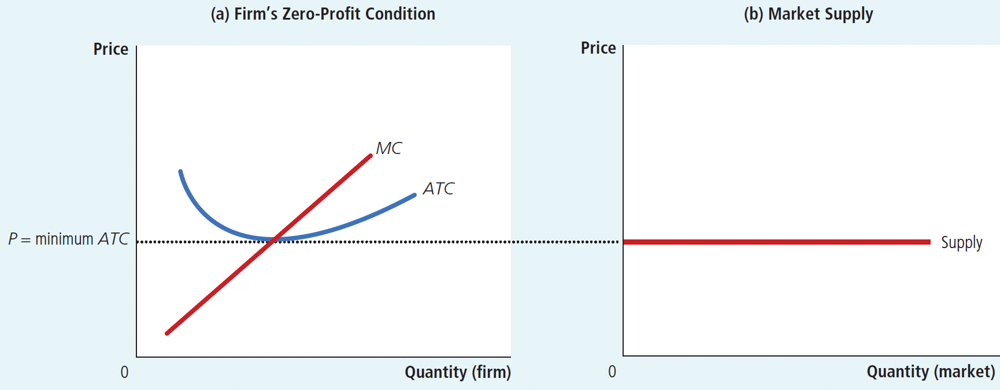
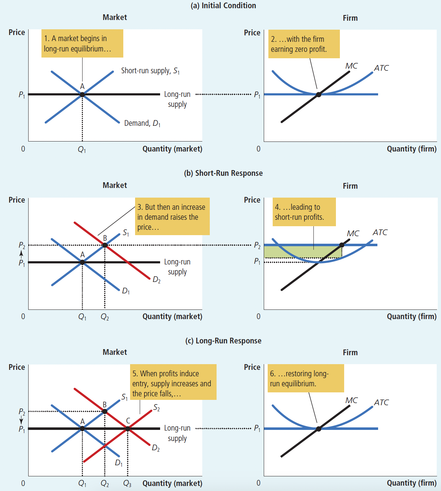

# Ch14 Firms in Competitive Markets

## 14.1 Competive Markets

### 14.1.1 The Meaning of Competition

competitive market: a market with many buyers and sellers trading identical products so that each buyer and seller is a price taker

A competitive market, sometimes called a perfectly competitive market, has three characteristics:

+ There are many buyers and many sellers in the market.
+ The goods offered by the various sellers are largely the same.
+ Firms can freely enter or exit the market.

As a result of characteristic 1 & 2, the actions of any single buyer or seller in the market have a negligible impact on the market price. Buyers and sellers in competitive markets must accept the price the market determines and, therefore, are said to be price takers.

### 14.1.2 The Revenue of a Competitive Firm

The total Revenue of a competitive firm: the total revenue earned by the firm by selling a certain amount of product at a certain price, 

i.e., $TR (Q) = P \times Q$ , where $TR (Q)$ is the total return, $P$ is the established market price, and $Q$ is the total amount of sales.

average revenue: total revenue divided by the quantity sold

 $\operatorname{AR}(Q)=T R(Q) / Q$

For all types of firms, average revenue equals the price of the good.

marginal revenue: the change in total revenue from an additional unit sold

 $M R （ Q ）=\triangle T R （ Q ） / \triangle Q$ 

For competitive firms, marginal revenue equals the price of the good.

## 14.2 Profit Maximization and the Competitive Firm's Supply Curve

## 14.2.2 The Marginal-Cost Curve and the Firm’s Supply Decision

Figure 14.1 Profit Maximization for a Competitive Firm

 

+ This figure shows the marginal-cost curve (MC), the average-total-cost curve (ATC), and the average-variable-cost curve (AVC), the market price (P)
+ For a competitive firm, the market price (P) equals both marginal revenue (MR) and average revenue (AR).
+ At the quantity $Q_1$, marginal revenue $MR_1$ exceeds marginal cost $MC_1$, so raising production increases profit.
+ At the quantity $Q_2$, marginal cost $MC_2$ is above marginal revenue $MR_2$, so reducing production increases profit.
+ The profit-maximizing quantity $Q_{MAX}$ is found where the horizontal line Price intersects the marginal-cost curve, $P = MC$ , or $MR = MC$ .

From the analysis of the image, we get three general rules for profit maximization:

1. If marginal revenue $>$ marginal cost, the firm should increase its output.
2. If marginal revenue $<$ marginal cost, the firm should decrease its output.
3. At the profit-maximizing level of output, marginal revenue $=$ marginal cost.

From equation $\mathrm{P}=\mathrm{MC}$, it can be seen that at each short-run equilibrium there is a correspondence between the output of the firm and the price of the good. This relationship can be expressed as $\mathrm{Q}_{\mathrm{S}}=\mathrm{f}(\mathrm{P})$ , which is the supply function of competing firms. Figure 14.2 shows how a competitive firm responds to the price increase.

Figure 14.2 Marginal Cost as the Competitive Firm’s Supply Curve

An increase in the price from $P_1$ to $P_2$ leads to an increase in the firm’s profit-maximizing quantity from $Q_1$ to $Q_2$. Because the marginal-cost curve shows the quantity supplied by the firm at any given price, it is the firm’s supply curve.

### 14.2.3 The Firm’s Short-Run Decision to Shut Down:

The difference between a temporary shutdown of a firm and the permanent exit of a firm from the market:

+ A shutdown refers to a short-run decision not to produce anything during a specific period of time because of current market conditions.

+ Exit refers to a long-run decision to leave the market.

The short-run and long-run decisions differ because most firms cannot avoid their fixed costs in the short run but can do so in the long run. That is, a firm that shuts down temporarily still has to pay its fixed costs, whereas a firm that exits the market does not have to pay any costs at all, fixed or variable.

What determines a firm’s shutdown decision:

If the firm shuts down, it loses all revenue from the sale of its product. At the same time, it saves the variable costs of making its product (but must still pay the fixed costs).

> The firm shuts down if total revenue is less than variable cost:

Shut down if $TR < VC$

> By dividing both sides of this inequality by the quantity Q, we can write it as:

Shut down if $TR/Q < VC/Q$

> As TR/Q, is average revenue, which equals the price P; and VC/Q, is average variable cost, AVC, we can write it as:

Shut down if $P < AVC$

Induction (a competitive firm’s profit-maximizing strategy):

> As shown in Figure 14.3

+ If the firm produces anything, it produces the quantity at which marginal cost equals the good’s price, which the firm takes as given.
+ If the price is less than average variable cost at that quantity, the firm is better off shutting down temporarily and not producing anything.
+ The competitive firm’s short-run supply curve is the portion of its marginal-cost curve that lies above average variable cost. (竞争企业的短期供给曲线，是边际成本曲线位于平均可变成本曲线之上的部分。也就是说，只有在这种情况下才会进行生产)

Figure 14.3 The Competitive Firm's Short-Run Supply Curve

### 14.2.5 The Firm's Long Run Decision to Exit or Enter a Market

sunk cost: a cost that has already been committed and cannot be recovered.

A firm’s long-run decision to exit a market is similar to its shutdown decision. If the firm exits, it will again lose all revenue from the sale of its product, but now it will save not only its variable costs of production but also its fixed costs. Thus, the firm exits the market if the revenue it would get from producing is less than its total cost.

> The firm exits if total revenue is less than total cost:

Exit if $TR < TC$

> By dividing both sides of this inequality by quantity Q, we can write it as:

Exit if $TR/Q < TC/Q$

> As TR/Q is average revenue, which equals the price P, and that TC/Q is average total cost(ATC), we can write it as:

Exit if $P < ATC$

> A parallel analysis applies to an entrepreneur who is considering starting a firm:

Enter if $P > ATC$

Induction (a competitive firm’s long-run profit-maximizing strategy):

> as shown in Figure 14.4

+ If the firm produces anything, it chooses the quantity at which marginal cost equals the price of the good.
+ If the price is less than the average total cost at that quantity, the firm chooses to exit (or not enter) the market.
+ The competitive firm’s long-run supply curve is the portion of its marginal-cost(MC) curve that lies above average total cost(ATC). If the price falls below average total cost, the firm is better off exiting the market.

Figure 14.4 The Competitive Firm’s Long-Run Supply Curve

### 14.2.6 Measuring Profit in Our Graph for the Competitive Firm

> profit equals total revenue (TR) minus total cost (TC):

$Profit = TR - TC$

> rewrite this definition by multiplying and dividing the right side by Q:

$Profit = (TR/Q - TC/Q) \times Q$

> Note that TR/Q is average revenue, which is the price, P, and TC/Q is average total cost, ATC. Therefore:

$Profit = (P - ATC) \times Q$

This way of expressing the firm’s profit allows us to measure profit in our graphs. (As shown in Figure 18.5)

The area of the shaded box between price and average total cost represents the firm’s profit. The height of this box is price minus average total cost (P - ATC), and the width of the box is the quantity of output (Q). Therefore, the area of the rectangle is $(P - ATC) \times Q$ , which is the firm’s profit.

+ In panel (a), price is above average total cost, so the firm has positive profit.

+ In panel (b), price is less than average total cost, so the firm incurs a loss.

  

FIGURE 18.5 Profit as the Area between Price and Average Total Cost

## 14.3 The Supply Curve in a Competitive Market

### 14.3.1 The Short-Run Supply Curve (in a Competitive Market)

In the short run, the number of firms in the market is fixed. For any given price, the quantity of output supplied to the market equals the sum of the quantities supplied by all the firms. (As shown in Figure 18.6)

Figure 18.6 Short-Run Market Supply

In the short run, the number of firms in the market is fixed. (For example, 1000 firms.) As a result, the market supply curve, shown in panel (b), reflects the individual firms’ marginal-cost curves, shown in panel (a).

### 14.3.2 The Long-Run Supply Curve (in a Competitive Market)

In the long-run, firms are able to enter and exit the market, and will enter or exit the market until (long-run) profit is driven to zero. (As shown in Figure 14.7)

Figure 14.7 Long-Run Market Supply

+ As a result, price equals the minimum of average total cost, as shown in panel (a). 
+ The long-run market supply curve is horizontal at this price, as shown in panel (b).
+ The number of firms adjusts to ensure that all demand is satisfied at this price(the minimum of average total cost)
+ The level of production with lowest average total cost is called the firm’s efficient scale. Therefore, in the long-run equilibrium of a competitive market with free entry and exit, firms must be operating at their efficient scale.

### 14-3c Why Do Competitive Firms Stay in Business If They Make Zero Profit?

Recall that profit equals $total ~ revenue - total ~ cost$ and that total cost includes all the opportunity costs of the firm. In particular,  the time and money that the firm owners devote to the business. In the zero-profit equilibrium, the firm’s revenue must compensate the owners for these opportunity costs.

In the zero-profit equilibrium, economic profit is zero, but accounting profit is positive. As a result, competitive firms still stay in business though they make zero profit.

### 14-3d A Shift in Demand in the Short Run and Long Run

Because firms can enter and exit in the long run but not in the short run, the response of a market to a change in demand depends on the time horizon. To see this, let’s trace the effects of a shift in demand over time. (As shown in Figure 14.8)

FIgure 14.8 An Increase in Demand in the Short Run and Long Run

+ Panel (a): The market starts in a long-run equilibrium, shown as point A in panel (a). In this equilibrium, each firm makes zero profit, and the price equals the minimum average total cost.
+ Panel (b): What happens in the short run when demand rises from $D_1$ to $D_2$ . The equilibrium goes from point A to point B, price rises from $P_1$ to $P_2$ , and the quantity sold in the market rises from $Q_1$ to $Q_2$ .
+ Panel (c): Because price now exceeds average total cost, each firm now makes a profit, which over time encourages new firms to enter the market. This entry shifts the short-run supply curve to the right from $S_1$ to $S_2$ .
+ In the new long-run equilibrium, point C, price has returned to $P_1$ but the quantity sold has increased to $Q_3$ . Profits are again zero, and price is back to the minimum of average total cost, but the market has more firms to satisfy the greater demand.

### 14-3e Why the Long-Run Supply Curve Might Slope Upward

Two reasons for an upward-sloping supply curve:

1. Some resources used in production may be available only in limited quantities. 

> Consider the market for farm products. The quantity of land is limited. As more people become farmers, the price of farmland is bid up, which raises the costs of **all farmers** in the market. Thus, an increase in demand for farm products cannot induce an increase in quantity supplied without also inducing a rise in farmers’ costs. The result is along-run market supply curve that is upward-sloping, **even with free entry into farming**.

2. Firms may have different costs.

> Consider the market for painters. Anyone can enter the market for painting services, but not everyone has the same costs. Costs vary in part because some people work faster than others and in part because some people have better alternative uses of their time than others. For any given price, those with lower costs are more likely to enter than those with higher costs. Because **new entrants have higher costs**, the price must rise to make entry profitable for them to enter the market. Thus, the long-run market supply curve for painting services slopes upward even with free entry into the market.
>
> The price in the market reflects the average total cost of the *marginal firm*—the firm that would exit the market if the price were any lower. This firm earns zero profit, but firms with lower costs earn positive profit. Entry does not eliminate this profit because would-be entrants have higher costs than firms already in the market. Higher-cost firms will enter only if the price rises, making the market profitable for them. 
>
> Thus, for these two reasons, a higher price may be necessary to induce a larger quantity supplied, in which case the long-run supply curve is upward-sloping rather than horizontal. Nonetheless, the basic lesson about entry and exit remains true. 

*Because firms can enter and exit more easily in the long run than in the short run, the long-run supply curve is typically more elastic than the short-run supply curve.*
