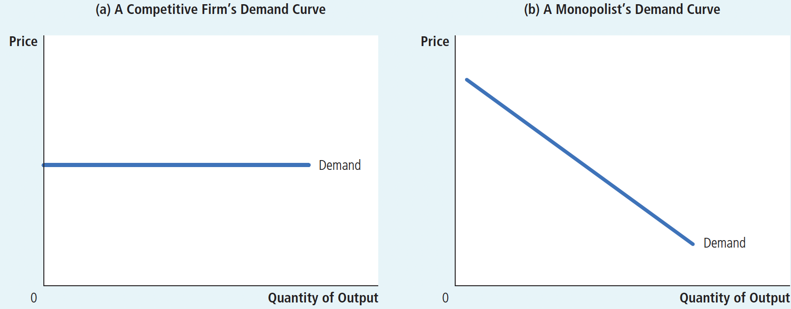
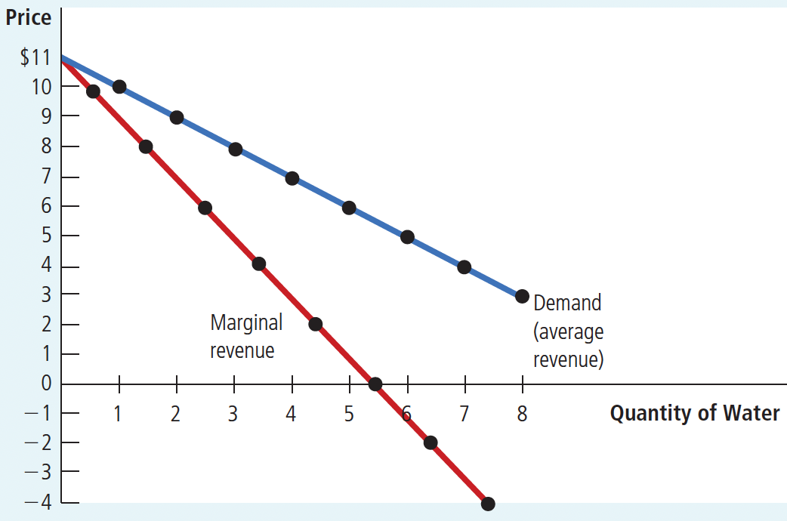
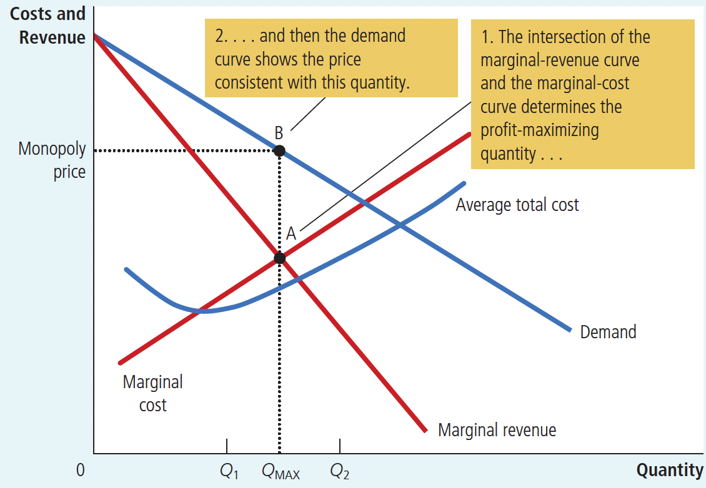
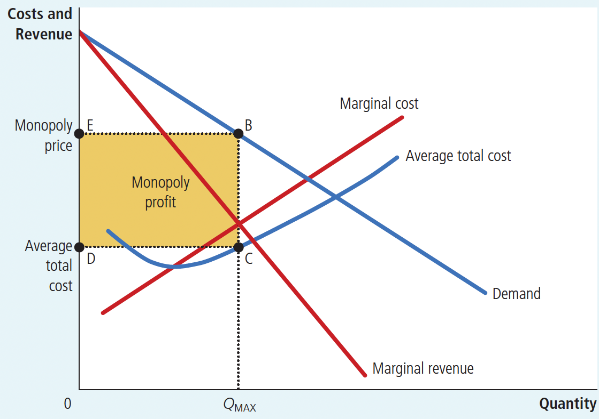
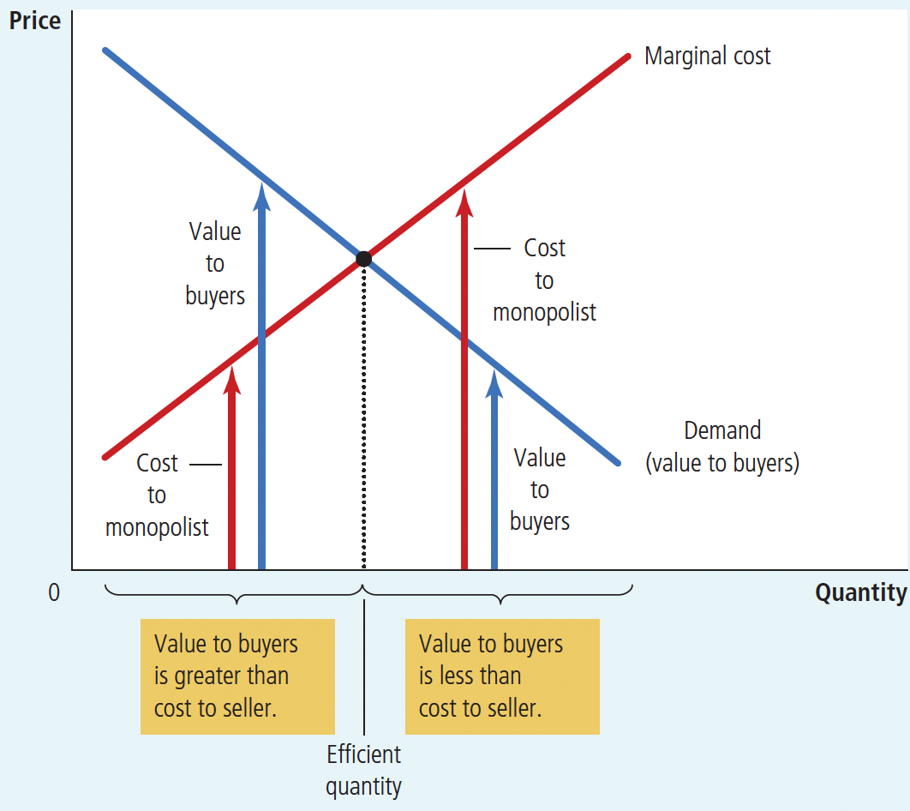
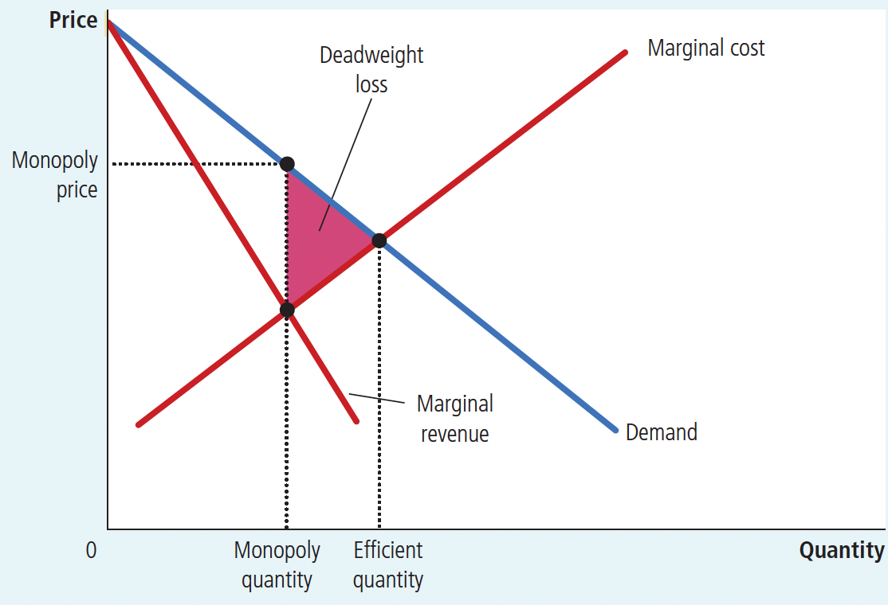
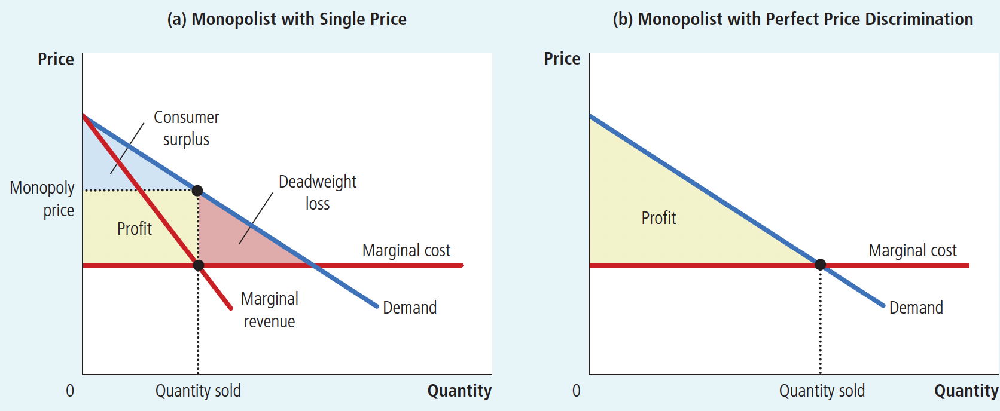
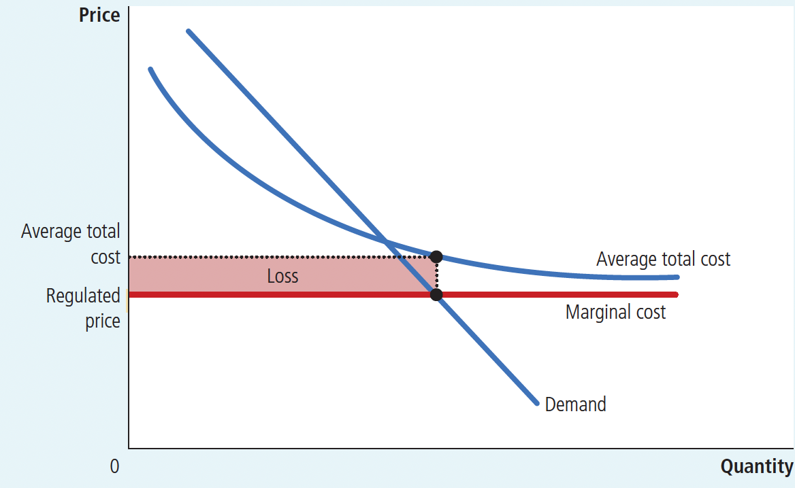

# Ch15 Monopoly 

## 15.1 Why Monopolies Arise

**Monopoly**: a firm that is the sole seller of a product without any close substitutes

Three main conditions for a monopolized market:
1. there is only one manufacturer in the market who produces and sells the goods
2. there are no close substitutes for the goods produced and sold by that vendor
3. it is extremely difficult or impossible for any other firm to enter the industry.

The fundamental cause of monopoly is barriers to entry. Barriers to entry have three main sources:

1. Monopoly resources: A key resource required for production is owned by a single firm.
2. Government regulation: The government gives a single firm the exclusive right to produce some good or service.
3. The production process: A single firm can produce output at a lower cost than can a larger number of firms.

>**natural monopoly**: a type of monopoly that arises because a single firm can supply a good or service to an entire market at a lower cost than could two or more firms

## 15.2 How Monopolies Make Production and Pring Decisions

### 15-2a Monopoly versus Competition

The key difference between a competitive firm and a monopoly is the monopoly’s ability to influence the price of its output：

+ A competitive firm is small relative to the market in which it operates and, therefore, has no power to influence the price of its output. It takes the price as given by market conditions.
+ a monopoly is the sole producer in its market, it can alter the price of its good by adjusting the quantity it supplies to the market.

The competitive firm faces a horizontal demand curve, and the demand curve faced by the monopolist slopes downward to the right. (As shown in Figure 18.2)

+ Because a competitive firm can sell as much or as little as it wants at this price.
+ The monopolist can control the market price by changing the volume of sales, i.e., by reducing the volume of sales to raise the price or by increasing the volume of sales to lower the price.

> In effect, because the competitive firm sells a product with many perfect substitutes (the products of all the other firms in its market), the demand curve that any one firm faces is perfectly elastic.

Figure 18.2 Demand Curves for Competitive and Monopoly Firms

The market demand curve provides a constraint on a monopoly’s ability to profit from its market power:

+ A monopolist would prefer, if it were possible, to charge a high price and sell a large quantity at that high price.
+ The market demand curve makes that outcome impossible. In particular, the market demand curve describes the combinations of price and quantity that are available to a monopoly firm.
+ By adjusting the quantity produced (or equivalently, the price charged), the monopolist can choose any point on the demand curve, but it cannot choose a point off the demand curve.

### 15-2b A Monopoly’s Revenue
Marginal revenue for monopolies is different from marginal revenue for competitive firms. When a monopoly increases the amount it sells, this action has two effects on total revenue ( $P \times Q$ ):

+ The output effect: More output is sold, so $Q$ is higher, which tends to increase total revenue.
+ The price effect: The price falls, so $P$ is lower, which tends to decrease total revenue.

When it increases production by 1 unit, it receives the market price for that unit, and it does not receive any less for the units it was already selling. That is because the competitive firm is a price taker, its marginal revenue equals the price of its good. 

When a monopoly increases production by 1 unit, it must reduce the price it charges for every unit it sells, and this cut in price reduces revenue on the units it was already selling. As a result, a monopoly’s marginal revenue is less than its price.

The marginal revenue (MR) curve for a monopoly manufacturer is also sloped to the lower right and lies below the average revenue (AR) curve. (As shown in Figure 15.3)

Figure 15.3 Demand and Marginal-Revenue Curve for a Monopoly

### 15-2c Profit Maximization

A monopolist maximizes its profit in two steps:

**Step 1. Choose the quantity of output that equates marginal revenue and marginal cost:**

Figure 15.4 graphs the demand curve, the marginal-revenue curve, and the cost curves for a monopoly firm. These curves contain all the information to determine the level of output that a profit-maximizing monopolist will choose.

Figure 15.4 Profit Maximization for a Monopoly

+ a low level of output such as $Q_1$ : marginal cost $<$ marginal revenue. If the firm increased production by 1 unit, the additional revenue would exceed the additional costs, and profit would rise.

+ high levels of output such as $Q_2$ : marginal cost $>$ marginal revenue. If the firm reduced production by 1 unit, the costs saved would exceed the revenue lost. Thus, if marginal cost is greater than marginal revenue, the firm can raise profit by reducing production.
+ the firm adjusts its level of production until the quantity reaches $Q_{MAX}$ , at which marginal revenue $=$ marginal cost. The monopolist’s profit-maximizing quantity of output is determined by the intersection of the marginal- revenue curve and the marginal-cost curve. (point A in Figure 4)

Competitive firms also choose the quantity of output at which marginal revenue equals marginal cost. But the marginal revenue of a competitive firm equals its price, whereas the marginal revenue of a monopoly is less than its price:

For a competitive firm: $P = MR = MC$

For a monopoly firm: $P > MR = MC$

**Step 2. Use the demand curve to find the highest price it can charge for that quantity:**

In Figure 4, the profit-maximizing price is found at point B. 

The key difference between markets with competitive firms and markets with a monopoly firm:

+ In competitive markets, price equals marginal cost.
+ In monopolized markets, price exceeds marginal cost.

### 15-2d A Monopoly’s Profit

Recall that profit equals total revenue (TR) minus total costs (TC):

$Profit = TR - TC = (TR/Q - TC/Q) \times Q =  (P - ATC) \times Q$

This equation for profit (which also holds for competitive firms) allows us to measure the monopolist’s profit in our graph. Consider the shaded box in Figure 15.5 . The height of the box (the segment BC) is price minus average total cost, $P – ATC$ , which is the profit on the typical unit sold. The width of the box (the segment DC) is the quantity sold, $Q_{MAX}$ . Therefore, the area of this box $(P - ATC) \times Q$ is the monopoly firm’s total profit.

FIGURE 15.5 The Monopolist’s Profit

> Why a Monopoly Does Not Have a Supply Curve?
>
> We have analyzed the price in a monopoly market using the market demand curve and the firm’s cost curves, without making any mention of the market supply curve. By contrast, when we analyzed prices in competitive markets beginning in Chapter 4, the two most important words were always supply and demand.
>
> What happened to the supply curve? Although monopoly firms make decisions about what quantity to supply, a monopoly does not have a supply curve. A supply curve tells us the quantity that firms choose to supply at any given price. This concept makes sense when we are analyzing competitive firms, which are price takers. But a monopoly firm is a price maker, not a price taker. It is not meaningful to ask what amount such a firm would produce at any given price because it cannot take the price as given. Instead, when the firm chooses the quantity to supply, that decision (along with the demand curve) determines the price.
>
> In a competitive market, each firm’s supply decisions can be analyzed without knowing the demand curve, but the monopolist’s decision about how much to supply is impossible to separate from the demand curve it faces. The shape of the demand curve determines the shape of the marginal-revenue curve, which in turn determines the monopolist’s profit-maximizing quantity. Therefore, we never talk about a monopoly’s supply curve.

## 15.3 The Welfare Cost of Monopolies

Consider maximizing total surplus, which equals

+ producer surplus (profit) $+$ consumer surplus
+ value of the good to consumers $-$ the costs of making the good incurred by the monopoly producer

The socially efficient quantity is found where the demand curve and the marginal-cost curve intersect. (As shown in Figure 15.7)

+ Below this quantity, the value of an extra unit to consumers exceeds the cost of providing it, so increasing output would raise total surplus.
+ Above this quantity, the cost of producing an extra unit exceeds the value of that unit to consumers, so decreasing output would raise total surplus.
+ At the optimal quantity, the value of an extra unit to consumers exactly equals the marginal cost of production.

Figure 15.7 The Efficient Level of Output

A benevolent social planner chooses the quantity at which the demand and marginal-cost curves intersect to maximize total surplus.

The monopolist chooses to produce and sell the quantity of output at which the marginal-revenue and marginal-cost curves intersect.

As a result, the monopolist produces less than the socially efficient quantity of output. (As shown in Figure 15.8)

Figure 15.8 The Inefficiency of Monopoly

Because a monopoly charges a price above marginal cost, not all consumers who value the good at more than its cost buy it. Thus, the quantity produced and sold by a monopoly is below the socially efficient level. The deadweight loss is represented by the area of the triangle between the demand curve (which reflects the value of the good to consumers) and the marginal-cost curve (which reflects the scosts of the monopoly producer).

## 15.4 Price Discrimination

**Price discrimination**: the business practice of selling the same good at different prices to different customers

Features of price discrimination:

1. For a firm to price discriminate, it must have some market power.

   >Price discrimination is not possible when a good is sold in a competitive market.

2. price discrimination is a rational strategy for a profit-maximizing monopolist. 

3. price discrimination requires the ability to separate customers according to their willingness to pay.

4. market forces can prevent firms from price discriminating.

   > e.g. , arbitrage(套利), the process of buying a good in one market at a low price and selling it in another market at a higher price to profit from the price difference

5. Price discriminationcan raise economic welfare, eliminating the inefficiency inherent in monopoly pricing.

## 15.4 The Analytics of Price Discrimination

*Perfect price discrimination* describes a situation in which the monopolist knows exactly each customer’s willingness to pay and can charge each customer a different price. In this case, the monopolist charges each customer exactly her willingness to pay, and the monopolist gets the entire surplus in every transaction.

Figure 15.9 illustrates producer and consumer surplus with and without price discrimination. To keep things simple, this figure is drawn assuming constant per unit costs—that is, marginal cost and average total cost are constant and equal.

Figure 15.9 Welfare with and without Price Discrimination

+ Panel (a): Without price discrimination, the firm charges a single price above marginal cost. Because some potential customers who value the good at more than marginal cost do not buy it at this high price, the monopoly causes a deadweight loss.
+ Panel (b): When a firm can perfectly price discriminate, as shown in  each customer who values the good at more than marginal cost buys the good and is charged her willingness to pay. All mutually beneficial trades take place, no deadweight loss occurs, and the entire surplus derived from the market goes to the monopoly producer in the form of profit.

*Imperfect price discrimination*: Customers within each group differ in their willingness to pay for the product, making perfect price discrimination impossible. There is no general answer on how imperfect price discrimination affects welfare. The only certain conclusion is that price discrimination raises the monopoly’s profit; otherwise, the firm would choose to charge all customers the same price.

Examples of Price Discrimination:

+ Movie Tickets
+ Airline Prices
+ Discount Coupons
+ Financial Aid
+ Quantity Discounts

## 15.5 Public Policy toward Monopolies

Policymakers in the government can respond to the problem of monopoly in one of four ways:

**1.By trying to make monopolized industries more competitive**:

> Increasing Competition with Antitrust Laws.

**2.By regulating the behavior of the monopolies:**

Two practical problems with margina lcost pricing as a regulatory system(按边际成本为垄断企业定价的两个问题):

1. Because a natural monopoly has declining average total cost, marginal cost is less than average total cost. Therefore, if regulators require a natural monopoly to charge a price equal to marginal cost, price will be below average total cost, and the monopoly will lose money.(As shown in Figure 15.10)
   + If subsidize the monopolist $\cdots$ In essence, the government picks up the losses inherent in marginal-cost pricing. Yet to pay for the subsidy, the government needs to raise money through taxation, which involves its own deadweight losses.
   + If allow the monopolist to charge a price higher than **marginal cost** $\cdots$ If the regulated price equals **average total cost**, the monopolist earns exactly zero economic profit. (Better than money loss) Yet this leads to deadweight losses because the monopolist’s price no longer reflects the marginal cost of producing the good. In essence, average-cost pricing is like a tax on the good the monopolist is selling.

2. A regulatory system (and with average-cost pricing as well)  gives the monopolist no incentive to reduce costs.

Figure 15.10 Marginal Pricing for a Natural Monopoly

**3.By turning some private monopolies into public enterprises:**

**4.By doing nothing at all:**

