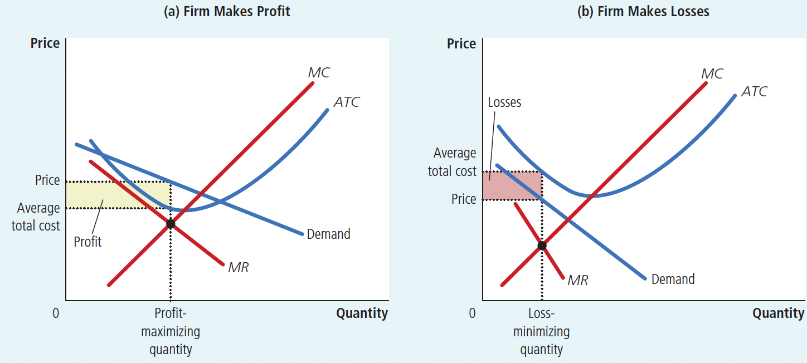
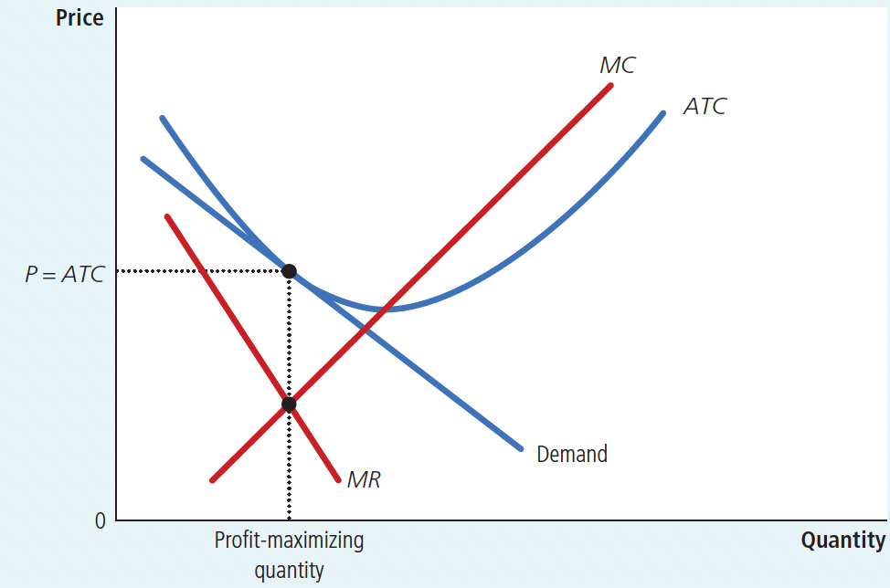
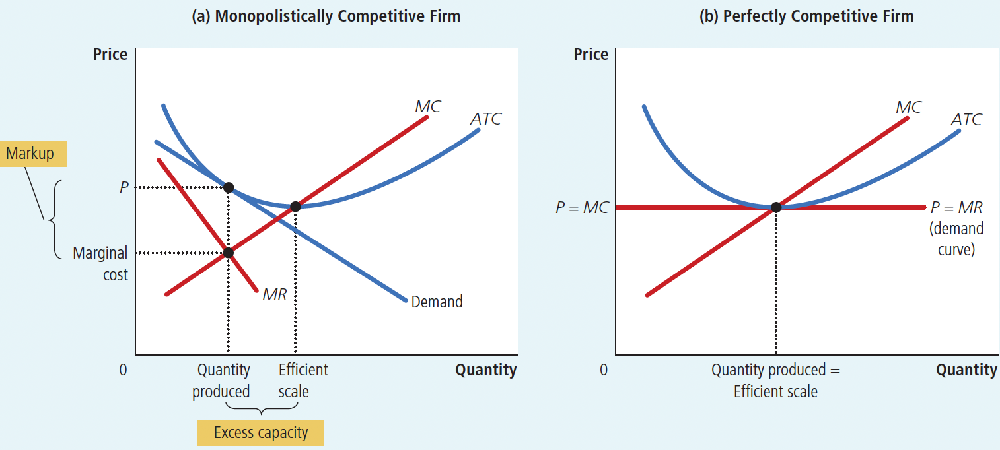

# Ch16 Monopolistic Competition

$~$

## 16.1 Between Monopoly and Perfect Competition

*Imperfect competition*: between Monopoly and perfect competition.

**Monopolistic competition**: a market structure in which many firms sell products that are similar but not identical.

$~$

Attributes of a monopolistic competition market:

+ Many sellers: There are many firms competing for the same group of customers.
+ Product differentiation: Each firm produces a product that is at least slightly different from those of other firms. Thus, rather than being a price taker, each firm faces a downward-sloping demand curve.
+ Free entry and exit: Firms can enter or exit the market without restriction. Thus, the number of firms in the market adjusts until economic profits are driven to zero.

$~$

**Demand Curve of Monopolistic Competition Firms:**

1. The demand curve also slopes downward to the right.

    >Since firms in monopolistic competition can, to some extent, control the price of their products.

2. The downward-sloping demand curve of monopolistic competition firms is relatively flat, similar to perfectly competitive firms.

    >The competitive factors in the market result in a highly elastic demand curve.

**Profit Maximization Rule for Monopolistic Competition Firms:**

>follow the profit maximization rule of monopolists:

1. Choose the output level where Marginal Revenue (MR) equals Marginal Cost (MC)

2. Use their demand curve to determine the price consistent with this output level.

$~$

## 16-2 Competition with Differentiated Products

$~$

### 16.2.1 The Short-Run Equilibrium of the Monopolistically Competitive Firm

In the short run equilibrium, the monopolistically competitive firm achieves the equilibrium condition of $MR = MC$ , by making simultaneous adjustments to output and price at the current scale of production, and may:

+ maximize profits
+ have zero profits
+ suffer minimal losses

Figure 16.2 Monopolistic Competitors in the Short Run

$~$

### 16.2.2 The Long-Run Equilibrium of the Monopolistically Competitive Firm

Two characteristics of the long-run equilibrium of monopolistically competitive firms

(1) Same as monopoly,

Price is above marginal cost because profit maximization requires that  $MC = MR$ .

The MR curve is below the demand curve because the demand curve slopes to the lower right.

(2) Same as competition, price is equal to average cost, so economic profit is equal to zero.
>Economic profit is zero because, unlike a monopoly, monopolistic competition firms have free entry.

Figure 16.3 A Monopolistic Competitor in the Long Run

$~$

### 16.2.3 Monopolistic versus Perfect Competition

Long-run equilibrium under monopolistic competition and perfect competition differs in two ways: (As shown in Figure 16.4)

**Difference 1: Excess Capacity**

The perfectly competitive firm produces at the efficient scale, where average total cost is minimized. By contrast, the monopolistically competitive firm produces at less than the efficient scale.

Under monopolistic competition, firms produce on the downward-sloping portion of their average-total-cost curves. (As shown in Figure 16.4)

In long-run equilibrium, perfectly competitive firms produce at the *efficient scale*(the quantity that minimizes average total cost). In contrast, monopolistically competitive firms produce below this level.

The difference is called excess capacity.

$~$

**Difference 2: Markup over Marginal Cost**

For a perfectly competitive firm, 
price equals marginal cost.

For a monopolistically competitive firm, price exceeds marginal cost.
>Because the firm always has some market power.

The zero-profit condition ensures only that price $=$ average total cost. It does not ensure that price equals marginal cost.

In the long-run equilibrium, monopolistically competitive firms operate on the declining portion of their average-total-cost curves, so marginal cost $<$ average total cost. Thus, for price to equal average total cost, price must be above marginal cost.

Perfectly competitive firms don't care about extra sales because additional profits are 0. But a monopolistically competitive firm is always eager to get another customer. Because its price exceeds marginal cost, an extra unit sold at the posted price means more profit.

Figure 16.4 Monopolistic versus Perfect Competition (the long-run euilibrium)

$~$

### 16.2.4 Monopolistic Competition and the Welfare of Society

Monopolistic competition reduces the level of social welfare and leads to market inefficiency as compared to perfect competition. 

Sources of inefficiency in monopolistically competitive markets:

1. The markup of price over marginal cost.

    >Because of the markup, some consumers who value the good at more than the marginal cost of production (but less than the price) will be deterred from buying it. Thus, a monopolistically competitive market has the normal deadweight loss of monopoly pricing.

2. The number of firms in the market may not be "ideal". That is, there may be too much or too little entry, because a new firm entering the market takes into account only the profit it would make.

This entry would also have the following two effects that are external to the firm:

1. The product-variety externality: Because consumers get consumer surplus from the introduction of a new product, the entry of a new firm conveys a positive externality on consumers.
2. The business-stealing externality: Because other firms lose customers and profits when faced with a new competitor, the entry of a new firm imposes a negative externality on existing firms.

Whether there are too many or too few products in a monopolistically competitive market depends on which externality is greater.

$~$

## 16.3 Advertising

Critics of advertising argue that firms advertise to manipulate people's preferences and suppress competition.

Defenders of advertising argue that firms advertise to provide information to customers,  increasing competition and the ability of markets to allocate resources efficiently.

$~$

### 16.3.3 Brand Names

Critics argue that brands make consumers perceive differences that do not actually exist. In many cases, unbranded items are virtually indistinguishable from branded items.

Defenders  argue that
1. Brands provide consumers with information about the quality of products whose quality cannot be easily judged before purchase.
2. Brands provide firms with incentives to maintain high quality because firms have an economic purpose to maintain their brand reputation.