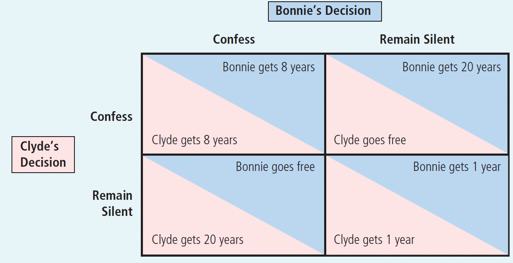

# Ch17 Oligopoly

$~$

## 17-1 Markets with Only a Few Sellers

**Oligopoly**: a market structure in which only a few sellers offer similar or identical products.

**Collusion**: an agreement among firms in a market about quantities to produce or prices to charge.

$~$

**Cartel**: a group of firms acting in unison.

Once a cartel is formed, the market is in effect served by a monopoly. A cartel must agree not only on the total level of production but also on the amount produced by each member. 

$~$

### 17-1c The Equilibrium for an Oligopoly

Oligopolists would like to form cartels and earn monopoly profits, but that is often impossible:

+ Squabbling among cartel members over how to divide the profit in the market can make agreement among members difficult.
+ Antitrust laws prohibit explicit agreements among oligopolists as a matter of public policy. Even talking about pricing and production restrictions with competitors can be a criminal offense.

$~$

**Nash equilibrium**: a situation in which economic actors interacting with one another each choose their best strategy *given the strategies that all the other actors have chosen*.

$~$

**The tension between cooperation and self-interest:**

1. Cooperation does not drive the oligopoly market to the monopoly outcome, though this can maximize their joint profit, because Oligopolists each pursue their own self-interest:

	Each member of the cartel will want a larger share of the market because a larger market share means larger profit. As each of them tries to do this, total production $\uparrow$ , and the price $\downarrow$

$~$

2. Self-interest does not drive the market to the competitive outcome:

	Like monopolists, oligopolists are aware that increasing the amount they produce reduces the price of their product, which in turn affects profits. Therefore, they stop short of following the competitive firm’s rule of producing up to the point where price equals marginal cost.

$~$

3. Summary: *when firms in an oligopoly individually choose production to maximize profit, they produce a quantity of output greater than the level produced by monopoly and less than the level produced by perfect competition. The oligopoly price is less than the monopoly price but greater than the competitive price (which equals marginal cost)*.

$~$

### 17-1d How the Size of an Oligopoly Affects the Market Outcome

How production in an oligopolistic market affects profit:

+ The output effect: Because price is above marginal cost, selling one more unit of good at the going price will raise profit.
+ The price effect: Raising production will increase the total amount sold, which will lower the price of the good and lower the profit on all the other gallons sold.

$~$

**The effect of the number of firms in the industry on each oligopoly**

As the number of sellers in an oligopoly $\uparrow$ :

+ The magnitude of the price effect $\downarrow$
  + When the oligopoly grows very large, the price effect is absent
    + The production decision of an individual firm no longer affects the market price.
    + Each firm takes the market price as given when deciding how much to produce and, therefore increases production as long as price is above marginal cost.
+ The oligopolistic market $\rightarrow$ a competitive market
  + The price $\rightarrow$ marginal cost
  + The quantity produced $\rightarrow$ the socially efficient level

$~$

## 17-2 The Economics of Cooperation 博弈论与合作经济学

> Why cooperation is difficult to maintain even when it is mutually beneficial?

$~$

game theory: the study of how people behave in strategic situations

$~$

### 17-2a The Prisoners’ Dilemma

**prisoners’ dilemma**: a particular “game” between two captured prisoners that illustrates why cooperation is difficult to maintain even when it is mutually beneficial.

+ 2 criminals A and B, and they face 3 cases (As shown in Figure 17.1):
  + case 1: A confess and implicate B, and B does not confess: A go free, B get 20 years in jail.
  + case 2: A and B both confess: both get 8 year in jail.
  + case 3: Neither of them confess: both get 1 year in jail.

$~$

Figure 17. 1 The Prisoners’ Dilemma

$~$

**dominant strategy**: a strategy that is best for a player in a game regardless of the strategies chosen by the other players

The Prisoner's Dilemma reflects the problem that the dominant strategy chosen from the perspective of the individual ends badly when viewed as a whole, i.e., individual rationality clashes with group rationality.

The logic of the Prisoner's Dilemma applies to many situations, including arms races, advertising, commons issues, and oligarchic.

$~$

The Prisoners’ Dilemma illustrates why oligopolies have trouble maintaining monopoly profits. The monopoly outcome is jointly rational, but each oligopolist has an incentive to cheat. Just as self-interest drives the prisoners in the prisoners’ dilemma to confess, self-interest makes it difficult for the oligopolists to maintain the cooperative outcome with low production, high prices, and monopoly profits.

$~$

### 17-2d The Prisoners’ Dilemma and the Welfare of Society

$~$

The prisoners’ dilemma  shows that cooperation can be difficult to maintain even when cooperation would make both players in the game better off. But is lack of cooperation a problem from the standpoint of society as a whole? The answer depends on the circumstances:

1. In the arms-race game, the noncooperative equilibrium is bad for society as well as the players, and society would be better off if the two players could reach the cooperative outcome.

2. The Prisoner's Dilemma leads to competition among oligopolies. The monopolistic outcome is good for the oligopolies, but the competitive outcome is best for society because it maximizes aggregate surplus. When oligopolies fail to cooperate, they produce close to the socially optimal quantity

$~$

### 17-2e Why People Sometimes Cooperate

$~$

1. In an indefinitely repeated game, there is always a chance for the other participants to give retaliation. Therefore, each participant will not take the behavior of cheating or defaulting. The equilibrium solution of Prisoner's Dilemma cooperation exists, and both participants can achieve the cooperative result.

2. In the finite-period repeated game, at the beginning of the game, each participant adopts the uncooperative strategy of cheating or defaulting. Therefore, the Nash equilibrium is the non-cooperation of the participants.

$~$

## 17-3 Public Policy toward Oligopolies

Policymakers use antitrust laws  to prevent oligopolists from acting together in ways that would make their markets less competitive.

The applicability of these laws is debated because some of the behaviors that appear likely to reduce competition may actually have a legitimate business purpose

Typical examples of debates about antitrust policy:

+ Resale Price Maintenance (转售价格维持)
+ Predatory Pricing (掠夺性定价)
+ Tying (搭售)