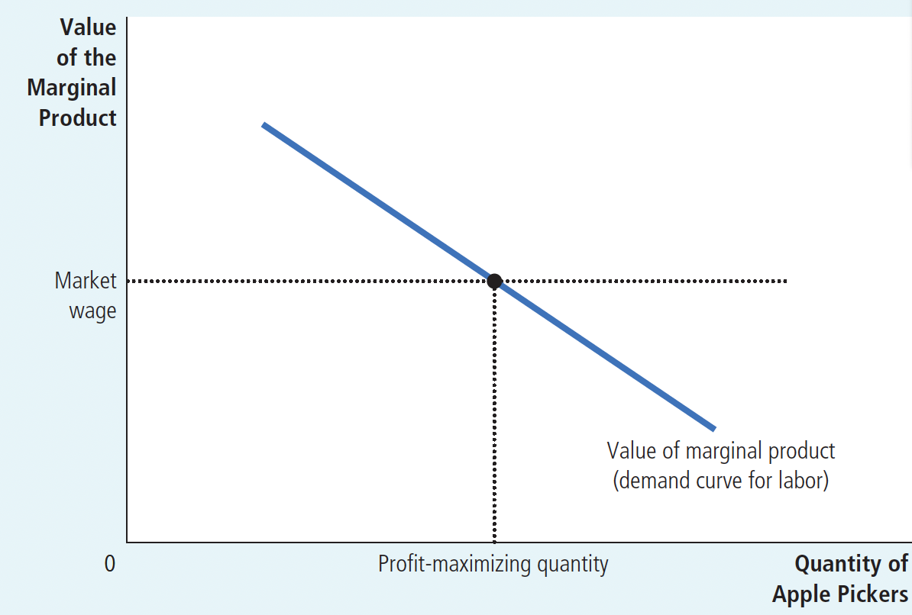
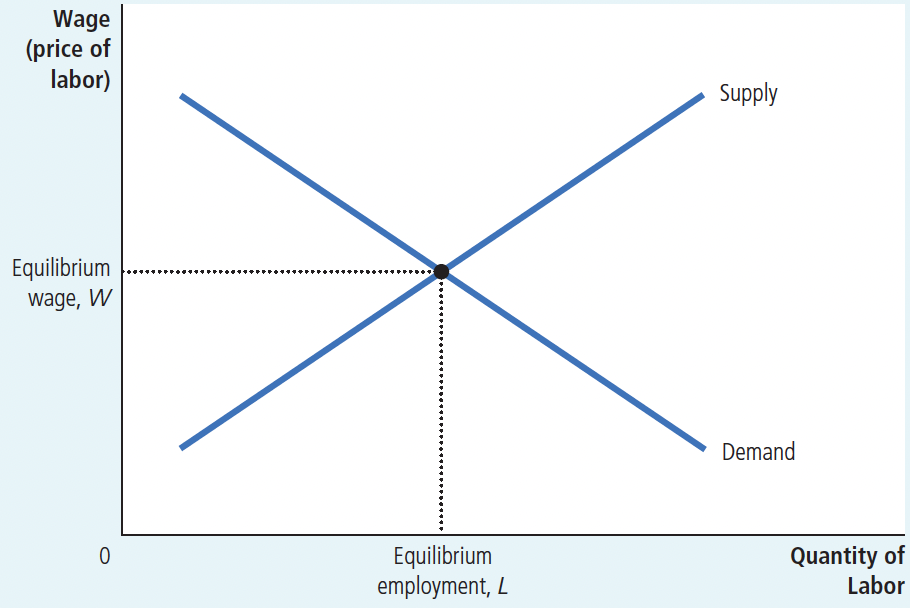
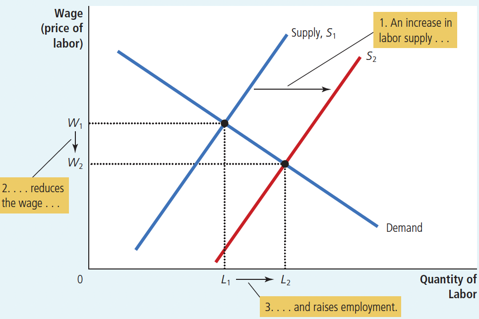
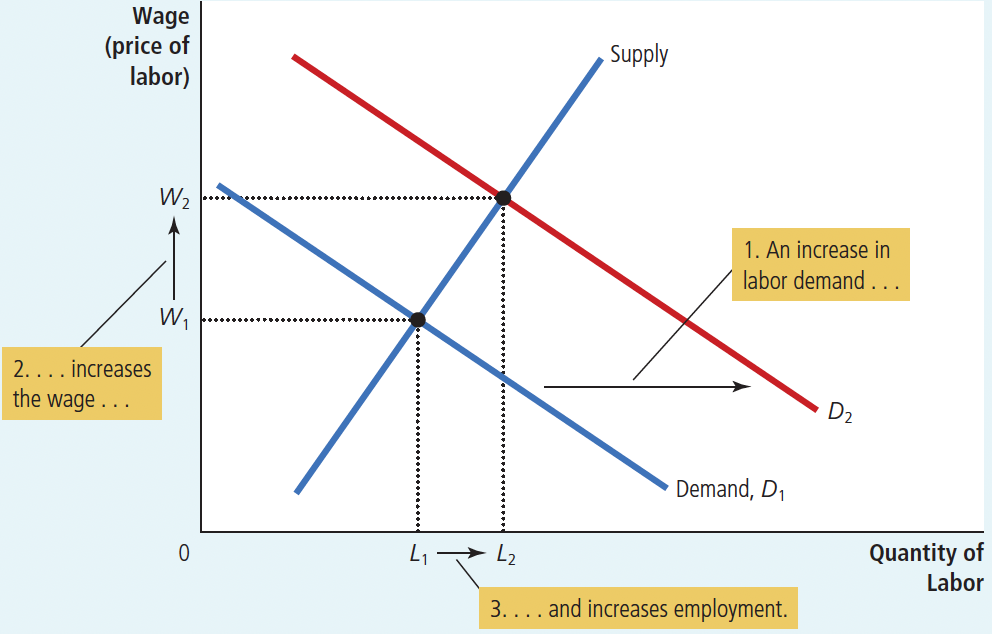
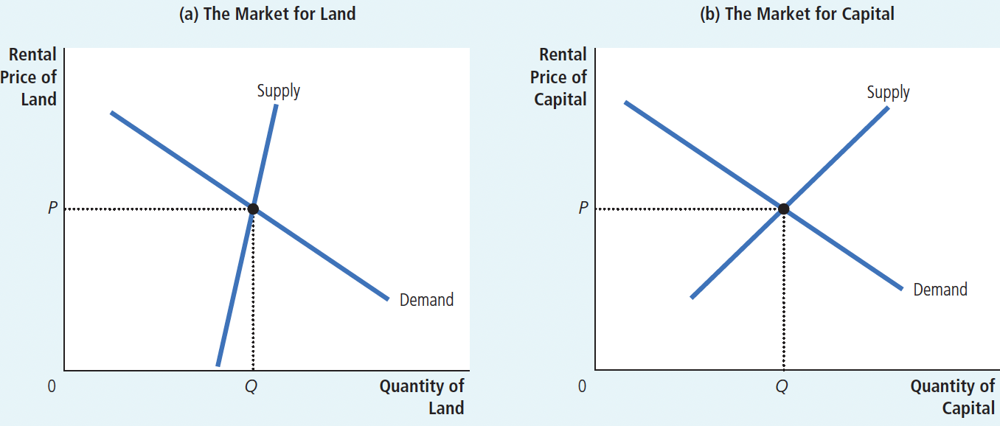

PART VI The Economics of Labor Markets

# Ch18 The Markets for the Factors of Production

**Factors of Production**: the inputs used to produce goods and services

$~$

## 18-1 The Demand for Labor

$~$

### 18-1a The Competitive Profit-Maximizing Firm

The price of labor, i.e. wages, is determined by the supply and demand for labor.

The demand for a factor of production is a *derived demand*. That is, a firm’s demand for a factor of production is derived from its decision to supply a good in another market.

Therefore, examining labor demand requires making two assumptions about firms:

+ Competitive(In product markets and factor markets)
+ Profit-Maximizing

$~$

### 18-1b The Production Function and the Marginal Product of Labor

**production function**: the relationship between the quantity of inputs used to make a good and the quantity of output of that good

**marginal product of labor**: the increase in the amount of output from an additional unit of labor

**diminishing marginal product**: the property whereby the marginal product of an input declines as the quantity of the input increases

理性决策者考虑边际量，可以从生产函数中得出劳动的边际产量——增加一单位劳动所引起的产量增加量。生产函数表现出边际产量递减的性质，即随着一种投入量的增加，该投入要素的边际产量递减。

$~$

### 18-1c The Value of the Marginal Product and the Demand for Labor边际产量值和劳动需求

>To find the worker’s contribution to revenue, we must convert the marginal product of labor (which is measured in bushels of apples) into the value of the marginal product (which is measured in dollars).

**value of the marginal product**: the marginal product of an input times the price of the output(As showin in Figure 3)

FIGURE 3 The Value of the Marginal Product of Labor

A competitive, profit-maximizing firm hires workers up to the point at which the value of the marginal product of labor equals the wage. The value-of-marginal-product curve is the labor-demand curve for a competitive, profit-maximizing firm.

$~$

对一个竞争的、追求利润最大化的企业来说，这条边际产量值曲线也是企业的劳动需求曲线。企业选择劳动量的决策原则是使边际产量值等于工资。

18-1d What Causes the Labor-Demand Curve to Shift

1. The Output Price

A rise in the price of the product increases the value of marginal output, and shifts the labor-demand curve to the right.

2. Technological Change
+ labor-augmenting technological change: Increase the marginal output of labor, and shift the labor-demand curve to the right. (Most possibly)
+ labor-saving technological change: Reduce the marginal product of labor, and shift the labor-demand curve to the left.

3. The Supply of Other Factors

$~$

## 18-2 The Supply of Labor

**The labor-supply curve:**

The labor-supply curve reflects how workers’ decisions about the labor- leisure trade-off respond to a change in that opportunity cost. An upward-sloping labor-supply curve means that an increase in the wage induces workers to increase the quantity of labor they supply.

However, the labor-supply curve need not be upward-sloping. With your extra wealth you may enjoy more leisure. If so, your labor supply curve would slope backward. In Chapter 21, we discuss the income and substitution effects. For now, we assume that the labor-supply curve is upward-sloping.

$~$

**What Causes the Labor-Supply Curve to Shift?**

1. Changes in Tastes
2. Changes in Alternative Opportunities
3. Immigration

$~$

## 18-3 Equilibrium in the Labor Market

So far we have established two facts about how wages are determined in competitive labor markets: (As shown in Figure 4)

+ The wage adjusts to balance the supply and demand for labor.
+ The wage equals the value of the marginal product of labor.

$~$

FIGURE 4 Equilibrium in a Labor Market

Any event that changes the supply or demand for labor must change the equilibrium wage and the value of the marginal product by the same amount because these must always be equal.

$~$

### 18-3a Shifts in Labor Supply

When labor supply increases (from $S_1$ to $S_2$ ):

+ The equilibrium wage falls
+ The employment rises, because at this lower wage, firms hire more labor. (As shown in Figure 5)

The change in the wage reflects a change in the value of the marginal product of labor: With more workers, the added output from an extra worker is smaller.

$~$

FIGURE 5 A Shift in Labor Supply

$~$

### 18-3b Shifts in Labor Demand

When labor demand increases: (from $D_1$ to $D_2$ ) 

+ The equilibrium wage rises
+ Employment rises. (As shown in Figure 6)

The change in the wage reflects a change in the value of the marginal product of labor: With a higher output price, the added output from an extra worker is more valuable.

$~$

FIGURE 6 A Shift in Labor Demand

$~$

## 18-4 The Other Factors of Production: Land and Capital

We can divide the factors of production of a company into three categories:

+ labor
+ land
+ capital

**capital**: the equipment and structures used to produce goods and services

$~$

### 18-4a Equilibrium in the Markets for Land and Capital

*The purchase price*: the price a person pays to own that factor of production indefinitely.

*The rental price*: the price a person pays to use that factor for a limited period of time.

$~$

The determination of rental price: (As shown in Figure 7)

The markets for land and capital follows the same logic as the labor market we discussed earlier: The firm increases the quantity hired until the value of the factor’s marginal product equals the factor’s price. Thus, the demand curve for each factor reflects the marginal productivity of that factor.

$~$

FIGURE 7 The Markets for Land and Capital

$~$

How much income goes to labor, how much goes to landowners, and how much goes to the owners of capital?

As long as the firms using the factors of production are competitive and profit-maximizing,
Labor, land, and capital each earn the value of their marginal contribution to the production process.

**The determination of purchase price (of land and capital)**:

The rental price and the purchase price are related: Buyers are willing to pay more for a piece of land or capital if it produces a valuable stream of rental income. The equilibrium rental income at any point in time equals the value of that factor’s marginal product. 

Therefore, the equilibrium purchase price of a piece of land or capital depends on:

+ the current value of the marginal product
+ the value of the marginal product expected to prevail in the future

### 18-4b Linkages among the Factors of Production

We have seen that the price paid for any factor of production—labor, land, or capital—equals the value of the marginal product of that factor. The marginal product of any factor, in turn, depends on the quantity of that factor that is available. Because of diminishing marginal product, a factor in abundant supply has a low marginal product and thus a low price, and a factor in scarce supply has a high marginal product and a high price. As a result, when the supply of a factor falls, its equilibrium price rises.

When the supply of any factor changes, however, the effects are not limited to the market for that factor. In most situations, factors of production are used together in a way that makes the productivity of each factor depend on the quantities of the other factors available for use in the production process. Therefore, when some event changes the supply of any one factor of production, it will typically affect not only the earnings of that factor but also the earnings of all the other factors as well.

In conclusion, an event that changes the supply of any factor of production can alter the earnings of all the factors. The change in earnings of any factor can be found by analyzing the impact of the event on the value of the marginal product of that factor.