PART VII Topics for Further Study

# Ch21 The Theory of Cousumer Choice

## 21.1 The Budget Constraint

**Budget Constraint**: the limit on the consumption bundles that a consumer can afford. (Take Figure 1 as an example)

Figure 1 The Consumer's Budget Constraint

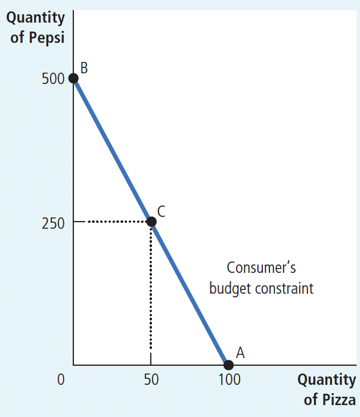

Taking $I$ as the consumer's income, $P_1, P_2$ as the prices of commodity 1 and commodity 2, and $\mathrm{X}_1, \mathrm{X}_2$ as the quantities of the two commodities, then the budget line equation is: $\mathrm{I}=\mathrm{P}_1 \mathrm{X}_1+\mathrm{P}_2 \mathrm{X}_2$, which means that the consumer's total income I is equal to the sum of the consumer's expenditures on good 1 and good 2.

The slope of the budget constraint equals the relative price of the two
goods—the price of one good compared to the price of the other, measuring the rate at which consumers exchange one good for another.

## 21.2 Preferences: What the Consumer Wants

**Indifference curve**: a curve that shows consumption bundles that give the consumer the same level of satisfaction.  (As shown in Figure 2)

**Marginal rate of substitution**: the rate at which a consumer is willing to trade one good for another.

Figure 2 The Consumer's Preferences

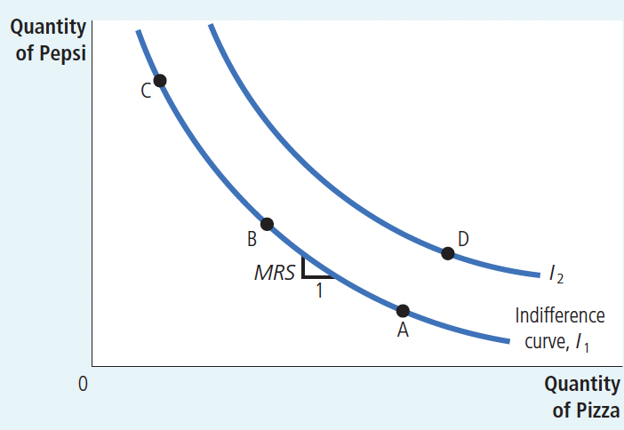

The consumer’s preferences are represented with indifference curves, which show the combinations of pizza and Pepsi that make the consumer equally satisfied. Because the consumer prefers more of a good, points on a higher indifference curve ( $I_2$ ) are preferred to points on a lower indifference curve ( $I_1$ ).

The marginal rate of substitution (MRS) shows the rate at which the consumer is willing to trade Pepsi for pizza. It measures the quantity of Pepsi the consumer must be given in exchange for 1 pizza.

以 MRS 代表商品的边际替代率， $\Delta \mathrm{X}_1$ 和 $\Delta \mathrm{X}_2$ 分别是商品 1 和商品 2 的变化量，则商品 1 对商品 2 的边际替代率的公式为:
$$
\operatorname{MRS}_{12}=-\frac{\Delta X_2}{\Delta X_1}
$$

当商品数量的变化趋于无穷小时, 则商品的边际替代率公式为:
$$
M R S_{12}=\lim _{\Delta X_1 \rightarrow 0}-\frac{\Delta X_2}{\Delta X_1}=-\frac{\mathrm{d} X_2}{\mathrm{~d} X_1}
$$

无差异曲线上任意一点的商品的边际替代率等于无差异曲线上该点的斜率的绝对值。由于无差异曲线并不是一条直线，所以在一条既定的无差异曲线上，各点的边际替代率不同

**Four properties that describe most indifference curves:**

1. Higher indifference curves are preferred to lower ones. People usually
prefer to consume more rather than less. This preference for greater quantities
is reflected in the indifference curves. As Figure 2 shows, higher indifference
curves represent larger quantities of goods than lower indifference
curves. Thus, the consumer prefers being on higher indifference curves.
2.  Indifference curves are downward-sloping. The slope of an indifference
curve reflects the rate at which the consumer is willing to substitute one
good for the other. In most cases, the consumer likes both goods. Therefore,
if the quantity of one good is reduced, the quantity of the other good must
increase for the consumer to be equally happy. For this reason, most indifference
curves slope downward.
3. Indifference curves do not cross.

To see why this is true, suppose that two indifference curves did cross, as in Figure 3. Then, because point A is on the same indifference curve as point B, the two points would make the
consumer equally happy. In addition, because point B is on the same indifference
curve as point C, these two points would make the consumer equally
happy. But these conclusions imply that points A and C would also make the
consumer equally happy, even though point C has more of both goods. This
contradicts our assumption that the consumer always prefers more of both
goods to less. Thus, indifference curves cannot cross.

4. Indifference curves are bowed inward. The slope of an indifference
curve is the marginal rate of substitution—the rate at which the consumer
is willing to trade off one good for the other. The marginal rate of substitution
(MRS) usually depends on the amount of each good the consumer is
currently consuming. In particular, because people are more willing to trade
away goods that they have in abundance and less willing to trade away
goods of which they have little, the indifference curves are bowed inward
toward the graph’s origin. As an example, consider Figure 4. At point A,
because the consumer has a lot of Pepsi and only a little pizza, she is very
hungry but not very thirsty. To induce the consumer to give up 1 pizza, she
has to be given 6 liters of Pepsi: The MRS is 6 liters per pizza. By contrast, at
point B, the consumer has little Pepsi and a lot of pizza, so she is very thirsty
but not very hungry. At this point, she would be willing to give up 1 pizza
to get 1 liter of Pepsi: The MRS is 1 liter per pizza. Thus, the bowed shape of
the indifference curve reflects the consumer’s greater willingness to give up a
good that she already has a lot of.

FIGURE 4 Bowed Indifference Curves

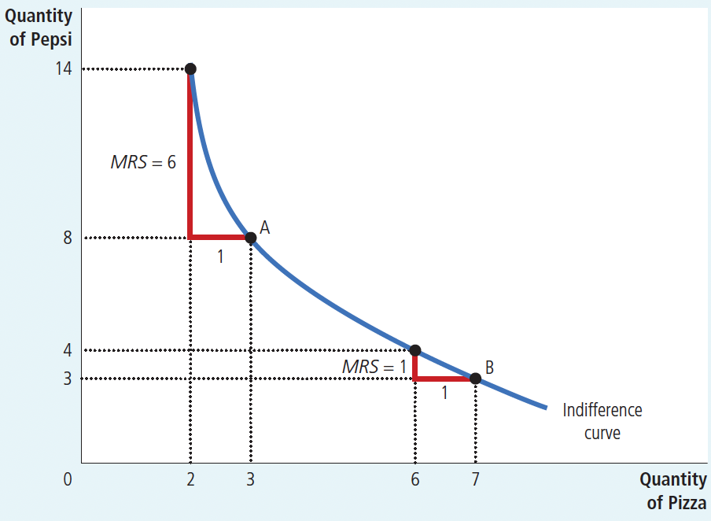

Indifference curves are usually bowed
inward. This shape implies that the
marginal rate of substitution (MRS)
depends on the quantity of the two goods
the consumer is currently consuming. At
point A, the consumer has little pizza and
much Pepsi, so she requires a lot of extra
Pepsi to induce her to give up one of the
pizzas: The MRS is 6 liters of Pepsi per
pizza. At point B, the consumer has much
pizza and little Pepsi, so she requires
only a little extra Pepsi to induce her to
give up one of the pizzas: The MRS is
1 liter of Pepsi per pizza.

### 21-2c Two Extreme Examples of Indifference Curves

The shape of an indifference curve reveals the consumer’s willingness to trade
one good for the other. When the goods are easy to substitute for each other, the
indifference curves are less bowed; when the goods are hard to substitute, the indifference curves are very bowed. To see why this is true, let’s consider the
extreme cases.

FIGURE 5
Perfect Substitutes and Perfect
Complements

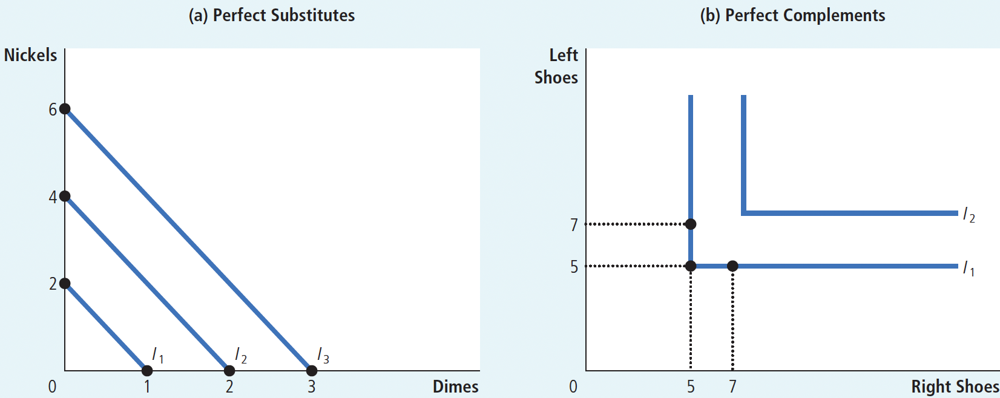

perfect substitutes(完全替代品): two goods with straightline indifference curves. The proportion of substitution between two goods is fixed

perfect complements(完全互补品): two goods with rightangle indifference curves. Both goods must be used at the same time in fixed proportions.

对完全互补的商品来说，相应的无差异曲线呈直角形状。

## 21.3 Optimization: What the Consumer Chooses

(1) 消费者的最优选择

将无差异曲线和预算线结合起来就可以说明消费者的最优选择。只有既定的预算线与一组无差异曲线簇中一条无差异曲线相切的点, 才是消费者获得最大效用水平或满足程度的均衡点。即消费者的最优选择条件是 $M R S_{12}=\frac{P_1}{P_2}$ ，这个式子表示两种商品的边际替代率等于商品的价格之比

FIGURE 6 The Consumer’s Optimum

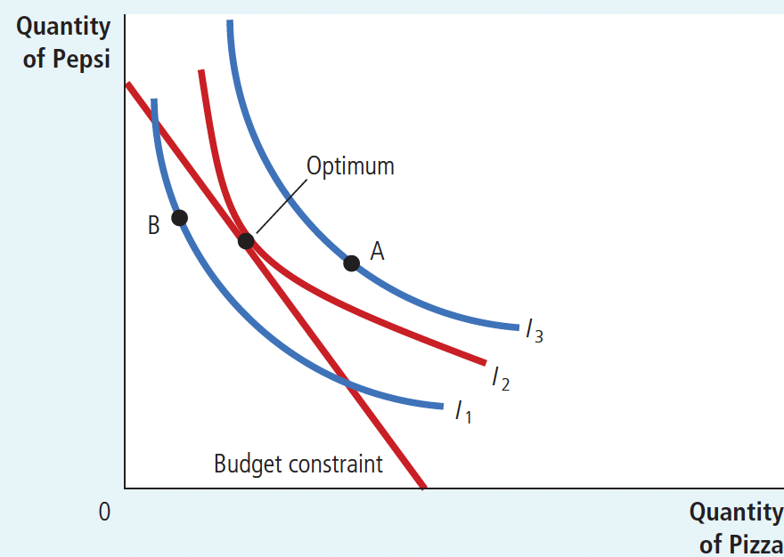

The consumer chooses the point on her budget
constraint that lies on the highest indifference
curve. At this point, called the optimum, the
marginal rate of substitution equals the relative
price of the two goods. Here the highest indifference
curve the consumer can reach is I2.
The consumer prefers point A, which lies on
indifference curve I3, but she cannot afford this
bundle of pizza and Pepsi. By contrast, point B
is affordable, but because it lies on a lower indifference
curve, the consumer does not prefer it.

### 21.3.2 How Changes in Income Affect the Consumer’s Choices

normal good: a good for which an
increase in income raises
the quantity demanded

inferior good: a good for which an
increase in income
reduces the quantity
demanded

收入变动使预算约束线移动，由于两种物品的相对价格并没有变，新预算约束线的斜率与原来的预算约束线一样。也就是说，收入增加引起预算约束线平行移动。预算约束线移动后与一组无差异曲线中的某一条再相切于某一点, 这一点就是新的消费者最优选择

Figure 7 An Increase in Income

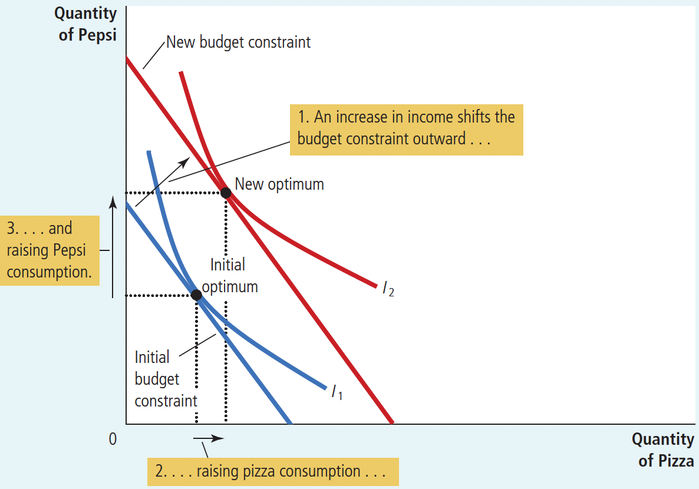

When the consumer’s income
rises, the budget constraint
shifts outward. If both goods
are normal goods, the consumer
responds to the increase in
income by buying more of both
of them. Here the consumer
buys more pizza and more
Pepsi.

Figure 8 An Inferior good

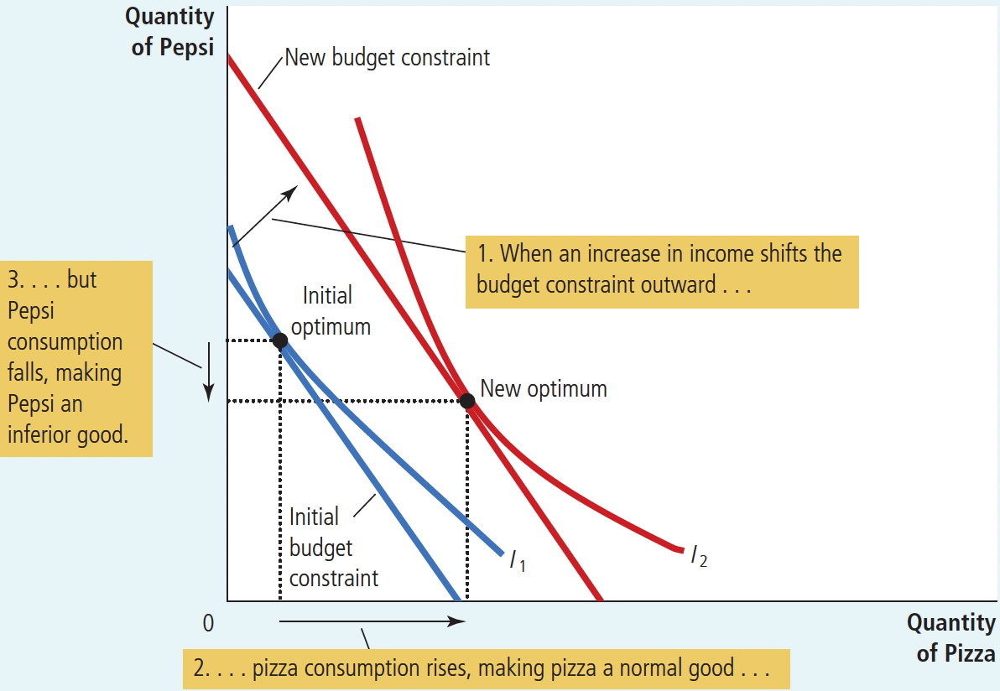

A good is inferior if the consumer
buys less of it when her income
rises. Here Pepsi is an inferior
good: When the consumer’s
income increases and the budget
constraint shifts outward, the
consumer buys more pizza but
less Pepsi.

### 21.3.3 How Changes in Prices Affect the Consumer’s Choices

商品价格变动使预算约束线发生变动，变动后的预算约束线与一组无差异曲线中的一条相切于某一点，这点就是价格变动后消费者的最优选择

Figure 9 Change in Price

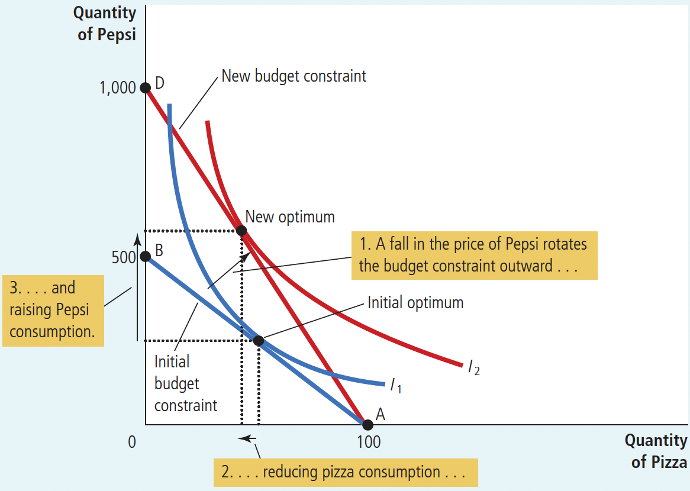

When the price of Pepsi falls,
the consumer’s budget constraint
shifts outward and
changes slope. The consumer
moves from the initial optimum
to the new optimum, which
changes her purchases of both
pizza and Pepsi. In this case,
the quantity of Pepsi consumed
rises, and the quantity of pizza
consumed falls.

### 21.3.4 Income and Substitution Effects

The impact of a change in the price of a good on consumption can be decomposed into two effects: an income effect and a substitution effect.

income effect: the change in
consumption that results
when a price change
moves the consumer
to a higher or lower
indifference curve

substitution effect: the change in
consumption that results
when a price change
moves the consumer
along a given indifference
curve to a point with
a new marginal rate of
substitution

The income effect is the change in consumption that results from the movement to a new
indifference curve. The substitution effect is the change in consumption that results from
moving to a new point on the same indifference curve with a different marginal rate of
substitution.

FIGURE 10
Income and Substitution Effects

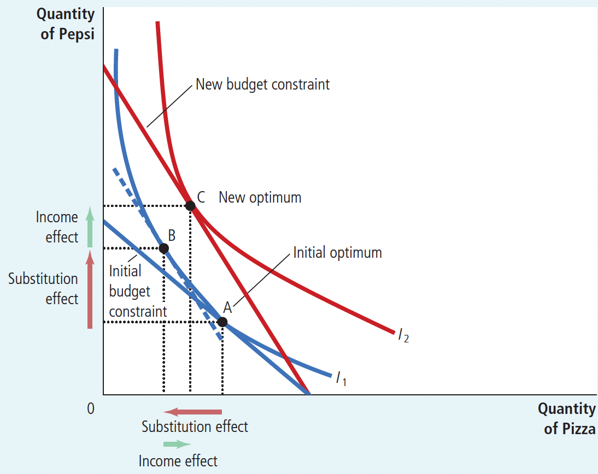

The effect of a change in price can be broken
down into an income effect and a substitution
effect. The substitution effect—the
movement along an indifference curve to
a point with a different marginal rate of
substitution—is shown here as the change
from point A to point B along indifference
curve I1. The income effect—the shift to a
higher indifference curve—is shown here
as the change from point B on indifference
curve I1 to point C on indifference curve I2.

当一种物品价格下降时，对消费者选择的影响可以分解为收入效应和替代效应。收入效应是由于低价格使消费者状况变好而引起的消费变动。替代效应是由于价格变动鼓励更多消费变得便宜的物品而引起的消费变动。收入效应反映在无差异曲线由低向高的移动上，而替代效应表现为沿着一条无差异曲线向有不同斜率的点的移动上

### 21.3.5 Deriving the Demand Curve 需求曲线的推导

FIGURE 11 Deriving the Demand Curve

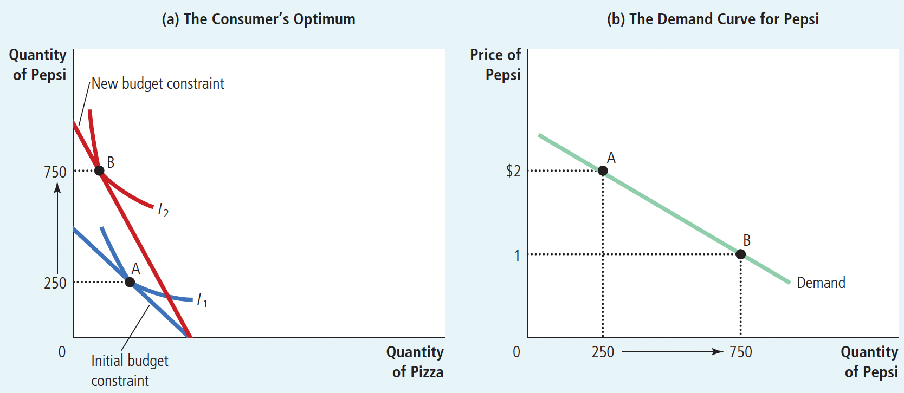

Panel (a) shows that when the price of Pepsi falls from $2 to $1, the consumer’s optimum moves from point A to point B, and the quantity of Pepsi consumed rises from 250 to 750 liters. 

The demand curve in panel (b) reflects this relationship
between the price and the quantity demanded.

①价格—消费曲线
在消费者的偏好、收入以及其他商品价格不变的条件下，与某一商品的不同价格水平相联系的消费者预算线和无差异曲线相切的消费者效用最大化的均衡点的轨迹。如图 21-1（a），其中 PCC 曲线为商品 1 的价格一消费曲线。
(2)需求曲线

由消费者的价格—消费曲线可以推导消费者的需求曲线，如图 21-1 所示。
在图 21-1（a）中，PCC 曲线上的每一点都是一个均衡点，都存在着价格与需求量的一一对应关系，把每一个价格及其对应的需求量绘制到（b）图上，就得到消费者需求曲线 D，从图上可以看出需求曲线向右下方倾斜，它表示商品的价格与需求量呈反方向变动。

## 21.4 Three Applications

（1）替代效应和收入效应对需求曲线形状的影响
(1)正常物品的替代效应和收入效应

正常物品的替代效应与价格成反方向的变动，收入效应也与价格成反方向的变动，在它们的共同作用下，总效应必定与价格成反方向的变动，从而使得正常物品的需求曲线是向右下方倾斜的

Figure 12 A Giffen Good

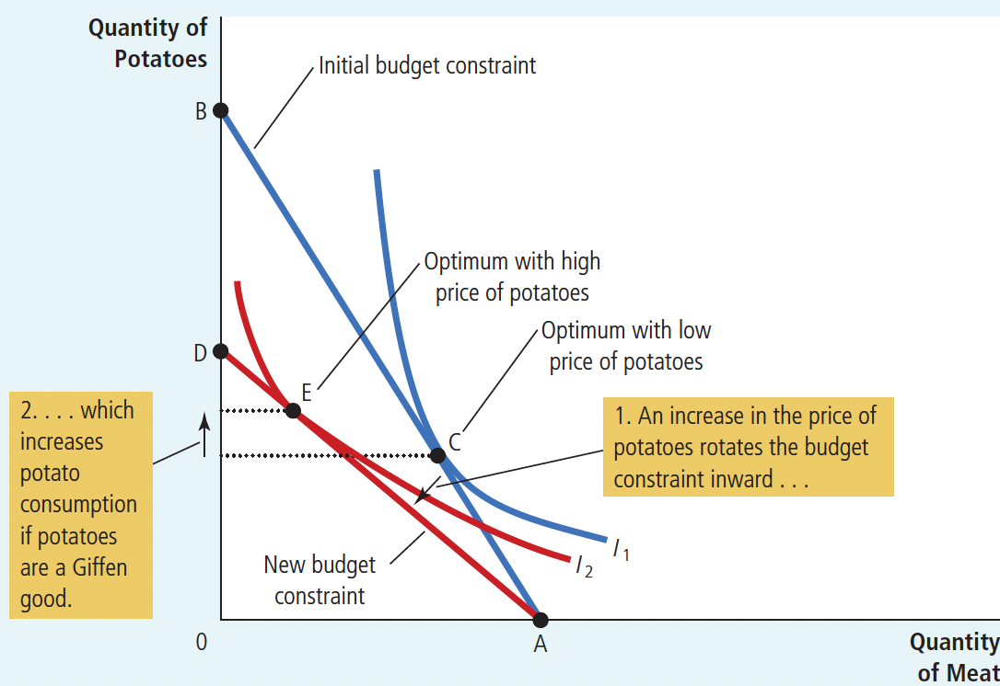

In this example, when the price of potatoes
rises, the consumer’s optimum shifts from
point C to point E. In this case, the consumer
responds to a higher price of potatoes
by buying less meat and more potatoes.

（2）低档物品的替代效应和收入效应
低档物品的替代效应与价格成反方向的变动，收入效应与价格成同方向变动，但是在一般情况下，收入效应

的作用小于替代效应的作用，从而总效应与价格成反方向变动，这样使得其需求曲线向右下方倾斜。
(3)吉芬物品的替代效应和收入效应

作为一种特殊的低档物品，吉芬物品的替代效应与价格成反方向的变动，收入效应与价格成同方向变动，但是其收入效应的作用大于替代效应的作用，从而总效应与价格成同方向变动，这样使得吉芬物品的需求曲线向右上方倾斜

（2）工资对劳动供给的影响
工资变化对劳动供给产生两种效应：替代效应和收入效应。以工资提高为例：
替代效应：当工资率提高时，消费者放弃劳动享受闲暇的代价较大，消费者就增加劳动时间替代闲暇时间。收入效应：当工资率提高时，到一定程度后，由于收入上升，消费者可能减少劳动时间而增加闲暇时间。最后，经济理论对工资增加导致劳动供给增加还是减少并没有给出明确的预期：如果替代效应大于收入效应，劳动供给增加；如果收入效应大于替代效应，劳动供给减少

Figure 13 The Work-Leisure Decision

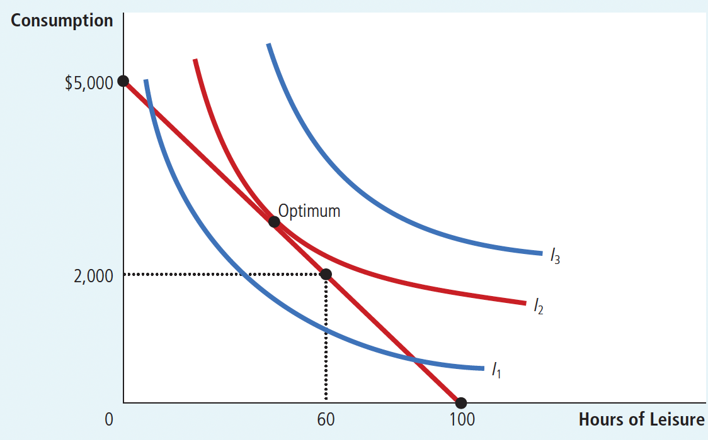

This figure shows Kayla’s budget constraint
for deciding how much to work, her indifference
curves for consumption and leisure, and
her optimum.

Figure 14 An Increase in the Wage

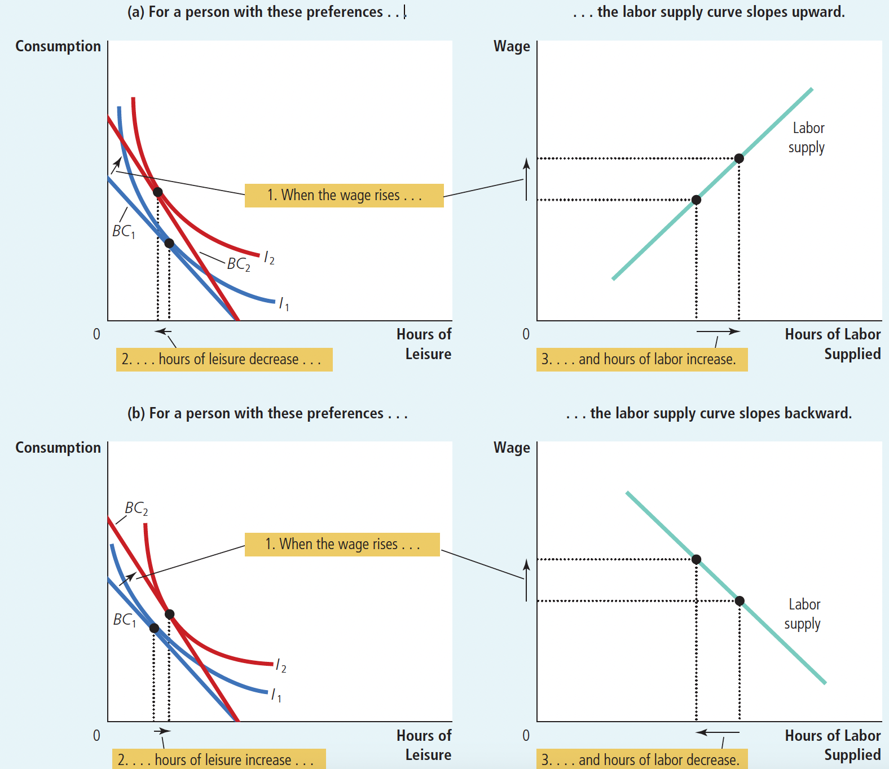

The two panels of this figure show how a person might respond to an increase in the wage.
The graphs on the left show the consumer’s initial budget constraint, BC1, and new budget
constraint, BC2, as well as the consumer’s optimal choices over consumption and leisure. The
graphs on the right show the resulting labor-supply curve. Because hours worked equal total
hours available minus hours of leisure, any change in leisure implies an opposite change in the
quantity of labor supplied. In panel (a), when the wage rises, consumption rises and leisure
falls, resulting in a labor-supply curve that slopes upward. In panel (b), when the wage rises,
both consumption and leisure rise, resulting in a labor-supply curve that slopes backward.

### 21-4c How Do Interest Rates Affect Household Saving?

利率变化对家庭储蓄产生两种效应：替代效应和收入效应。以利率提高为例：
替代效应：当利率上升时，现时消费的成本上升，以后消费比较划算，因此，替代效应使家庭储蓄得更多

收入效应：当利率上升时，得到以后同样的储蓄现在所需存入的本金变少，现在可支配收入就较多，这会使得家庭增加消费，因此，收入效应使家庭储蓄减少

Figure 15 The Consumption-Saving Decision

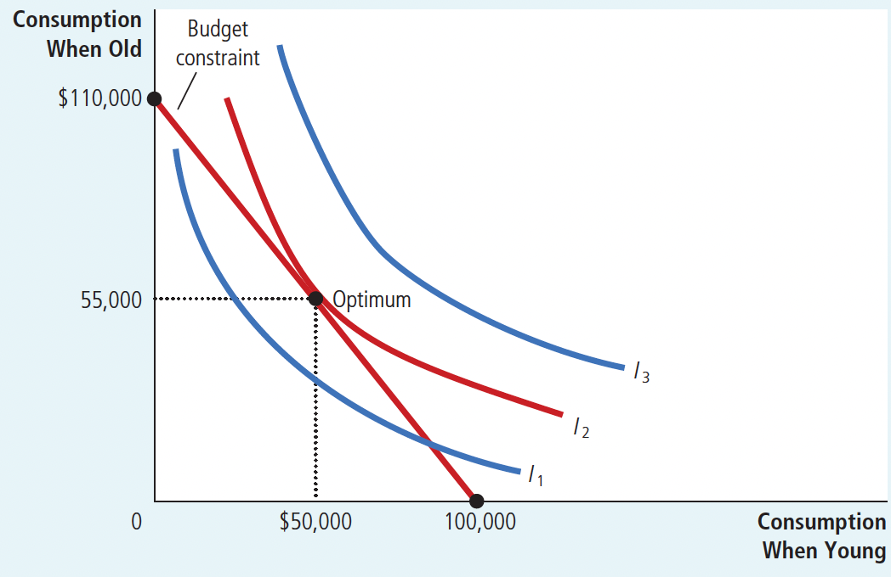

This figure shows the budget constraint for
a person deciding how much to consume in
the two periods of his life, the indifference
curves representing his preferences, and the
optimum.

最后的结果既取决于收入效应又取决于替代效应。如果高利率的替代效应大于收入效应，则储蓄增加。如果收入效应大于替代效应，则储蓄减少。因此，消费者选择理论说明了，利率提高既可能鼓励储蓄，也可能抑制储蓄

Figure 16 An Increase in the Interest Rate

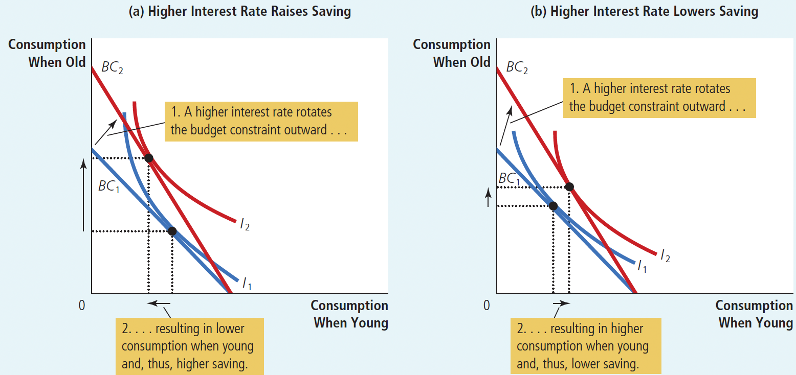

In both panels, an increase in the interest rate shifts the budget constraint
outward.

In panel (a), consumption when young falls, and consumption when old
rises. The result is an increase in saving when young.

In panel (b), consumption in
both periods rises. The result is a decrease in saving when young.